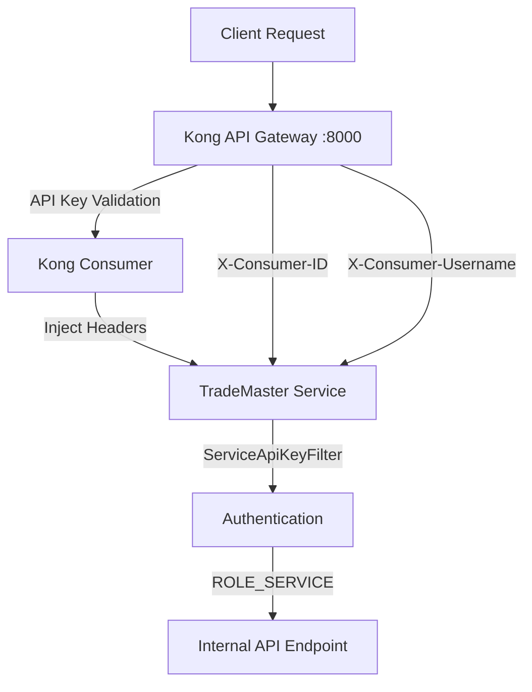

# Kong API Key Authentication Setup Guide

This guide documents the Kong API Gateway configuration for TradeMaster services with dynamic API key authentication.

## Overview

TradeMaster uses Kong API Gateway for centralized API key management and service-to-service authentication. Each service has dedicated Kong consumers with auto-generated API keys for secure internal communication.

## Architecture



## Services Configuration

### Trading Service
- **Consumer**: `trading-service-internal`
- **Service**: `trading-service` → `trading-service:8083`
- **Route**: `/api/internal/trading/greeting` → `/api/internal/greeting`
- **API Key**: Auto-generated by Kong (stored in Kong database)

### Event Bus Service  
- **Consumer**: `event-bus-service-internal`
- **Service**: `event-bus-service` → `event-bus-service:8081`
- **Route**: `/api/internal/event-bus/greeting` → `/api/internal/greeting`
- **API Key**: Auto-generated by Kong (stored in Kong database)

## Quick Start

### 1. Start Services
```bash
# Start all services including Kong
docker compose up -d

# Wait for all services to be healthy
docker compose ps
```

### 2. Configure Kong (Automatic Setup)
```bash
# Run the Kong configuration script
./scripts/configure-kong-api-keys.sh

# This script will:
# - Create Kong consumers for each service
# - Generate API keys automatically
# - Set up routes and plugins
# - Test the configuration
```

### 3. Test Authentication
```bash
# Get API keys from Kong
TRADING_KEY=$(curl -s http://localhost:8001/consumers/trading-service-internal/key-auth | jq -r '.data[0].key')
EVENTBUS_KEY=$(curl -s http://localhost:8001/consumers/event-bus-service-internal/key-auth | jq -r '.data[0].key')

# Test trading service
curl -H "X-API-Key: $TRADING_KEY" http://localhost:8000/api/internal/trading/greeting

# Test event-bus service  
curl -H "X-API-Key: $EVENTBUS_KEY" http://localhost:8000/api/internal/event-bus/greeting

# Test security (should fail)
curl http://localhost:8000/api/internal/trading/greeting
```

## Authentication Flow

### 1. Client Request
```bash
curl -H "X-API-Key: YJ91T9ytzQWuZIXIWkSfCvVArmHEtclB" \
     http://localhost:8000/api/internal/trading/greeting
```

### 2. Kong Processing
1. **Route Matching**: Kong matches `/api/internal/trading/greeting`
2. **Key-Auth Plugin**: Validates `X-API-Key` header against consumer database
3. **Consumer Identification**: Identifies consumer (`trading-service-internal`)
4. **Header Injection**: Adds `X-Consumer-ID` and `X-Consumer-Username` headers
5. **URI Transformation**: Rewrites URI to `/api/internal/greeting`
6. **Service Routing**: Forwards request to `trading-service:8083`

### 3. Service Processing
1. **ServiceApiKeyFilter**: Recognizes Kong consumer headers
2. **Authentication**: Sets `ROLE_SERVICE` in Spring Security context
3. **Authorization**: `@PreAuthorize("hasRole('SERVICE')")` allows access
4. **Response**: Returns authenticated response

## Security Features

### API Key Validation
- ✅ **Dynamic Keys**: Kong generates unique API keys per consumer
- ✅ **Header Injection**: Kong automatically adds consumer identification headers
- ✅ **Centralized Management**: All API keys managed through Kong Admin API
- ✅ **Audit Logging**: All authentication attempts logged with correlation IDs

### Defense in Depth
- ✅ **Kong Gateway**: First layer - validates API keys
- ✅ **Service Filter**: Second layer - validates Kong consumer headers
- ✅ **Spring Security**: Third layer - role-based authorization
- ✅ **Request Rejection**: Direct service calls (bypassing Kong) are rejected

### Public Endpoints
- ✅ **Health Checks**: Management port health endpoints remain public (`:9081`, `:9083`)
- ✅ **Monitoring**: Prometheus metrics endpoints accessible for monitoring
- ✅ **Error Handling**: Proper error responses for authentication failures

## Configuration Details

### Kong Consumers
```bash
# Trading Service Consumer
curl -X POST http://localhost:8001/consumers \
  -d "username=trading-service-internal" \
  -d "custom_id=svc-$(date +%s)-trading-$(openssl rand -hex 4)" \
  -d "tags=internal,trading,service-to-service,high-priority"

# Event Bus Service Consumer  
curl -X POST http://localhost:8001/consumers \
  -d "username=event-bus-service-internal" \
  -d "custom_id=svc-$(date +%s)-events-$(openssl rand -hex 4)" \
  -d "tags=internal,events,service-to-service"
```

### Kong Routes & Plugins
```bash
# Create Route
curl -X POST http://localhost:8001/routes \
  -d "name=trading-internal-api" \
  -d "service.name=trading-service" \
  -d "paths[]=/api/internal/trading/greeting" \
  -d "strip_path=false"

# Add Key-Auth Plugin
curl -X POST http://localhost:8001/routes/{route-id}/plugins \
  -d "name=key-auth" \
  -d "config.key_names[]=X-API-Key" \
  -d "config.hide_credentials=false"

# Add Request-Transformer Plugin  
curl -X POST http://localhost:8001/routes/{route-id}/plugins \
  -H "Content-Type: application/json" \
  -d '{"name": "request-transformer", "config": {"replace": {"uri": "/api/internal/greeting"}}}'
```

## Troubleshooting

### Common Issues

1. **"No API key found in request"**
   - Solution: Include `X-API-Key` header in request
   - Check: `curl -H "X-API-Key: YOUR_KEY" http://localhost:8000/api/internal/trading/greeting`

2. **"Unauthorized"** 
   - Solution: Verify API key is valid
   - Check: `curl -s http://localhost:8001/consumers/trading-service-internal/key-auth`

3. **"SERVICE_AUTHENTICATION_FAILED"**
   - Solution: Ensure Kong is injecting consumer headers
   - Check: Kong route has key-auth plugin configured
   - Check: Request is going through Kong (`:8000`) not direct service (`:8083`)

4. **"404 Not Found"**
   - Solution: Verify Kong route configuration
   - Check: `curl -s http://localhost:8001/routes | jq '.data[].paths'`

### Debug Commands
```bash
# Check Kong consumers
curl -s http://localhost:8001/consumers | jq '.data[].username'

# Check routes
curl -s http://localhost:8001/routes | jq '.data[] | {name, paths}'

# Check plugins on route
curl -s http://localhost:8001/routes/{route-id}/plugins | jq '.data[].name'

# Check service health
curl -s http://localhost:9083/actuator/health | jq '.status'

# View service logs
docker compose logs trading-service --tail=50
```

## API Reference

### Get API Keys
```bash
# Trading service API key
curl -s http://localhost:8001/consumers/trading-service-internal/key-auth | jq -r '.data[0].key'

# Event bus service API key  
curl -s http://localhost:8001/consumers/event-bus-service-internal/key-auth | jq -r '.data[0].key'
```

### Test Endpoints
```bash
# Trading service internal API
curl -H "X-API-Key: YOUR_TRADING_KEY" \
     http://localhost:8000/api/internal/trading/greeting

# Event bus service internal API
curl -H "X-API-Key: YOUR_EVENTBUS_KEY" \
     http://localhost:8000/api/internal/event-bus/greeting

# Health endpoints (public - no API key required)
curl http://localhost:9083/actuator/health  # Trading service management
curl http://localhost:9081/actuator/health  # Event bus service management
```

## Production Considerations

### Security
- 🔐 **API Key Rotation**: Implement regular API key rotation
- 🔐 **Rate Limiting**: Add Kong rate limiting plugins  
- 🔐 **IP Whitelisting**: Restrict access by IP if needed
- 🔐 **TLS Encryption**: Enable HTTPS for all communication

### Monitoring  
- 📊 **Kong Metrics**: Monitor Kong via Prometheus endpoint
- 📊 **Service Health**: Monitor service health endpoints
- 📊 **Authentication Logs**: Monitor failed authentication attempts
- 📊 **Performance**: Track API response times and throughput

### High Availability
- 🏗️ **Kong Clustering**: Deploy Kong in cluster mode
- 🏗️ **Database Backup**: Backup Kong configuration database
- 🏗️ **Service Redundancy**: Run multiple service instances
- 🏗️ **Health Checks**: Implement comprehensive health checking

## Maintenance

### Adding New Services
1. Create Kong consumer: `curl -X POST http://localhost:8001/consumers -d "username=new-service-internal"`
2. Generate API key: `curl -X POST http://localhost:8001/consumers/new-service-internal/key-auth`
3. Create service: `curl -X POST http://localhost:8001/services -d "name=new-service" -d "host=new-service" -d "port=8080"`
4. Create route: `curl -X POST http://localhost:8001/routes -d "name=new-service-internal" -d "service.name=new-service" -d "paths[]=/api/internal/new-service"`
5. Add plugins: key-auth and request-transformer as needed

### Updating Configuration
- Use Kong Admin API to modify routes, services, and plugins
- Changes take effect immediately without restart
- Monitor Kong logs for configuration errors

### Backup & Restore
```bash
# Backup Kong configuration
curl -s http://localhost:8001/config | jq > kong-backup.json

# Restore Kong configuration (if needed)
curl -X POST http://localhost:8001/config -d @kong-backup.json
```

---

**Note**: This configuration provides enterprise-grade security with Kong API Gateway managing authentication centrally while maintaining service autonomy and security isolation.