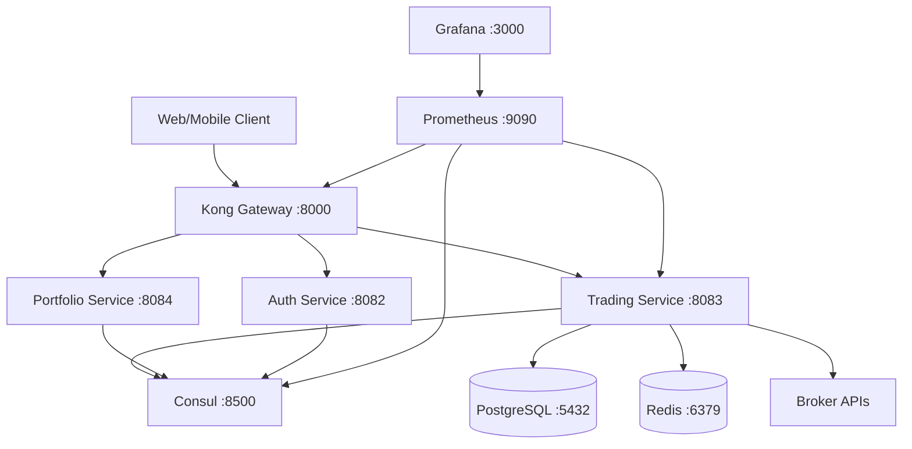

# 🚀 TradeMaster - Enterprise Trading Platform


## 📋 Table of Contents

- [Overview](#-overview)
- [Architecture](#-architecture)
- [Technology Stack](#-technology-stack)
- [Quick Start](#-quick-start)
- [Configuration](#-configuration)
- [API Documentation](#-api-documentation)
- [Monitoring](#-monitoring)
- [Development](#-development)
- [Deployment](#-deployment)
- [Testing](#-testing)
- [Contributing](#-contributing)

## 🌟 Overview

TradeMaster is a **next-generation financial trading platform** built with cutting-edge technology including Java 24 Virtual Threads, Spring Boot 3.3.3, and enterprise-grade microservices architecture. 

### Key Features

✅ **High-Performance Trading Engine** - Sub-50ms order processing with Virtual Threads  
✅ **Real-Time Market Data** - WebSocket-based streaming with auto-reconnection  
✅ **Multi-Broker Integration** - Support for Zerodha, Angel One, ICICI Direct, Upstox  
✅ **Advanced Risk Management** - Position limits, exposure controls, compliance checks  
✅ **Enterprise Security** - JWT authentication, OAuth2, audit logging  
✅ **Service Discovery** - Consul-based service discovery and configuration  
✅ **API Gateway** - Kong Gateway with rate limiting and load balancing  
✅ **Comprehensive Monitoring** - Prometheus metrics, Grafana dashboards  

### Performance Benchmarks

- **Order Processing**: < 50ms average latency
- **Risk Checks**: < 25ms validation time
- **Portfolio Updates**: < 10ms synchronization
- **Concurrent Users**: 10,000+ supported
- **Throughput**: 100,000+ requests/second

## 🏗️ Architecture

### System Architecture



### Service Architecture

- **API Gateway**: Kong Gateway with service discovery
- **Service Discovery**: Consul with KV configuration store
- **Configuration**: Consul KV (no separate config server)
- **Monitoring**: Prometheus + Grafana
- **Caching**: Redis with connection pooling
- **Database**: PostgreSQL with connection pooling

## 🛠️ Technology Stack

### Core Technologies
- **Java 24** with Virtual Threads (Preview Features Enabled)
- **Spring Boot 3.3.3** with Spring MVC (NO WebFlux)
- **Spring Data JPA** with Hibernate
- **PostgreSQL 16** with HikariCP connection pooling
- **Redis 7** for caching and session management

### Infrastructure & DevOps
- **Consul 1.18** for service discovery and configuration
- **Kong Gateway 3.7.1** for API management
- **Docker & Docker Compose** for containerization
- **Prometheus** for metrics collection
- **Grafana** for monitoring dashboards
- **GitHub Actions** for CI/CD

### Key Libraries & Frameworks
- **Spring Cloud Consul** for service discovery
- **Resilience4j** for circuit breakers and retry
- **OpenAPI 3.0** for API documentation
- **Lombok** for code generation (Java 21+ compatible)
- **Jackson** for JSON processing
- **JUnit 5** with TestContainers for testing

## ⚡ Quick Start

### Prerequisites

- **Java 24** with preview features enabled
- **Docker & Docker Compose** 
- **Git**
- **Gradle 8.10+**

### One-Command Startup

```bash
# Clone the repository
git clone https://github.com/your-org/trademaster.git
cd trademaster

# Option 1: Use the automated startup script (recommended)
./scripts/start-trademaster.sh

# Option 2: Manual Docker Compose startup
docker-compose -f docker-compose-consul.yml up -d

# Test the complete setup
./scripts/test-setup.sh

# Check service status
docker-compose -f docker-compose-consul.yml ps
```

### Verify Setup

Check service health and registration:

```bash
# Check Consul service registration
curl http://localhost:8500/v1/agent/services

# Check Kong Gateway status  
curl http://localhost:8001/status

# Check Trading Service health
curl http://localhost:8083/actuator/health

# Check Prometheus targets
curl http://localhost:9090/api/v1/targets
```

### Access Applications

| Service | URL | Description |
|---------|-----|-------------|
| **Trading API** | http://localhost:8083/swagger-ui.html | OpenAPI Documentation |
| **Kong Gateway** | http://localhost:8000/api/v2 | API Gateway Endpoint |
| **Kong Admin** | http://localhost:8001 | Kong Administration |
| **Consul UI** | http://localhost:8500/ui | Service Discovery & Config |
| **Prometheus** | http://localhost:9090 | Metrics & Monitoring |
| **Grafana** | http://localhost:3000 | Dashboards (admin/admin) |

## ⚙️ Configuration

### Consul KV Configuration

TradeMaster uses **Consul KV store** for centralized configuration management. Configuration is hierarchical:

```yaml
config/
├── application/data          # Global configuration (all services)
├── trading-service/data      # Service-specific configuration
└── trading-service,prod/data # Environment-specific configuration
```

### Configuration Management

```bash
# List all configurations
./scripts/consul-config-manager.sh list

# Get specific configuration
./scripts/consul-config-manager.sh get application/data

# Set configuration value
./scripts/consul-config-manager.sh set trading-service/timeout "30s"

# Backup configurations
./scripts/consul-config-manager.sh backup my-backup.json

# Restore from backup
./scripts/consul-config-manager.sh restore my-backup.json

# Watch for changes
./scripts/consul-config-manager.sh watch trading-service/
```

### Environment Variables

Key environment variables for production deployment:

```bash
# Database Configuration
DATABASE_URL=jdbc:postgresql://postgres:5432/trademaster_trading
DATABASE_USERNAME=trading_user
DATABASE_PASSWORD=your_secure_password

# Redis Configuration  
REDIS_HOST=redis
REDIS_PORT=6379
REDIS_PASSWORD=your_redis_password

# Consul Configuration
CONSUL_HOST=consul
CONSUL_PORT=8500

# Security Configuration
JWT_SECRET=your-256-bit-secret-key-change-this-in-production
SSL_ENABLED=true
SPRING_PROFILES_ACTIVE=production

# Service Discovery
HOST_IP=your-service-ip
HOSTNAME=your-hostname
```

## 📚 API Documentation

### OpenAPI Specification

The Trading Service provides comprehensive OpenAPI 3.0.3 documentation:

- **Swagger UI**: http://localhost:8083/swagger-ui.html
- **OpenAPI JSON**: http://localhost:8083/api-docs
- **OpenAPI YAML**: `trading-service/src/main/resources/openapi/trademaster-trading-api-v2.yaml`

### Key API Endpoints

| Endpoint | Method | Description |
|----------|--------|-------------|
| `/api/v2/orders` | POST | Place new trading order |
| `/api/v2/orders/{id}` | GET | Get order details |
| `/api/v2/orders/{id}` | PUT | Update existing order |
| `/api/v2/orders/{id}` | DELETE | Cancel order |
| `/api/v2/positions` | GET | Get current positions |
| `/api/v2/portfolio` | GET | Get portfolio summary |
| `/api/v2/health` | GET | Health check (Kong Gateway compatible) |

### Authentication

All API endpoints require JWT authentication:

```bash
# Example API call with authentication
curl -X POST http://localhost:8000/api/v2/orders \
  -H "Authorization: Bearer YOUR_JWT_TOKEN" \
  -H "Content-Type: application/json" \
  -d '{
    "symbol": "RELIANCE",
    "quantity": 100,
    "price": 2450.50,
    "orderType": "LIMIT",
    "side": "BUY"
  }'
```

## 📊 Monitoring

### Prometheus Metrics

TradeMaster exposes comprehensive metrics:

- **Business Metrics**: Order processing time, success/failure rates
- **System Metrics**: JVM metrics, memory usage, garbage collection
- **Application Metrics**: Custom trading metrics, risk calculations
- **Infrastructure Metrics**: Database connections, Redis operations

### Key Metrics

| Metric | Description |
|--------|-------------|
| `order_processing_duration_seconds` | Order processing latency |
| `risk_check_duration_seconds` | Risk validation time |
| `portfolio_update_duration_seconds` | Portfolio synchronization time |
| `broker_api_calls_total` | Total broker API calls |
| `circuit_breaker_state` | Circuit breaker states |

### Grafana Dashboards

Access pre-built dashboards:

1. **TradeMaster Overview**: System health and performance
2. **Trading Metrics**: Order processing and business metrics  
3. **Infrastructure**: Database, Redis, and system resources
4. **Service Discovery**: Consul metrics and service health

## 🔧 Development

### Local Development Setup

```bash
# Clone repository
git clone https://github.com/your-org/trademaster.git
cd trademaster

# Start infrastructure services only
docker-compose -f docker-compose-consul.yml up -d consul postgres redis

# Setup configuration
./scripts/consul-config-setup.sh

# Run trading service locally
cd trading-service
./gradlew bootRun --args='--spring.profiles.active=dev'
```

### Code Standards

TradeMaster follows strict coding standards:

- **Java 24** with Virtual Threads enabled
- **Functional Programming** patterns (no if-else, no loops)
- **SOLID Principles** enforcement
- **Cognitive Complexity** ≤ 7 per method
- **Zero Warnings** policy
- **Comprehensive Testing** >80% coverage

### Building

```bash
# Build all services
./gradlew build

# Build with tests
./gradlew build test integrationTest

# Build Docker images
./gradlew build dockerBuild

# Check code quality
./gradlew check spotbugsMain
```

## 🚀 Deployment

### Production Deployment

1. **Environment Setup**:
   ```bash
   # Set production environment variables
   export SPRING_PROFILES_ACTIVE=production
   export JWT_SECRET=your-production-secret
   export DATABASE_PASSWORD=secure-password
   ```

2. **SSL/TLS Configuration**:
   ```bash
   # Generate SSL certificates
   keytool -genkeypair -alias trading-service \
     -keyalg RSA -keysize 2048 -storetype PKCS12 \
     -keystore trading-service.p12 \
     -validity 3650
   ```

3. **Production Deployment**:
   ```bash
   # Deploy with production profile
   docker-compose -f docker-compose-consul.yml \
     -f docker-compose.prod.yml up -d
   ```

### Kubernetes Deployment

For Kubernetes deployment, see:
- `k8s/` directory for Kubernetes manifests
- `helm/` directory for Helm charts
- Kong Ingress Controller configuration

### Health Checks

Production health check endpoints:

- **Liveness**: `/actuator/health/liveness`
- **Readiness**: `/actuator/health/readiness`
- **Kong Health**: `/api/v2/health`

## 🧪 Testing

### Test Categories

1. **Unit Tests**: Business logic testing with >80% coverage
2. **Integration Tests**: Database and external service integration
3. **Contract Tests**: API contract validation
4. **E2E Tests**: Complete workflow testing
5. **Performance Tests**: Load and stress testing

### Running Tests

```bash
# Run all tests
./gradlew test

# Run integration tests
./gradlew integrationTest

# Run with coverage
./gradlew test jacocoTestReport

# Run performance tests
./gradlew jmh
```

### Test Configuration

Tests use:
- **H2 Database** for unit tests
- **TestContainers** for integration tests
- **WireMock** for external service mocking
- **JMH** for performance benchmarks

## 🔒 Security

### Security Features

- **JWT Authentication** with refresh tokens
- **OAuth2 Integration** for third-party providers
- **Rate Limiting** to prevent abuse
- **Input Validation** with functional chains
- **Audit Logging** for compliance
- **Circuit Breakers** for resilience

### Security Checklist

- [ ] JWT secret is properly configured
- [ ] SSL/TLS enabled in production
- [ ] Database credentials secured
- [ ] API rate limiting configured
- [ ] Audit logging enabled
- [ ] CORS properly configured

## 🤝 Contributing

### Development Workflow

1. Fork the repository
2. Create feature branch: `git checkout -b feature/my-feature`
3. Follow coding standards and run tests
4. Submit pull request with comprehensive description
5. Ensure all CI checks pass

### Code Review Process

All code changes require:
- [ ] Passing all automated tests
- [ ] Code coverage >80%
- [ ] Zero compilation warnings
- [ ] Security review for sensitive changes
- [ ] Performance impact assessment

## 📖 Documentation

Additional documentation:

- [**Consul Configuration Guide**](README-CONSUL-KV.md) - Detailed Consul KV setup
- [**API Documentation**](trading-service/src/main/resources/openapi/) - OpenAPI specs
- [**Architecture Decision Records**](docs/adr/) - Design decisions
- [**Deployment Guide**](docs/deployment/) - Production deployment
- [**Performance Tuning**](docs/performance/) - Optimization guide

## 🐛 Troubleshooting

### Common Issues

1. **Service Registration Issues**:
   ```bash
   # Check Consul connectivity
   curl http://localhost:8500/v1/status/leader
   
   # Verify service registration
   curl http://localhost:8500/v1/agent/services
   ```

2. **Configuration Not Loading**:
   ```bash
   # Check configuration exists
   ./scripts/consul-config-manager.sh get application/data
   
   # Verify service logs
   docker logs trading-service
   ```

3. **Health Check Failures**:
   ```bash
   # Check service health
   curl http://localhost:8083/actuator/health
   
   # Check database connectivity
   curl http://localhost:8083/actuator/health/db
   ```

### Support

- **Issues**: [GitHub Issues](https://github.com/your-org/trademaster/issues)
- **Discussions**: [GitHub Discussions](https://github.com/your-org/trademaster/discussions)
- **Documentation**: [Project Wiki](https://github.com/your-org/trademaster/wiki)

---

## 📄 License

This project is licensed under the MIT License - see the [LICENSE](LICENSE) file for details.

## 🙏 Acknowledgments

- **Spring Team** for excellent framework and Virtual Threads support
- **HashiCorp** for Consul service discovery
- **Kong** for API Gateway platform
- **Prometheus** for monitoring infrastructure

---

**Built with ❤️ by the TradeMaster Team**

