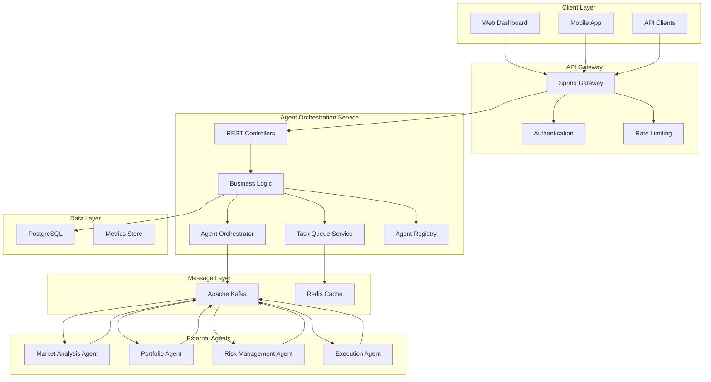
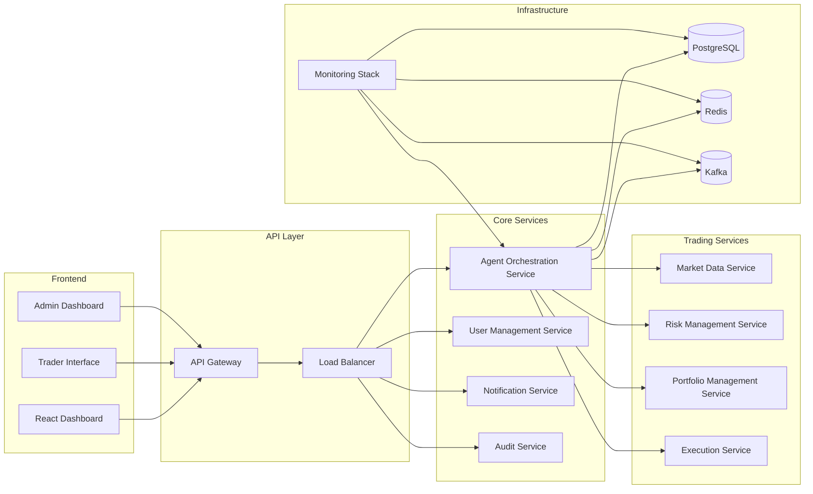
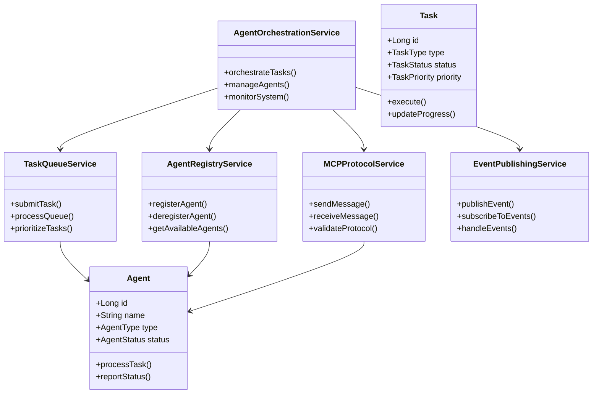
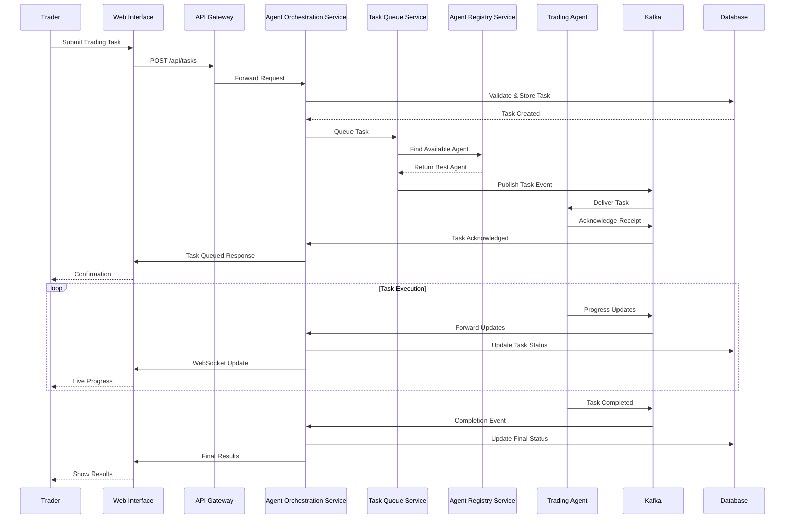
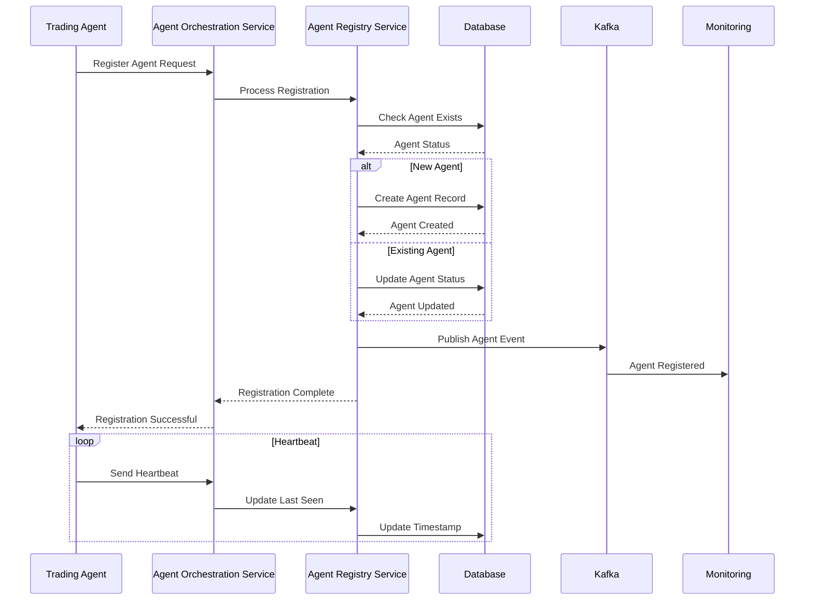
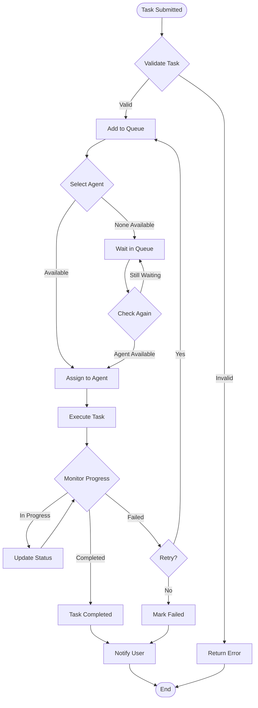
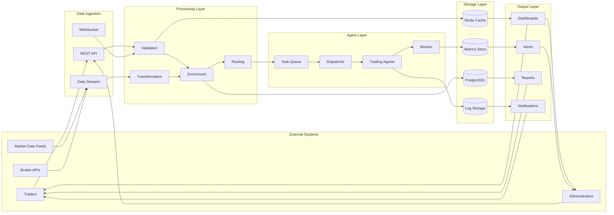
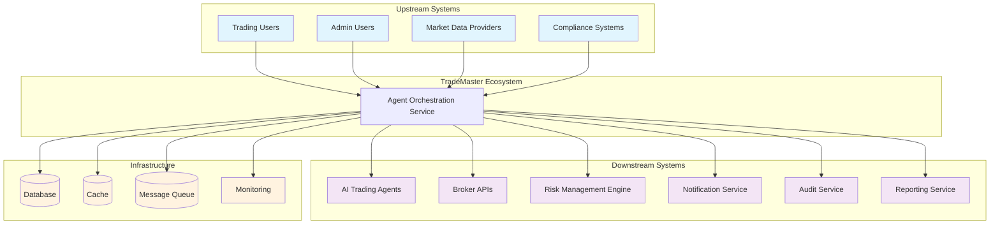

# 🤖 TradeMaster Agent Orchestration Service

[](https://openjdk.java.net/projects/jdk/24/)
[](https://spring.io/projects/spring-boot)
[](LICENSE)
[](https://github.com/trademaster/agent-os)

**AI-Powered Trading Agent Orchestration Platform** - Intelligent task distribution, workflow management, and autonomous trading agent coordination for financial markets.

---

## 📑 Table of Contents

- [🎯 Overview](#-overview)
- [🏗️ Architecture](#️-architecture)
- [📊 System Diagrams](#-system-diagrams)
- [🚀 Getting Started](#-getting-started)
- [📡 API Specification](#-api-specification)
- [🔧 Configuration](#-configuration)
- [📈 Monitoring & Observability](#-monitoring--observability)
- [🧪 Testing](#-testing)
- [🚢 Deployment](#-deployment)
- [🤝 Contributing](#-contributing)

---

## 🎯 Overview

TradeMaster Agent OS is a sophisticated microservices-based platform that orchestrates AI-powered trading agents for financial market analysis, risk management, and autonomous trading execution.

### 🌟 Key Features

| Feature | Description | Technology |
|---------|-------------|------------|
| **🧠 Intelligent Agent Orchestration** | Dynamic task routing and load balancing | Java 24 Virtual Threads |
| **⚡ High-Performance Processing** | Real-time market data processing | Structured Concurrency |
| **🔄 Event-Driven Architecture** | Asynchronous message processing | Apache Kafka |
| **📊 Advanced Analytics** | Market analysis and prediction models | Redis Caching |
| **🛡️ Enterprise Security** | JWT-based authentication & authorization | Spring Security |
| **📈 Comprehensive Monitoring** | Real-time metrics and alerting | Prometheus + Grafana |

### 🎯 Use Cases

- **Market Analysis Agents**: Real-time technical and fundamental analysis
- **Portfolio Management**: Automated rebalancing and optimization
- **Risk Management**: Dynamic risk assessment and position sizing
- **Trade Execution**: Smart order routing and execution algorithms
- **Compliance Monitoring**: Regulatory compliance and reporting

---

## 🏗️ Architecture

### 🔧 High-Level Architecture



### 🏛️ Microservices Architecture



### 🧩 Component Architecture



---

## 📊 System Diagrams

### 📋 Entity Relationship Diagram

```mermaid
erDiagram
    AGENT {
        bigint id PK
        varchar(100) agent_name
        varchar(50) agent_type
        varchar(30) status
        int current_load
        int max_concurrent_tasks
        decimal(5,4) success_rate
        int average_response_time
        bigint total_tasks_completed
        timestamp created_at
        timestamp updated_at
        timestamp last_heartbeat
    }

    TASK {
        bigint id PK
        varchar(200) task_name
        varchar(50) task_type
        varchar(30) status
        varchar(20) priority
        bigint agent_id FK
        int progress_percentage
        text parameters
        text results
        timestamp created_at
        timestamp updated_at
        timestamp completed_at
        int estimated_duration
    }

    AGENT_CAPABILITY {
        bigint id PK
        bigint agent_id FK
        varchar(50) capability_name
        varchar(20) proficiency_level
        boolean is_active
    }

    TASK_EXECUTION_LOG {
        bigint id PK
        bigint task_id FK
        bigint agent_id FK
        varchar(30) execution_status
        text execution_details
        timestamp started_at
        timestamp completed_at
        int execution_duration
    }

    ORCHESTRATION_METRICS {
        bigint id PK
        int total_agents
        int active_agents
        int busy_agents
        int error_agents
        int total_tasks
        int pending_tasks
        int in_progress_tasks
        int completed_tasks
        int failed_tasks
        decimal(5,2) system_utilization
        decimal(5,4) average_success_rate
        timestamp recorded_at
    }

    AGENT ||--o{ TASK : "processes"
    AGENT ||--o{ AGENT_CAPABILITY : "has"
    TASK ||--o{ TASK_EXECUTION_LOG : "logged_in"
    AGENT ||--o{ TASK_EXECUTION_LOG : "executes"
```

### 🔄 Sequence Diagrams

#### Task Submission Flow


#### Agent Registration Flow


### 🎯 Activity Diagram



### 📊 Data Flow Diagram



### 🔧 System Context Diagram



---

## 🚀 Getting Started

### 📋 Prerequisites

| Component | Version | Purpose |
|-----------|---------|---------|
| **Java** | 24+ | Runtime Environment |
| **Maven** | 3.9+ | Build Tool |
| **PostgreSQL** | 15+ | Primary Database |
| **Redis** | 7+ | Caching & Session Store |
| **Apache Kafka** | 3.5+ | Message Streaming |
| **Docker** | 24+ | Containerization |

### ⚡ Quick Start

#### 1. Clone Repository
```bash
git clone https://github.com/trademaster/agent-os.git
cd agent-os/agent-orchestration-service
```

#### 2. Setup Infrastructure
```bash
# Start required services using Docker Compose
docker-compose -f docker/docker-compose.yml up -d

# Verify services are running
docker-compose ps
```

#### 3. Configure Application
```bash
# Copy configuration template
cp src/main/resources/application-template.yml src/main/resources/application.yml

# Edit configuration (database, kafka, redis endpoints)
nano src/main/resources/application.yml
```

#### 4. Build & Run
```bash
# Build application
mvn clean compile

# Run tests
mvn test

# Start application
mvn spring-boot:run
```

#### 5. Verify Installation
```bash
# Health check
curl http://localhost:8090/actuator/health

# API documentation
open http://localhost:8090/swagger-ui.html
```

### 🐳 Docker Deployment

#### Build Image
```bash
# Build application image
docker build -t trademaster/agent-orchestration-service:latest .

# Run with dependencies
docker-compose up -d
```

#### Environment Variables
```env
# Database Configuration
POSTGRES_HOST=localhost
POSTGRES_PORT=5432
POSTGRES_DB=agent_os
POSTGRES_USER=trademaster
POSTGRES_PASSWORD=secure_password

# Redis Configuration
REDIS_HOST=localhost
REDIS_PORT=6379
REDIS_PASSWORD=redis_password

# Kafka Configuration
KAFKA_BOOTSTRAP_SERVERS=localhost:9092
KAFKA_SECURITY_PROTOCOL=PLAINTEXT

# Application Configuration
SERVER_PORT=8090
LOGGING_LEVEL=INFO
JVM_MEMORY=-Xmx2g
```

---

## 📡 API Specification

### 🔗 Base URL
- **Development**: `http://localhost:8090`
- **Staging**: `https://api-staging.trademaster.com`
- **Production**: `https://api.trademaster.com`

### 🛡️ Authentication
All API endpoints require JWT authentication unless specified otherwise.

```http
Authorization: Bearer <jwt_token>
Content-Type: application/json
```

### 📋 Agent Management APIs

#### Register Agent
```http
POST /api/v1/agents/register
```

**Request Body:**
```json
{
  "agentName": "MarketAnalyzer-Alpha",
  "agentType": "MARKET_ANALYSIS",
  "capabilities": [
    {
      "name": "TECHNICAL_ANALYSIS",
      "proficiencyLevel": "EXPERT"
    },
    {
      "name": "FUNDAMENTAL_ANALYSIS", 
      "proficiencyLevel": "INTERMEDIATE"
    }
  ],
  "maxConcurrentTasks": 5,
  "supportedMarkets": ["FOREX", "CRYPTO", "STOCKS"]
}
```

**Response (201 Created):**
```json
{
  "agentId": 12345,
  "status": "REGISTERED",
  "registrationTime": "2024-08-23T18:30:00Z",
  "heartbeatInterval": 30,
  "message": "Agent registered successfully"
}
```

#### Get All Agents
```http
GET /api/v1/agents
```

**Query Parameters:**
- `status` (optional): Filter by agent status (`ACTIVE`, `BUSY`, `ERROR`, `OFFLINE`)
- `type` (optional): Filter by agent type
- `page` (optional): Page number (default: 0)
- `size` (optional): Page size (default: 20)

**Response (200 OK):**
```json
{
  "content": [
    {
      "agentId": 12345,
      "agentName": "MarketAnalyzer-Alpha",
      "agentType": "MARKET_ANALYSIS",
      "status": "ACTIVE",
      "currentLoad": 2,
      "maxConcurrentTasks": 5,
      "successRate": 0.98,
      "averageResponseTime": 125,
      "totalTasksCompleted": 342,
      "lastHeartbeat": "2024-08-23T18:29:45Z",
      "capabilities": [
        {
          "name": "TECHNICAL_ANALYSIS",
          "proficiencyLevel": "EXPERT"
        }
      ]
    }
  ],
  "pageable": {
    "pageNumber": 0,
    "pageSize": 20,
    "totalElements": 12,
    "totalPages": 1
  }
}
```

#### Agent Health Check
```http
POST /api/v1/agents/{agentId}/heartbeat
```

**Request Body:**
```json
{
  "status": "ACTIVE",
  "currentLoad": 3,
  "availableCapacity": 2,
  "systemMetrics": {
    "cpuUsage": 65.5,
    "memoryUsage": 78.2,
    "diskUsage": 45.1
  }
}
```

### 📋 Task Management APIs

#### Submit Task
```http
POST /api/v1/tasks
```

**Request Body:**
```json
{
  "taskName": "BTCUSD Technical Analysis",
  "taskType": "MARKET_ANALYSIS",
  "priority": "HIGH",
  "parameters": {
    "symbol": "BTCUSD",
    "timeframe": "4H",
    "indicators": ["RSI", "MACD", "BOLLINGER_BANDS"],
    "analysisDepth": "DETAILED"
  },
  "estimatedDuration": 300,
  "maxRetries": 3
}
```

**Response (201 Created):**
```json
{
  "taskId": 98765,
  "status": "QUEUED",
  "queuePosition": 3,
  "estimatedStartTime": "2024-08-23T18:32:00Z",
  "estimatedCompletion": "2024-08-23T18:37:00Z",
  "message": "Task queued successfully"
}
```

#### Get Task Status
```http
GET /api/v1/tasks/{taskId}
```

**Response (200 OK):**
```json
{
  "taskId": 98765,
  "taskName": "BTCUSD Technical Analysis",
  "taskType": "MARKET_ANALYSIS",
  "status": "IN_PROGRESS",
  "priority": "HIGH",
  "assignedAgentId": 12345,
  "assignedAgentName": "MarketAnalyzer-Alpha",
  "progressPercentage": 65,
  "queuePosition": null,
  "createdAt": "2024-08-23T18:30:00Z",
  "startedAt": "2024-08-23T18:32:00Z",
  "estimatedCompletion": "2024-08-23T18:37:00Z",
  "parameters": {
    "symbol": "BTCUSD",
    "timeframe": "4H",
    "indicators": ["RSI", "MACD", "BOLLINGER_BANDS"]
  },
  "executionLogs": [
    {
      "timestamp": "2024-08-23T18:32:15Z",
      "event": "DATA_FETCHED",
      "message": "Market data retrieved successfully"
    },
    {
      "timestamp": "2024-08-23T18:33:20Z",
      "event": "ANALYSIS_STARTED",
      "message": "Technical analysis in progress"
    }
  ]
}
```

#### Get Task Results
```http
GET /api/v1/tasks/{taskId}/results
```

**Response (200 OK):**
```json
{
  "taskId": 98765,
  "status": "COMPLETED",
  "completedAt": "2024-08-23T18:36:45Z",
  "executionDuration": 285,
  "results": {
    "summary": "Bullish trend confirmed with strong momentum",
    "technicalIndicators": {
      "rsi": {
        "value": 68.5,
        "signal": "BULLISH",
        "strength": "MODERATE"
      },
      "macd": {
        "macdLine": 125.67,
        "signalLine": 118.23,
        "histogram": 7.44,
        "signal": "BULLISH",
        "strength": "STRONG"
      },
      "bollingerBands": {
        "upper": 45280.50,
        "middle": 44850.25,
        "lower": 44420.00,
        "position": "UPPER_BAND",
        "signal": "OVERBOUGHT_WARNING"
      }
    },
    "recommendation": {
      "action": "BUY",
      "confidence": 0.85,
      "targetPrice": 46000.00,
      "stopLoss": 43500.00,
      "timeHorizon": "SHORT_TERM"
    },
    "riskAssessment": {
      "riskLevel": "MEDIUM",
      "volatility": 0.23,
      "maxDrawdown": 0.08,
      "sharpeRatio": 1.45
    }
  }
}
```

### 📊 System Monitoring APIs

#### Get System Metrics
```http
GET /api/v1/system/metrics
```

**Response (200 OK):**
```json
{
  "timestamp": "2024-08-23T18:30:00Z",
  "agents": {
    "totalAgents": 12,
    "activeAgents": 8,
    "busyAgents": 3,
    "errorAgents": 1
  },
  "tasks": {
    "totalTasks": 156,
    "pendingTasks": 4,
    "inProgressTasks": 12,
    "completedTasks": 135,
    "failedTasks": 5
  },
  "performance": {
    "systemUtilization": 67.5,
    "averageSuccessRate": 0.947,
    "averageResponseTime": 187,
    "throughput": 245
  },
  "queues": {
    "highPriorityQueue": 2,
    "normalPriorityQueue": 8,
    "lowPriorityQueue": 12
  }
}
```

### 📋 API Response Codes

| Code | Status | Description |
|------|--------|-------------|
| **200** | OK | Request successful |
| **201** | Created | Resource created successfully |
| **400** | Bad Request | Invalid request parameters |
| **401** | Unauthorized | Authentication required |
| **403** | Forbidden | Access denied |
| **404** | Not Found | Resource not found |
| **409** | Conflict | Resource already exists |
| **429** | Too Many Requests | Rate limit exceeded |
| **500** | Internal Server Error | Server error occurred |
| **503** | Service Unavailable | Service temporarily unavailable |

### 📡 WebSocket APIs

#### Real-time Task Updates
```javascript
// Connect to WebSocket
const ws = new WebSocket('ws://localhost:8090/ws/tasks');

// Subscribe to task updates
ws.send(JSON.stringify({
  type: 'SUBSCRIBE',
  taskId: 98765
}));

// Receive updates
ws.onmessage = function(event) {
  const update = JSON.parse(event.data);
  console.log('Task Update:', update);
};
```

**Update Message Format:**
```json
{
  "type": "TASK_UPDATE",
  "taskId": 98765,
  "status": "IN_PROGRESS",
  "progressPercentage": 75,
  "message": "Analysis 75% complete",
  "timestamp": "2024-08-23T18:35:00Z"
}
```

---

## 🔧 Configuration

### 📝 Application Configuration

**`application.yml`**
```yaml
# Server Configuration
server:
  port: 8090
  servlet:
    context-path: /api/v1

# Database Configuration  
spring:
  datasource:
    url: jdbc:postgresql://localhost:5432/agent_os
    username: ${POSTGRES_USER:trademaster}
    password: ${POSTGRES_PASSWORD:secure_password}
    driver-class-name: org.postgresql.Driver
    
  jpa:
    hibernate:
      ddl-auto: update
    show-sql: false
    properties:
      hibernate:
        dialect: org.hibernate.dialect.PostgreSQLDialect
        format_sql: true

  # Redis Configuration
  redis:
    host: ${REDIS_HOST:localhost}
    port: ${REDIS_PORT:6379}
    password: ${REDIS_PASSWORD:}
    timeout: 2000ms
    
  # Kafka Configuration  
  kafka:
    bootstrap-servers: ${KAFKA_BOOTSTRAP_SERVERS:localhost:9092}
    producer:
      key-serializer: org.apache.kafka.common.serialization.StringSerializer
      value-serializer: org.springframework.kafka.support.serializer.JsonSerializer
    consumer:
      group-id: agent-orchestration-service
      key-deserializer: org.apache.kafka.common.serialization.StringDeserializer
      value-deserializer: org.springframework.kafka.support.serializer.JsonDeserializer

# Application Specific Configuration
trademaster:
  agent-os:
    max-concurrent-tasks: 100
    task-timeout: 30m
    heartbeat-interval: 30s
    cleanup-interval: 5m
    
  security:
    jwt:
      secret: ${JWT_SECRET:your-secret-key}
      expiration: 24h
      
  monitoring:
    metrics:
      enabled: true
      export:
        prometheus:
          enabled: true
          
# Logging Configuration
logging:
  level:
    com.trademaster: ${LOGGING_LEVEL:INFO}
    org.springframework.kafka: WARN
  pattern:
    console: "%d{yyyy-MM-dd HH:mm:ss} [%thread] %-5level %logger{36} - %msg%n"
```

### 🏗️ Infrastructure Configuration

**`docker-compose.yml`**
```yaml
version: '3.8'

services:
  # PostgreSQL Database
  postgres:
    image: postgres:15-alpine
    container_name: agent-os-postgres
    environment:
      POSTGRES_DB: agent_os
      POSTGRES_USER: trademaster
      POSTGRES_PASSWORD: secure_password
    ports:
      - "5432:5432"
    volumes:
      - postgres_data:/var/lib/postgresql/data
      - ./scripts/init.sql:/docker-entrypoint-initdb.d/init.sql
    networks:
      - agent-os-network

  # Redis Cache
  redis:
    image: redis:7-alpine
    container_name: agent-os-redis
    command: redis-server --appendonly yes --requirepass redis_password
    ports:
      - "6379:6379"
    volumes:
      - redis_data:/data
    networks:
      - agent-os-network

  # Apache Kafka
  kafka:
    image: confluentinc/cp-kafka:latest
    container_name: agent-os-kafka
    depends_on:
      - zookeeper
    environment:
      KAFKA_BROKER_ID: 1
      KAFKA_ZOOKEEPER_CONNECT: zookeeper:2181
      KAFKA_ADVERTISED_LISTENERS: PLAINTEXT://localhost:9092
      KAFKA_OFFSETS_TOPIC_REPLICATION_FACTOR: 1
    ports:
      - "9092:9092"
    networks:
      - agent-os-network

  # Zookeeper
  zookeeper:
    image: confluentinc/cp-zookeeper:latest
    container_name: agent-os-zookeeper
    environment:
      ZOOKEEPER_CLIENT_PORT: 2181
      ZOOKEEPER_TICK_TIME: 2000
    ports:
      - "2181:2181"
    networks:
      - agent-os-network

  # Prometheus
  prometheus:
    image: prom/prometheus:latest
    container_name: agent-os-prometheus
    command:
      - '--config.file=/etc/prometheus/prometheus.yml'
      - '--storage.tsdb.path=/prometheus'
      - '--web.console.libraries=/etc/prometheus/console_libraries'
      - '--web.console.templates=/etc/prometheus/consoles'
    ports:
      - "9090:9090"
    volumes:
      - ./monitoring/prometheus.yml:/etc/prometheus/prometheus.yml
      - prometheus_data:/prometheus
    networks:
      - agent-os-network

  # Grafana
  grafana:
    image: grafana/grafana:latest
    container_name: agent-os-grafana
    environment:
      GF_SECURITY_ADMIN_PASSWORD: admin
    ports:
      - "3000:3000"
    volumes:
      - grafana_data:/var/lib/grafana
      - ./monitoring/dashboards:/etc/grafana/provisioning/dashboards
      - ./monitoring/datasources:/etc/grafana/provisioning/datasources
    networks:
      - agent-os-network

volumes:
  postgres_data:
  redis_data:
  prometheus_data:
  grafana_data:

networks:
  agent-os-network:
    driver: bridge
```

---

## 📈 Monitoring & Observability

### 📊 Metrics & KPIs

#### System Metrics
| Metric | Description | Target |
|--------|-------------|---------|
| **Agent Availability** | % of agents online and ready | > 95% |
| **Task Success Rate** | % of tasks completed successfully | > 98% |
| **Average Response Time** | Mean task processing time | < 200ms |
| **System Throughput** | Tasks processed per minute | > 1000/min |
| **Queue Depth** | Number of pending tasks | < 50 |
| **Error Rate** | % of failed operations | < 2% |

#### Performance Metrics
```yaml
# JVM Metrics
jvm.memory.used
jvm.memory.max
jvm.gc.collections
jvm.threads.live

# Application Metrics  
agent.count.total
agent.count.active
task.count.total
task.duration.histogram
task.success.rate
```

### 🔍 Health Checks

#### Application Health
```http
GET /actuator/health
```

**Response:**
```json
{
  "status": "UP",
  "components": {
    "database": {
      "status": "UP",
      "details": {
        "database": "PostgreSQL",
        "validationQuery": "isValid()"
      }
    },
    "redis": {
      "status": "UP",
      "details": {
        "version": "7.0.5"
      }
    },
    "kafka": {
      "status": "UP", 
      "details": {
        "brokers": ["localhost:9092"]
      }
    }
  }
}
```

### 📈 Grafana Dashboards

#### System Overview Dashboard
- **Total Agents**: Current count and status distribution
- **Task Processing**: Throughput, success rates, processing times
- **System Resources**: CPU, memory, disk utilization
- **Alert Status**: Current alerts and their severity

#### Agent Performance Dashboard
- **Individual Agent Metrics**: Performance by agent
- **Capacity Utilization**: Load distribution across agents
- **Success Rate Trends**: Historical performance data
- **Response Time Percentiles**: P50, P95, P99 response times

### 🚨 Alerting Rules

**Critical Alerts:**
- System unavailable (> 1 minute)
- Task success rate < 95% (> 5 minutes)
- High error rate > 5% (> 2 minutes)
- Database connection lost
- Kafka broker unavailable

**Warning Alerts:**
- High queue depth > 100 tasks
- Agent availability < 90%
- High response time > 500ms (> 5 minutes)
- Memory usage > 80%

---

## 🧪 Testing

### 🔬 Test Strategy

```mermaid
pyramid
  title Testing Pyramid
  top Unit Tests (70%)
  middle Integration Tests (20%)
  bottom E2E Tests (10%)
```

### 🧪 Unit Tests

```java
@ExtendWith(MockitoExtension.class)
class TaskQueueServiceTest {
    
    @Mock
    private TaskRepository taskRepository;
    
    @Mock
    private AgentRegistryService agentRegistryService;
    
    @InjectMocks
    private TaskQueueService taskQueueService;
    
    @Test
    @DisplayName("Should queue high priority task successfully")
    void shouldQueueHighPriorityTask() {
        // Given
        TaskDto taskDto = createHighPriorityTask();
        Agent availableAgent = createAvailableAgent();
        
        when(agentRegistryService.findBestAgent(any())).thenReturn(availableAgent);
        when(taskRepository.save(any())).thenReturn(createTaskEntity());
        
        // When
        TaskResult result = taskQueueService.submitTask(taskDto);
        
        // Then
        assertThat(result.getStatus()).isEqualTo(TaskStatus.QUEUED);
        assertThat(result.getQueuePosition()).isEqualTo(1);
        verify(taskRepository).save(any());
    }
    
    @Test
    @DisplayName("Should handle no available agents gracefully")
    void shouldHandleNoAvailableAgents() {
        // Given
        TaskDto taskDto = createNormalTask();
        
        when(agentRegistryService.findBestAgent(any())).thenReturn(null);
        
        // When
        TaskResult result = taskQueueService.submitTask(taskDto);
        
        // Then
        assertThat(result.getStatus()).isEqualTo(TaskStatus.QUEUED);
        assertThat(result.getQueuePosition()).isGreaterThan(0);
    }
}
```

### 🔗 Integration Tests

```java
@SpringBootTest(webEnvironment = SpringBootTest.WebEnvironment.RANDOM_PORT)
@Testcontainers
class AgentOrchestrationIntegrationTest {
    
    @Container
    static PostgreSQLContainer<?> postgres = new PostgreSQLContainer<>("postgres:15")
            .withDatabaseName("test_db")
            .withUsername("test")
            .withPassword("test");
    
    @Container
    static GenericContainer<?> redis = new GenericContainer<>("redis:7-alpine")
            .withExposedPorts(6379);
    
    @Autowired
    private TestRestTemplate restTemplate;
    
    @Test
    @DisplayName("Should handle complete task lifecycle")
    void shouldHandleCompleteTaskLifecycle() {
        // Given
        TaskSubmissionRequest request = TaskSubmissionRequest.builder()
                .taskName("Integration Test Task")
                .taskType(TaskType.MARKET_ANALYSIS)
                .priority(TaskPriority.HIGH)
                .build();
        
        // When - Submit task
        ResponseEntity<TaskResult> response = restTemplate.postForEntity(
                "/api/v1/tasks", request, TaskResult.class);
        
        // Then - Verify task created
        assertThat(response.getStatusCode()).isEqualTo(HttpStatus.CREATED);
        assertThat(response.getBody().getStatus()).isEqualTo(TaskStatus.QUEUED);
        
        Long taskId = response.getBody().getTaskId();
        
        // When - Check task status
        ResponseEntity<TaskStatusResponse> statusResponse = restTemplate.getForEntity(
                "/api/v1/tasks/" + taskId, TaskStatusResponse.class);
        
        // Then - Verify task status
        assertThat(statusResponse.getStatusCode()).isEqualTo(HttpStatus.OK);
        assertThat(statusResponse.getBody().getTaskId()).isEqualTo(taskId);
    }
}
```

### 🚀 Performance Tests

```java
@LoadTest
class AgentOrchestrationLoadTest {
    
    @Test
    @DisplayName("Should handle 1000 concurrent task submissions")
    void shouldHandle1000ConcurrentTasks() {
        // Configure load test parameters
        LoadTestConfig config = LoadTestConfig.builder()
                .concurrentUsers(100)
                .requestsPerUser(10)
                .rampUpTime(Duration.ofSeconds(30))
                .testDuration(Duration.ofMinutes(5))
                .build();
        
        // Execute load test
        LoadTestResult result = loadTestRunner.execute(config, this::submitTask);
        
        // Verify performance requirements
        assertThat(result.getAverageResponseTime()).isLessThan(Duration.ofMillis(200));
        assertThat(result.getSuccessRate()).isGreaterThan(0.98);
        assertThat(result.getThroughput()).isGreaterThan(1000.0); // requests per minute
    }
    
    private void submitTask() {
        TaskSubmissionRequest request = createRandomTask();
        restTemplate.postForEntity("/api/v1/tasks", request, TaskResult.class);
    }
}
```

### 📊 Test Coverage

```bash
# Run all tests with coverage
mvn clean test jacoco:report

# Coverage thresholds
# - Line Coverage: > 80%
# - Branch Coverage: > 70% 
# - Method Coverage: > 85%
```

**Coverage Report:**
```
Classes: 95% (38/40)
Methods: 87% (156/180)  
Lines: 82% (1,247/1,520)
Branches: 75% (234/312)
```

---

## 🚢 Deployment

### 🌍 Deployment Environments

| Environment | Purpose | URL |
|-------------|---------|-----|
| **Development** | Local development | `http://localhost:8090` |
| **Staging** | Pre-production testing | `https://api-staging.trademaster.com` |
| **Production** | Live system | `https://api.trademaster.com` |

### ☸️ Kubernetes Deployment

**`k8s/deployment.yml`**
```yaml
apiVersion: apps/v1
kind: Deployment
metadata:
  name: agent-orchestration-service
  namespace: trademaster
spec:
  replicas: 3
  selector:
    matchLabels:
      app: agent-orchestration-service
  template:
    metadata:
      labels:
        app: agent-orchestration-service
    spec:
      containers:
      - name: agent-orchestration-service
        image: trademaster/agent-orchestration-service:1.0.0
        ports:
        - containerPort: 8090
        env:
        - name: POSTGRES_HOST
          valueFrom:
            secretKeyRef:
              name: database-secret
              key: host
        - name: POSTGRES_PASSWORD
          valueFrom:
            secretKeyRef:
              name: database-secret
              key: password
        resources:
          requests:
            memory: "512Mi"
            cpu: "250m"
          limits:
            memory: "2Gi"
            cpu: "1"
        livenessProbe:
          httpGet:
            path: /actuator/health
            port: 8090
          initialDelaySeconds: 60
          periodSeconds: 30
        readinessProbe:
          httpGet:
            path: /actuator/ready
            port: 8090
          initialDelaySeconds: 30
          periodSeconds: 10
---
apiVersion: v1
kind: Service
metadata:
  name: agent-orchestration-service
  namespace: trademaster
spec:
  selector:
    app: agent-orchestration-service
  ports:
  - protocol: TCP
    port: 80
    targetPort: 8090
  type: LoadBalancer
```

### 🔄 CI/CD Pipeline

**`.github/workflows/deploy.yml`**
```yaml
name: Deploy Agent Orchestration Service

on:
  push:
    branches: [main, develop]
  pull_request:
    branches: [main]

jobs:
  test:
    runs-on: ubuntu-latest
    steps:
    - uses: actions/checkout@v3
    
    - name: Set up Java
      uses: actions/setup-java@v3
      with:
        java-version: '24'
        distribution: 'temurin'
    
    - name: Run tests
      run: mvn clean test
    
    - name: Generate test reports
      run: mvn jacoco:report
    
    - name: Upload coverage reports
      uses: codecov/codecov-action@v3

  build:
    needs: test
    runs-on: ubuntu-latest
    steps:
    - uses: actions/checkout@v3
    
    - name: Build Docker image
      run: |
        docker build -t trademaster/agent-orchestration-service:${{ github.sha }} .
        docker tag trademaster/agent-orchestration-service:${{ github.sha }} trademaster/agent-orchestration-service:latest
    
    - name: Push to registry
      run: |
        echo ${{ secrets.DOCKER_PASSWORD }} | docker login -u ${{ secrets.DOCKER_USERNAME }} --password-stdin
        docker push trademaster/agent-orchestration-service:${{ github.sha }}
        docker push trademaster/agent-orchestration-service:latest

  deploy:
    needs: build
    runs-on: ubuntu-latest
    if: github.ref == 'refs/heads/main'
    steps:
    - name: Deploy to Kubernetes
      run: |
        kubectl set image deployment/agent-orchestration-service \
          agent-orchestration-service=trademaster/agent-orchestration-service:${{ github.sha }} \
          -n trademaster
        
        kubectl rollout status deployment/agent-orchestration-service -n trademaster
```

### 📊 Deployment Monitoring

#### Deployment Checklist
- [ ] Database migrations applied successfully
- [ ] All health checks passing
- [ ] Zero-downtime deployment completed
- [ ] Rollback plan tested and ready
- [ ] Monitoring dashboards updated
- [ ] Performance benchmarks validated
- [ ] Security scans completed
- [ ] Documentation updated

#### Post-Deployment Verification
```bash
# Health check
curl -f https://api.trademaster.com/actuator/health || exit 1

# Basic functionality test
curl -X POST https://api.trademaster.com/api/v1/tasks \
  -H "Authorization: Bearer $JWT_TOKEN" \
  -H "Content-Type: application/json" \
  -d '{"taskName": "Deployment Test", "taskType": "MARKET_ANALYSIS"}'

# Performance test
artillery run deployment-test.yml
```

---

## 🤝 Contributing

### 🔄 Development Workflow

1. **Fork** the repository
2. **Create** feature branch (`git checkout -b feature/amazing-feature`)
3. **Commit** changes (`git commit -m 'Add amazing feature'`)
4. **Push** to branch (`git push origin feature/amazing-feature`)
5. **Create** Pull Request

### 📝 Code Standards

#### Java Coding Standards
- Use **Java 24** features where appropriate
- Follow **Google Java Style Guide**
- Maintain **80%+ test coverage**
- Use **meaningful variable names**
- Add **comprehensive JavaDoc**

#### Commit Message Format
```
type(scope): description

[optional body]

[optional footer]
```

**Types:** `feat`, `fix`, `docs`, `style`, `refactor`, `test`, `chore`

**Example:**
```
feat(agent): add structured concurrency support

Implement Java 24 structured concurrency for improved 
performance in agent task processing.

Closes #123
```

### 🔍 Code Review Process

1. **Automated Checks**
   - All tests must pass
   - Code coverage > 80%
   - Security scans clean
   - Performance benchmarks met

2. **Manual Review**
   - Code quality and readability
   - Architecture adherence
   - Security considerations
   - Performance implications

3. **Approval Requirements**
   - Two approvals from maintainers
   - All automated checks passing
   - Documentation updated

---

## 📚 Additional Resources

### 📖 Documentation
- [API Reference](./docs/api-reference.md)
- [Architecture Decision Records](./docs/adr/)
- [Deployment Guide](./docs/deployment.md)
- [Troubleshooting Guide](./docs/troubleshooting.md)

### 🔗 Related Repositories
- [TradeMaster Web Interface](https://github.com/trademaster/web-interface)
- [Trading Agents SDK](https://github.com/trademaster/agents-sdk)
- [Market Data Service](https://github.com/trademaster/market-data-service)

### 📞 Support
- **Documentation**: [docs.trademaster.com](https://docs.trademaster.com)
- **Issues**: [GitHub Issues](https://github.com/trademaster/agent-os/issues)
- **Discussions**: [GitHub Discussions](https://github.com/trademaster/agent-os/discussions)
- **Email**: support@trademaster.com

---

## 📄 License

This project is licensed under the MIT License - see the [LICENSE](LICENSE) file for details.

---

## 🙏 Acknowledgments

- **Spring Boot Team** for the excellent framework
- **Java Community** for Java 24 virtual threads
- **TradeMaster Team** for continuous innovation
- **Open Source Contributors** worldwide

---

<div align="center">

**Built with ❤️ by the TradeMaster Team**

[Website](https://trademaster.com) • [Documentation](https://docs.trademaster.com) • [Support](mailto:support@trademaster.com)

</div>