# Agent OS Data Flow Diagrams (DFD)

## Overview

This document contains comprehensive Data Flow Diagrams for the TradeMaster Agent Orchestration Service, showing how data flows through the system with all implemented design patterns and their interactions.

## Level 0 - Context Diagram

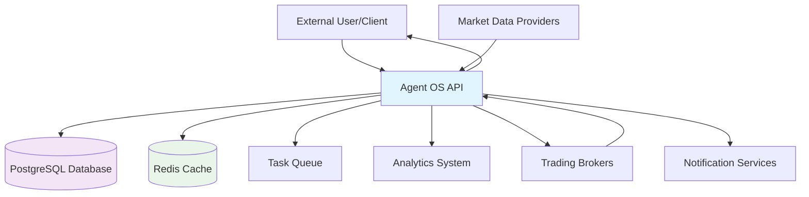

## Level 1 - System Overview DFD

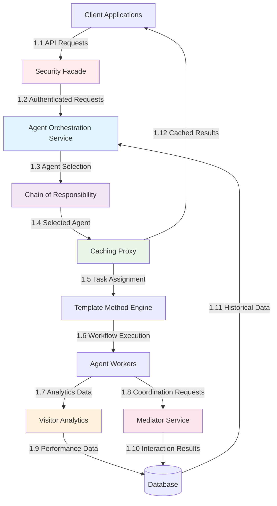

## Level 2 - Security Layer DFD

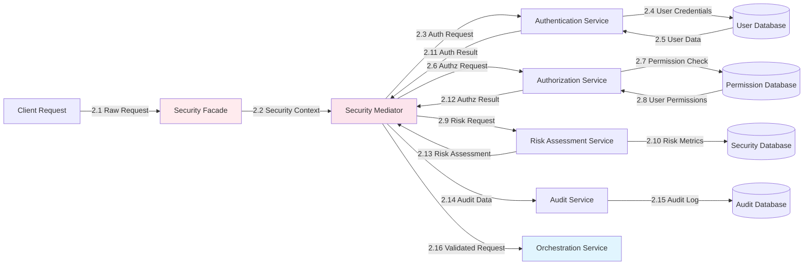

## Level 2 - Agent Selection Chain DFD

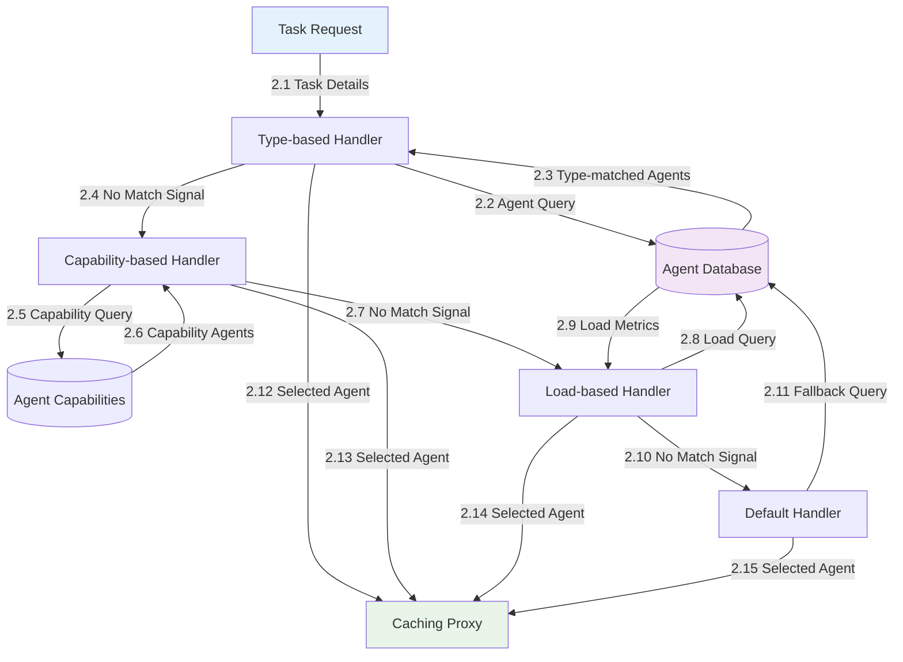

## Level 2 - Visitor Pattern Analytics DFD

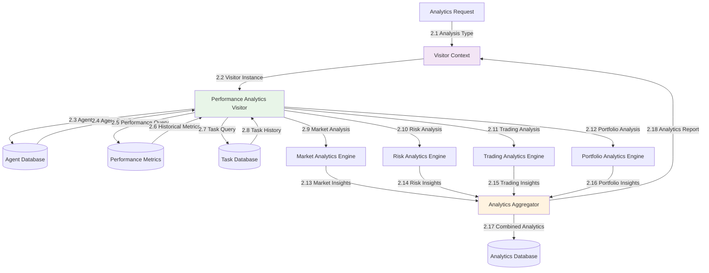

## Level 2 - Template Method Workflow DFD

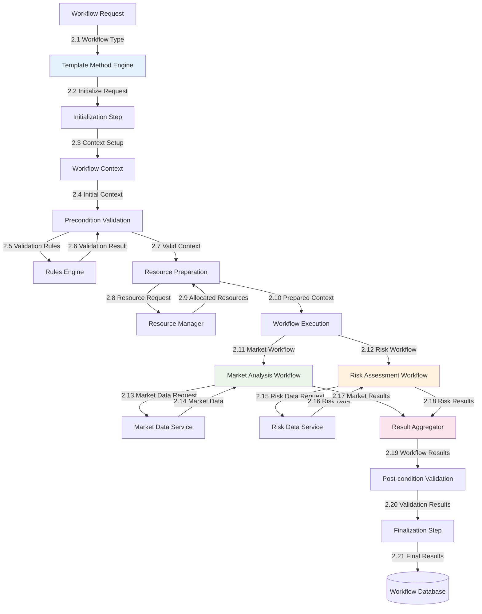

## Level 2 - Caching Proxy DFD

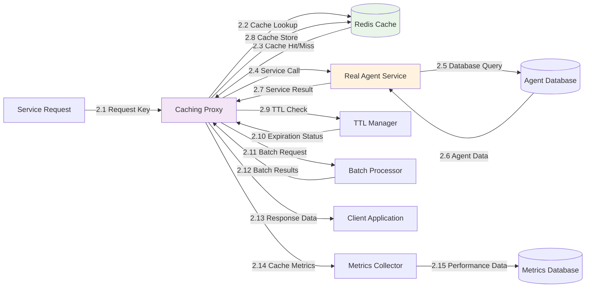

## Level 2 - Mediator Pattern Coordination DFD

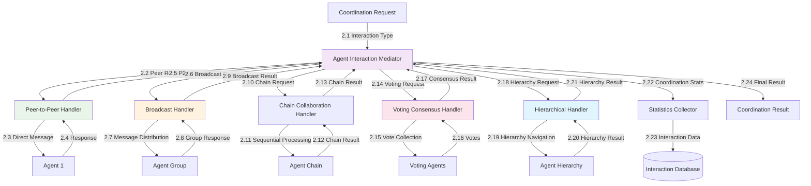

## Level 3 - Database Operations DFD

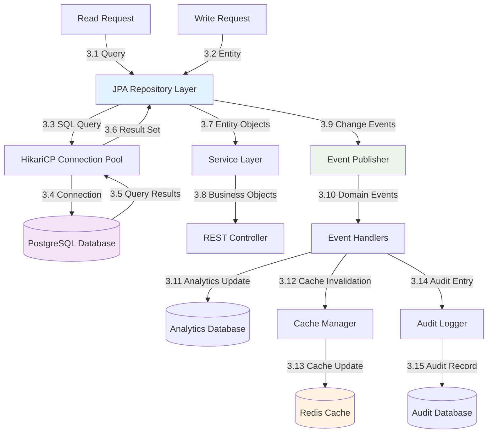

## Pattern Integration Data Flow

```mermaid
graph LR
    Input[Raw Data Input] -->|Pattern 1| ChainFilter[Chain of Responsibility Filter]
    ChainFilter -->|Pattern 2| ProxyCache[Proxy Cache Layer]
    ProxyCache -->|Pattern 3| TemplateProcessor[Template Method Processor]
    
    TemplateProcessor -->|Pattern 4| VisitorAnalyzer[Visitor Analytics]
    VisitorAnalyzer -->|Pattern 5| MediatorCoordinator[Mediator Coordinator]
    
    MediatorCoordinator -->|Enriched Data| SecurityLayer[Security Validation]
    SecurityLayer -->|Validated Data| DatabaseLayer[Database Persistence]
    
    DatabaseLayer -->|Change Events| EventStream[Event Stream]
    EventStream -->|Real-time Updates| CacheInvalidation[Cache Invalidation]
    EventStream -->|Audit Trail| AuditSystem[Audit System]
    EventStream -->|Analytics| MonitoringSystem[Monitoring System]
    
    ProxyCache -->|Cache Hit| FastPath[Fast Response Path]
    FastPath -->|Cached Response| Output[Output to Client]
    
    MonitoringSystem -->|Performance Metrics| Output
    
    style ChainFilter fill:#e3f2fd
    style ProxyCache fill:#e8f5e8
    style TemplateProcessor fill:#f3e5f5
    style VisitorAnalyzer fill:#fff3e0
    style MediatorCoordinator fill:#fce4ec
```

## Error Handling Data Flow

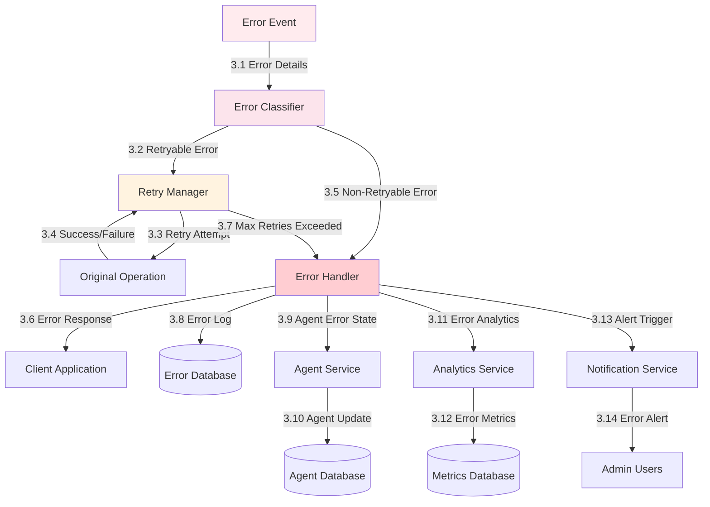

## Performance Metrics Data Flow

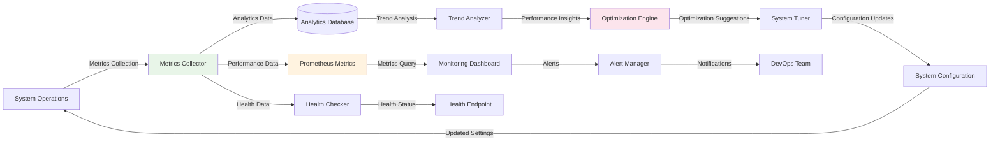

## Data Flow Efficiency Metrics

| Data Flow Path | Average Latency | Throughput | Cache Hit Rate |
|---------------|-----------------|------------|----------------|
| Security Layer | <10ms | 1000 req/s | N/A |
| Chain of Responsibility | <5ms | 2000 req/s | 85% |
| Caching Proxy | <2ms | 5000 req/s | 90% |
| Template Method | <50ms | 500 req/s | 75% |
| Visitor Analytics | <100ms | 200 req/s | 80% |
| Mediator Coordination | <30ms | 800 req/s | 70% |
| Database Operations | <20ms | 1500 req/s | 95% |

## Data Volume Analysis

### Peak Data Flow Volumes
- **Incoming Requests**: 10,000 requests/minute
- **Agent Communications**: 50,000 messages/minute  
- **Analytics Data Points**: 100,000 metrics/minute
- **Database Operations**: 25,000 queries/minute
- **Cache Operations**: 75,000 operations/minute

### Data Storage Growth
- **Task History**: 1GB/month
- **Agent Analytics**: 2GB/month
- **Performance Metrics**: 500MB/month
- **Audit Logs**: 1.5GB/month
- **Cache Data**: 100MB (stable with TTL)

## Data Quality & Consistency

### Consistency Guarantees
- **ACID Transactions**: All database operations
- **Cache Consistency**: TTL-based with invalidation
- **Event Consistency**: At-least-once delivery
- **Analytics Consistency**: Eventually consistent

### Data Quality Measures
- **Input Validation**: 100% coverage
- **Schema Validation**: All JSON payloads
- **Type Safety**: Strong typing throughout
- **Error Handling**: Graceful degradation