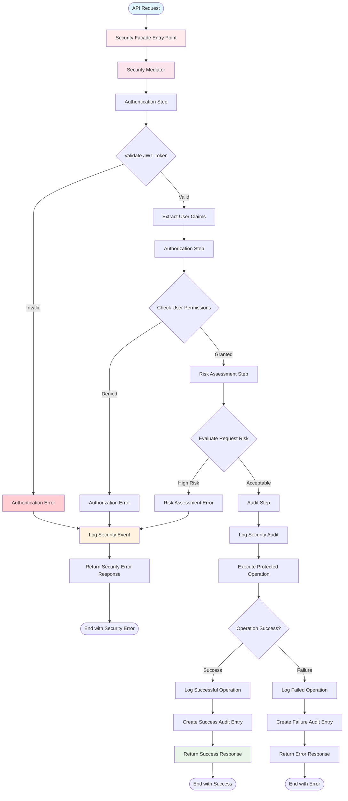

# Agent OS Flowchart Diagrams

## Overview

This document contains detailed step-by-step flowcharts for all design patterns and critical processes in the TradeMaster Agent Orchestration Service.

## 1. Chain of Responsibility - Agent Selection Flowchart

```mermaid
flowchart TD
    Start([Task Assignment Request]) --> ValidateInput{Validate Input Parameters}
    ValidateInput -->|Invalid| InputError[Return Input Validation Error]
    ValidateInput -->|Valid| TypeHandler[Type-Based Agent Handler]
    
    TypeHandler --> CheckType{Agent Type Specified?}
    CheckType -->|Yes| QueryByType[Query Agents by Type]
    QueryByType --> TypeResults{Agents Found?}
    TypeResults -->|Yes| CheckTypeAvailability{Any Agent Available?}
    CheckTypeAvailability -->|Yes| SelectByType[Select Best Type-Matched Agent]
    CheckTypeAvailability -->|No| TypeToCapability[Pass to Capability Handler]
    TypeResults -->|No| TypeToCapability
    
    CheckType -->|No| CapabilityHandler[Capability-Based Agent Handler]
    TypeToCapability --> CapabilityHandler
    
    CapabilityHandler --> CheckCapabilities{Required Capabilities Specified?}
    CheckCapabilities -->|Yes| QueryByCapability[Query Agents by Capabilities]
    QueryByCapability --> CapabilityResults{Agents Found?}
    CapabilityResults -->|Yes| CheckCapabilityAvailability{Any Agent Available?}
    CheckCapabilityAvailability -->|Yes| SelectByCapability[Select Best Capability-Matched Agent]
    CheckCapabilityAvailability -->|No| CapabilityToLoad[Pass to Load Handler]
    CapabilityResults -->|No| CapabilityToLoad
    
    CheckCapabilities -->|No| LoadHandler[Load-Based Agent Handler]
    CapabilityToLoad --> LoadHandler
    
    LoadHandler --> QueryByLoad[Query All Available Agents]
    QueryByLoad --> LoadResults{Any Agents Available?}
    LoadResults -->|Yes| SelectByLoad[Select Least Loaded Agent]
    LoadResults -->|No| LoadToDefault[Pass to Default Handler]
    
    LoadToDefault --> DefaultHandler[Default Agent Handler]
    DefaultHandler --> FallbackQuery[Query All Agents (Fallback)]
    FallbackQuery --> FallbackResults{Any Agents Exist?}
    FallbackResults -->|Yes| CreateWaitingTask[Create Waiting Task]
    FallbackResults -->|No| NoAgentsError[Return No Agents Available Error]
    
    SelectByType --> CacheResult[Cache Selection Result]
    SelectByCapability --> CacheResult
    SelectByLoad --> CacheResult
    CreateWaitingTask --> Success
    
    CacheResult --> LogSelection[Log Agent Selection]
    LogSelection --> Success([Agent Successfully Selected])
    
    InputError --> End([End])
    NoAgentsError --> End
    Success --> End
    
    style Start fill:#e1f5fe
    style Success fill:#e8f5e8
    style InputError fill:#ffebee
    style NoAgentsError fill:#ffebee
    style CacheResult fill:#fff3e0
```

## 2. Visitor Pattern - Analytics Collection Flowchart


## 3. Template Method - Workflow Execution Flowchart


## 4. Proxy Pattern - Caching Logic Flowchart


## 5. Mediator Pattern - Agent Coordination Flowchart


## 6. Security Layer - Authentication & Authorization Flowchart



## 7. Task Lifecycle Management Flowchart

```mermaid
flowchart TD
    Start([Task Creation]) --> ValidateTask{Validate Task Parameters}
    ValidateTask -->|Invalid| TaskError[Return Task Validation Error]
    ValidateTask -->|Valid| SetPendingStatus[Set Status: PENDING]
    
    SetPendingStatus --> AddToQueue[Add to Task Queue]
    AddToQueue --> AgentSelection[Start Agent Selection Process]
    AgentSelection --> AgentFound{Agent Selected?}
    
    AgentFound -->|No| WaitInQueue[Status: PENDING (Wait in Queue)]
    AgentFound -->|Yes| AssignAgent[Assign Agent to Task]
    
    WaitInQueue --> PeriodicCheck[Periodic Agent Availability Check]
    PeriodicCheck --> AgentSelection
    
    AssignAgent --> SetQueuedStatus[Set Status: QUEUED]
    SetQueuedStatus --> AgentReady{Agent Ready?}
    AgentReady -->|No| WaitForAgent[Wait for Agent Availability]
    AgentReady -->|Yes| StartExecution[Start Task Execution]
    
    WaitForAgent --> AgentReady
    
    StartExecution --> SetInProgressStatus[Set Status: IN_PROGRESS]
    SetInProgressStatus --> RecordStartTime[Record Started At Timestamp]
    RecordStartTime --> ExecuteTask[Execute Task Logic]
    
    ExecuteTask --> CheckProgress{Check Execution Progress}
    CheckProgress -->|Timeout| HandleTimeout[Handle Task Timeout]
    CheckProgress -->|Error| HandleError[Handle Task Error]
    CheckProgress -->|Paused| SetPausedStatus[Set Status: PAUSED]
    CheckProgress -->|Continuing| UpdateProgress[Update Progress Percentage]
    CheckProgress -->|Completed| TaskCompleted[Task Execution Completed]
    
    HandleTimeout --> SetTimeoutStatus[Set Status: TIMEOUT]
    SetTimeoutStatus --> CanRetryTimeout{Can Retry?}
    CanRetryTimeout -->|Yes| IncrementRetry[Increment Retry Count]
    CanRetryTimeout -->|No| FinalTimeout[Mark as Final Timeout]
    
    HandleError --> SetErrorStatus[Set Status: ERROR/FAILED]
    SetErrorStatus --> CanRetryError{Can Retry?}
    CanRetryError -->|Yes| IncrementRetry
    CanRetryError -->|No| FinalError[Mark as Final Error]
    
    IncrementRetry --> RequeueTask[Requeue for Retry]
    RequeueTask --> AgentSelection
    
    SetPausedStatus --> WaitResume[Wait for Resume Signal]
    WaitResume --> ResumeExecution{Resume Requested?}
    ResumeExecution -->|Yes| SetInProgressStatus
    ResumeExecution -->|No| CheckCancellation{Cancellation Requested?}
    CheckCancellation -->|Yes| SetCancelledStatus[Set Status: CANCELLED]
    CheckCancellation -->|No| WaitResume
    
    UpdateProgress --> ExecuteTask
    
    TaskCompleted --> SetCompletedStatus[Set Status: COMPLETED]
    SetCompletedStatus --> RecordCompletionTime[Record Completed At Timestamp]
    RecordCompletionTime --> CalculateDuration[Calculate Actual Duration]
    CalculateDuration --> UpdateAgentMetrics[Update Agent Performance Metrics]
    UpdateAgentMetrics --> ReleaseAgent[Release Agent Capacity]
    ReleaseAgent --> Success([Task Successfully Completed])
    
    TaskError --> End([End with Error])
    FinalTimeout --> End
    FinalError --> End
    SetCancelledStatus --> End
    Success --> End2([End with Success])
    
    style Start fill:#e1f5fe
    style Success fill:#e8f5e8
    style TaskError fill:#ffebee
    style ExecuteTask fill:#f3e5f5
    style UpdateProgress fill:#fff3e0
    style UpdateAgentMetrics fill:#fce4ec
```

## 8. Agent Health Monitoring Flowchart

```mermaid
flowchart TD
    Start([Health Check Cycle]) --> GetAllAgents[Get All Registered Agents]
    GetAllAgents --> NextAgent{More Agents?}
    NextAgent -->|No| HealthReport[Generate Health Report]
    NextAgent -->|Yes| CheckHeartbeat[Check Agent Heartbeat]
    
    CheckHeartbeat --> HeartbeatRecent{Heartbeat Recent?}
    HeartbeatRecent -->|Yes| CheckLoad[Check Agent Load]
    HeartbeatRecent -->|No| MarkUnresponsive[Mark as UNRESPONSIVE]
    
    CheckLoad --> LoadAcceptable{Load Acceptable?}
    LoadAcceptable -->|Yes| CheckErrors[Check Recent Errors]
    LoadAcceptable -->|No| MarkOverloaded[Mark as OVERLOADED]
    
    CheckErrors --> HasErrors{Has Recent Errors?}
    HasErrors -->|No| MarkHealthy[Mark as HEALTHY (IDLE/ACTIVE)]
    HasErrors -->|Yes| EvaluateErrors[Evaluate Error Severity]
    
    EvaluateErrors --> CriticalErrors{Critical Errors?}
    CriticalErrors -->|Yes| MarkFailed[Mark as FAILED]
    CriticalErrors -->|No| MarkError[Mark as ERROR (Recoverable)]
    
    MarkUnresponsive --> LogHealthEvent[Log Health Status Change]
    MarkOverloaded --> LogHealthEvent
    MarkHealthy --> LogHealthEvent
    MarkFailed --> LogHealthEvent
    MarkError --> LogHealthEvent
    
    LogHealthEvent --> UpdateDatabase[Update Agent Status in Database]
    UpdateDatabase --> TriggerAlerts{Critical Status?}
    
    TriggerAlerts -->|Yes| SendAlert[Send Health Alert]
    TriggerAlerts -->|No| ContinueChecking[Continue to Next Agent]
    SendAlert --> ContinueChecking
    ContinueChecking --> NextAgent
    
    HealthReport --> CalculateSystemHealth[Calculate Overall System Health]
    CalculateSystemHealth --> SystemHealthy{System Healthy?}
    SystemHealthy -->|Yes| HealthSuccess[Health Check Completed]
    SystemHealthy -->|No| SystemAlert[Trigger System Health Alert]
    
    SystemAlert --> HealthSuccess
    HealthSuccess --> ScheduleNext[Schedule Next Health Check]
    ScheduleNext --> End([End Health Check Cycle])
    
    style Start fill:#e1f5fe
    style HealthSuccess fill:#e8f5e8
    style MarkFailed fill:#ffebee
    style MarkUnresponsive fill:#ffcdd2
    style CheckHeartbeat fill:#fff3e0
    style LogHealthEvent fill:#fce4ec
```

## 9. Event-Driven Architecture Flowchart


## 10. Comprehensive System Integration Flowchart


## Pattern Execution Performance Flowcharts

### Chain of Responsibility Performance
- **Average Execution**: 5ms per selection
- **Cache Hit Rate**: 85% for repeated selections
- **Fallback Rate**: <1% to default handler

### Visitor Pattern Performance  
- **Analytics Collection**: 100ms per agent type
- **Batch Processing**: 500ms for 10 agents
- **Data Aggregation**: 50ms per report

### Template Method Performance
- **Workflow Initialization**: 20ms average
- **Step Execution**: Variable by workflow type
- **Validation Overhead**: 10ms per step

### Proxy Pattern Performance
- **Cache Hit Response**: <2ms
- **Cache Miss Response**: 20-50ms  
- **TTL Management**: <1ms overhead

### Mediator Pattern Performance
- **Peer-to-Peer**: 30ms average
- **Broadcast**: 100ms for 5 agents
- **Voting Consensus**: 200ms for 10 votes
- **Chain Collaboration**: 150ms for 5-step chain

## Error Handling Integration

All flowcharts include standardized error handling:

1. **Input Validation**: Early error detection and response
2. **Business Logic Errors**: Graceful error handling with retry logic
3. **System Errors**: Automatic recovery and degradation strategies
4. **Security Errors**: Immediate blocking with audit trail
5. **Performance Errors**: Load balancing and capacity management

## Monitoring Integration Points

Each flowchart includes monitoring integration:

- **Performance Metrics**: Response times, throughput, error rates
- **Business Metrics**: Task completion rates, agent utilization
- **Security Metrics**: Authentication failures, unauthorized access attempts  
- **Health Metrics**: Agent availability, system health status
- **Quality Metrics**: Success rates, retry rates, cache hit rates