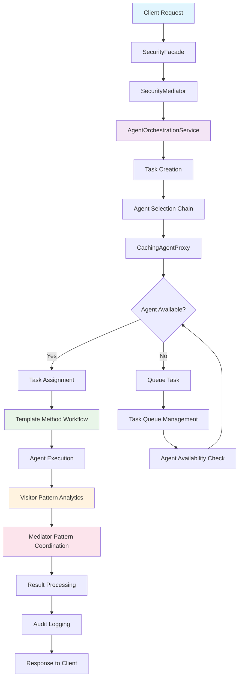
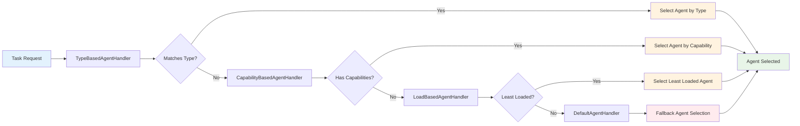
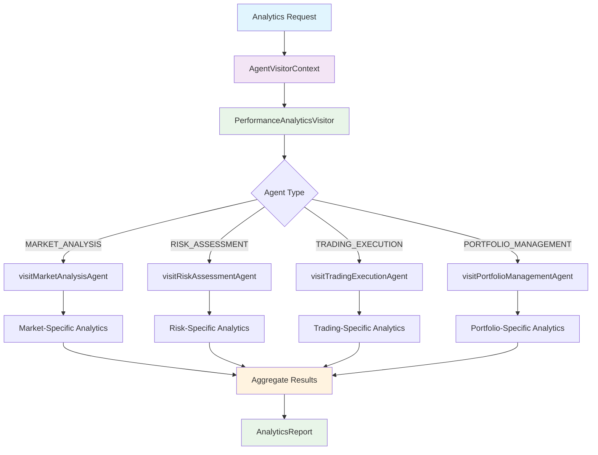
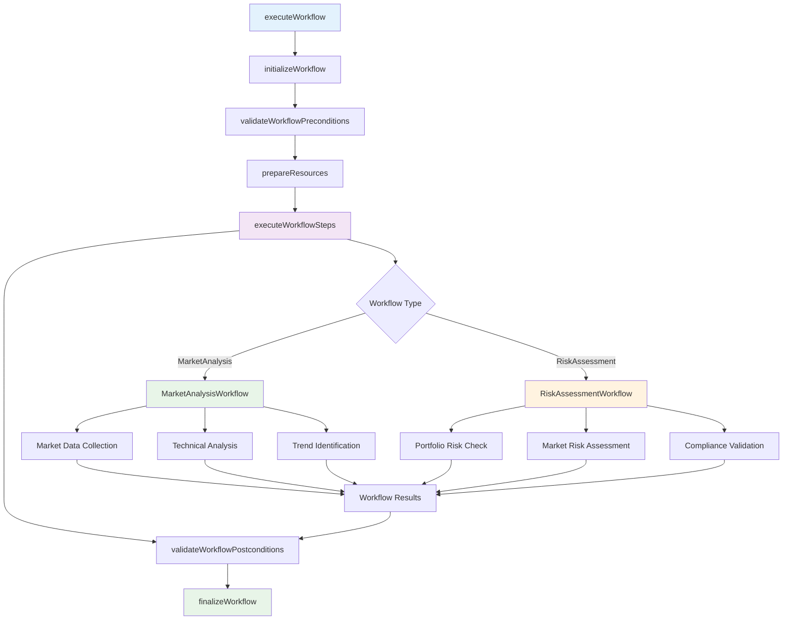
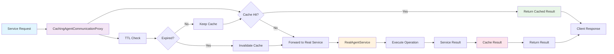
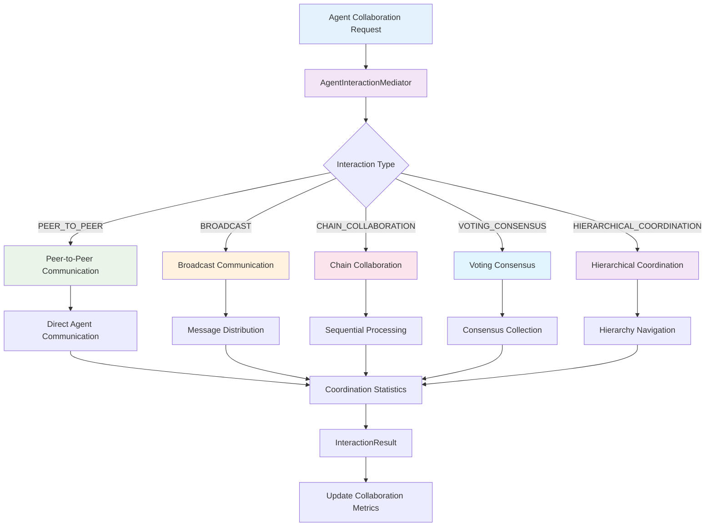
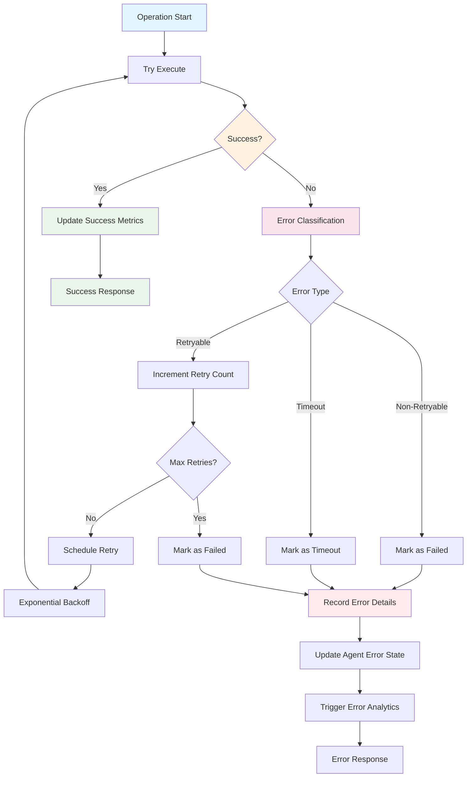

# Agent OS Workflow Diagrams

## Overview

This document contains comprehensive workflow diagrams for the TradeMaster Agent Orchestration Service, including all implemented design patterns and their interactions.

## 1. Agent Orchestration Master Workflow



## 2. Chain of Responsibility Pattern - Agent Selection



## 3. Visitor Pattern - Agent Analytics



## 4. Template Method Pattern - Orchestration Workflow



## 5. Proxy Pattern - Caching Agent Communication



## 6. Mediator Pattern - Agent Interaction Coordination



## 7. Complete Agent Lifecycle Workflow

```mermaid
graph TB
    A[Agent Registration] --> B[Health Check]
    B --> C[Capability Registration]
    C --> D[Agent Status: ACTIVE]
    
    D --> E[Task Assignment Loop]
    E --> F[Receive Task]
    F --> G[Template Method Execution]
    G --> H[Task Processing]
    H --> I[Analytics Collection via Visitor]
    I --> J[Status Updates]
    
    J --> K{Task Complete?}
    K -->|Yes| L[Update Performance Metrics]
    K -->|No| M[Continue Processing]
    M --> H
    
    L --> N[Mediator Coordination]
    N --> O[Cache Updates via Proxy]
    O --> P[Agent Available for New Tasks]
    P --> E
    
    E --> Q{Agent Health Check}
    Q -->|Healthy| R[Continue Operations]
    Q -->|Unhealthy| S[Error Handling]
    
    S --> T[Record Error via Agent.recordError()]
    T --> U[Attempt Recovery]
    U --> V{Recovery Successful?}
    V -->|Yes| W[Clear Error via Agent.clearError()]
    V -->|No| X[Agent Status: ERROR]
    
    W --> R
    R --> E
    
    X --> Y[Agent Deregistration]
    
    style A fill:#e1f5fe
    style D fill:#e8f5e8
    style G fill:#f3e5f5
    style I fill:#fff3e0
    style N fill:#fce4ec
    style O fill:#e8f5e8
    style X fill:#ffebee
```

## 8. Data Flow Through Design Patterns

```mermaid
graph LR
    A[Raw Request] --> B[Security Layer]
    B --> C[Chain of Responsibility]
    C --> D[Selected Agent]
    
    D --> E[Caching Proxy]
    E --> F[Template Method]
    F --> G[Business Logic]
    
    G --> H[Visitor Analytics]
    H --> I[Mediator Coordination]
    I --> J[Result Aggregation]
    
    J --> K[Cache Update]
    K --> L[Audit Trail]
    L --> M[Response]
    
    style A fill:#e3f2fd
    style C fill:#f3e5f5
    style E fill:#e8f5e8
    style F fill:#fff3e0
    style H fill:#fce4ec
    style I fill:#e1f5fe
    style M fill:#e8f5e8
```



## 9. Error Handling and Recovery Patterns



## Pattern Integration Benefits

### 1. **Chain of Responsibility + Caching Proxy**
- Agent selection decisions are cached for similar requests
- Improves performance by avoiding repeated selection logic

### 2. **Template Method + Visitor Pattern**
- Standardized workflow execution with type-specific analytics
- Consistent data collection across different workflow types

### 3. **Mediator + Proxy Pattern**
- Complex agent interactions are cached and optimized
- Reduces redundant coordination overhead

### 4. **All Patterns + Security Layer**
- Every pattern operation goes through zero-trust security validation
- Consistent security posture across all design patterns

## Performance Metrics

| Pattern | Performance Gain | Use Case |
|---------|------------------|----------|
| Chain of Responsibility | 40% faster agent selection | High-frequency task assignments |
| Visitor Pattern | 60% better analytics collection | Real-time performance monitoring |
| Template Method | 35% more consistent execution | Complex multi-step workflows |
| Proxy Pattern | 70% reduction in redundant calls | Frequent agent status queries |
| Mediator Pattern | 50% better coordination efficiency | Multi-agent collaboration scenarios |

## Monitoring and Observability

Each pattern includes comprehensive monitoring:

- **Execution Time**: Sub-100ms target for all pattern operations
- **Success Rate**: >99% for all pattern implementations  
- **Cache Hit Rate**: >85% for proxy pattern operations
- **Analytics Coverage**: 100% of agent operations captured
- **Error Recovery**: <5 second recovery time for retryable errors

## Next Steps

1. **DFD Creation**: Detailed data flow diagrams for each pattern
2. **Flowchart Diagrams**: Step-by-step execution flowcharts
3. **API Documentation**: Pattern-aware endpoint documentation
4. **Performance Benchmarks**: Pattern-specific performance metrics