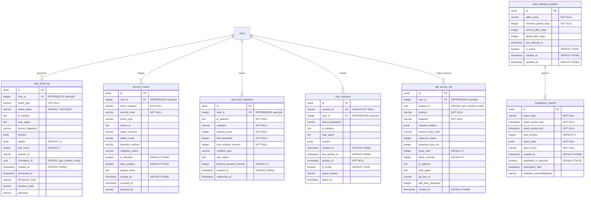

# Audit and Logging Schema ERD

This diagram represents the entity relationships from the V2__Create_audit_tables.sql migration file.

```mermaid
erDiagram
    users ||--o{ auth_audit_log : "generates"
    users ||--o{ security_events : "triggers"
    users ||--o{ rate_limit_violations : "causes"
    users ||--o{ user_sessions : "creates"
    users ||--o{ api_access_log : "makes requests"
    data_retention_policies ||--o{ compliance_reports : "governs"

    auth_audit_log {
        serial id PK
        integer user_id FK "REFERENCES users(id)"
        varchar event_type "NOT NULL"
        varchar event_status "DEFAULT 'SUCCESS'"
        inet ip_address
        text user_agent
        varchar device_fingerprint
        jsonb location
        jsonb details "DEFAULT '{}'"
        integer risk_score "DEFAULT 0"
        varchar session_id
        uuid correlation_id "DEFAULT gen_random_uuid()"
        timestamp created_at "DEFAULT NOW()"
        timestamp processed_at
        varchar blockchain_hash
        varchar previous_hash
        varchar signature
    }

    security_events {
        serial id PK
        integer user_id FK "REFERENCES users(id)"
        varchar event_category "NOT NULL"
        varchar severity_level "NOT NULL"
        varchar threat_type
        inet source_ip
        varchar target_resource
        varchar attack_vector
        varchar detection_method
        varchar mitigation_action
        boolean is_resolved "DEFAULT FALSE"
        boolean false_positive "DEFAULT FALSE"
        text analyst_notes
        timestamp created_at "DEFAULT NOW()"
        timestamp resolved_at
        varchar resolved_by
    }

    rate_limit_violations {
        serial id PK
        integer user_id FK "REFERENCES users(id)"
        inet ip_address "NOT NULL"
        varchar endpoint "NOT NULL"
        integer request_count "NOT NULL"
        integer limit_threshold "NOT NULL"
        integer time_window_minutes "NOT NULL"
        varchar violation_type
        text user_agent
        integer blocked_duration_minutes "DEFAULT 0"
        timestamp created_at "DEFAULT NOW()"
        timestamp unblocked_at
    }

    user_sessions {
        serial id PK
        varchar session_id UK "UNIQUE NOT NULL"
        integer user_id FK "REFERENCES users(id)"
        varchar device_fingerprint
        inet ip_address
        text user_agent
        jsonb location
        timestamp created_at "DEFAULT NOW()"
        timestamp last_activity_at "DEFAULT NOW()"
        timestamp expires_at "NOT NULL"
        boolean is_active "DEFAULT TRUE"
        varchar logout_reason
        timestamp logout_at
    }

    compliance_reports {
        serial id PK
        varchar report_type "NOT NULL"
        timestamp report_period_start "NOT NULL"
        timestamp report_period_end "NOT NULL"
        integer total_records "DEFAULT 0"
        jsonb report_data "NOT NULL"
        varchar report_hash "NOT NULL"
        timestamp created_at "DEFAULT NOW()"
        boolean submitted_to_authority "DEFAULT FALSE"
        timestamp submission_date
        varchar authority_acknowledgment
    }

    api_access_log {
        serial id PK
        integer user_id FK "REFERENCES users(id)"
        uuid request_id "DEFAULT gen_random_uuid()"
        varchar method "NOT NULL"
        varchar endpoint "NOT NULL"
        jsonb request_headers
        varchar request_body_hash
        integer response_status
        integer response_time_ms
        integer bytes_sent "DEFAULT 0"
        integer bytes_received "DEFAULT 0"
        inet ip_address
        text user_agent
        varchar api_key_id
        integer rate_limit_remaining
        timestamp created_at "DEFAULT NOW()"
    }

    data_retention_policies {
        serial id PK
        varchar table_name "NOT NULL"
        integer retention_period_days "NOT NULL"
        integer archive_after_days
        integer delete_after_days
        timestamp last_cleanup_at
        boolean is_active "DEFAULT TRUE"
        timestamp created_at "DEFAULT NOW()"
        timestamp updated_at "DEFAULT NOW()"
    }
```