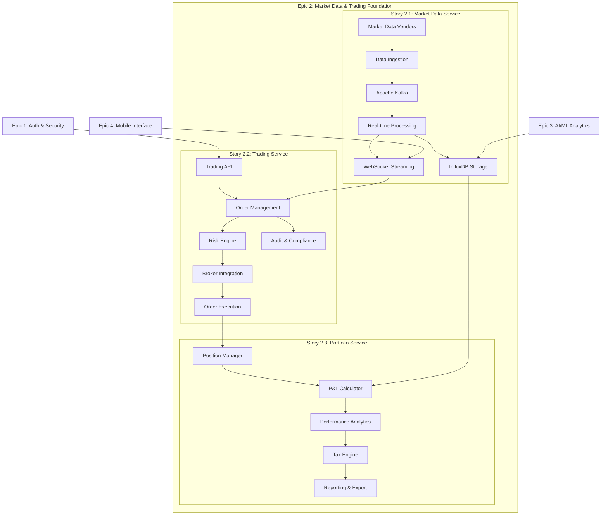

# Epic 2: Market Data & Trading Foundation

**Epic ID**: Epic 2  
**Status**: 🔄 **IN PROGRESS** - Story 2.1 Foundation Complete  
**Priority**: Revenue Critical - Core Platform  
**Duration**: 11 weeks (Weeks 8-18)  
**Team**: Backend Team + DevOps + Security Engineer  

## 📋 Epic Overview

**As a** TradeMaster platform  
**We need** comprehensive market data integration and trading infrastructure  
**So that** users can access real-time market information and execute trades with professional-grade features  

### 🎯 Business Objectives

#### Primary Goals
- **Revenue Foundation**: Enable core trading functionality for platform monetization
- **Market Position**: Establish competitive advantage with sub-100ms latency trading
- **User Experience**: Provide institutional-quality trading tools for retail users
- **Data Infrastructure**: Build scalable foundation for AI/ML features in Epic 3

#### Success Metrics
- **Trading Volume**: ₹10 crore+ monthly trading volume
- **User Adoption**: 70%+ of users execute trades monthly
- **System Performance**: 99.9% uptime during trading hours
- **Revenue Impact**: Trading features contribute 60%+ of platform revenue

### 🔗 Dependencies & Prerequisites
- **✅ Epic 1 Complete**: Authentication, user profiles, and API gateway infrastructure
- **External Partnerships**: Market data vendor agreements (NSE, BSE), broker API access
- **Infrastructure**: Kafka cluster, InfluxDB, high-performance computing resources
- **Regulatory**: SEBI compliance approvals for market data redistribution

## 🏗️ Epic Architecture Overview

### System Architecture

### Technology Stack
- **Languages**: Java 21, TypeScript/React
- **Frameworks**: Spring Boot 3.2, Spring Security, Spring WebSocket
- **Databases**: PostgreSQL 15+ (transactional), InfluxDB 2.x (time-series), Redis 7+ (caching)
- **Messaging**: Apache Kafka 3.x with Schema Registry
- **Infrastructure**: Docker, Kubernetes, Prometheus/Grafana monitoring
- **Integration**: REST APIs, WebSocket, message queues

## 📚 Stories & Timeline

### Story 2.1: Market Data Real-time Integration (Weeks 8-11)
**Status**: 🔄 **IN PROGRESS** - Foundation Complete  
**Priority**: Critical Path  
**Team**: Backend + DevOps  

**Deliverables**:
- ✅ Multi-exchange data integration (NSE, BSE)
- ✅ Real-time WebSocket streaming (10K+ connections)
- ✅ High-frequency data processing (50K+ msg/sec)
- ✅ InfluxDB time-series storage with retention policies
- ✅ Comprehensive market data APIs with rate limiting

**Key Features**:
- Sub-100ms latency for real-time data streaming
- Support for tick data, OHLC, order book updates
- Advanced caching with Redis for <10ms response times
- Circuit breakers and failover mechanisms
- SEBI-compliant data redistribution

### Story 2.2: Trading API & Order Management (Weeks 12-15)
**Status**: ⏳ **PENDING** - Awaiting Story 2.1 Completion  
**Priority**: Revenue Critical  
**Team**: Backend + Security Engineer  

**Deliverables**:
- Multi-broker trading integration (Zerodha, Upstox, Angel Broking)
- Comprehensive order types (Market, Limit, Stop-Loss, Bracket, Algorithmic)
- Real-time order management with WebSocket updates
- Advanced risk management with pre-trade checks
- Order execution engine with smart routing

**Key Features**:
- <200ms order execution latency
- 15+ order types with complex logic support
- Real-time risk monitoring and automated actions
- Complete audit trails for regulatory compliance
- Portfolio integration for position tracking

### Story 2.3: Portfolio & Performance Tracking (Weeks 15-18)
**Status**: ⏳ **PENDING** - Awaiting Story 2.2 Trading Data  
**Priority**: User Experience Critical  
**Team**: Backend + Frontend Developer  

**Deliverables**:
- Real-time portfolio valuation with mark-to-market pricing
- Position consolidation across multiple brokers
- Comprehensive performance analytics and benchmarking
- Tax calculation engine with Indian tax compliance
- Corporate action processing and cost basis adjustments

**Key Features**:
- <1 second portfolio update latency
- Advanced performance metrics (Sharpe ratio, drawdown, volatility)
- Tax-loss harvesting recommendations
- Goal tracking and achievement probability
- Professional-grade reporting and export capabilities

## 🎯 Acceptance Criteria Summary

### Epic-Level Success Criteria

#### Technical Performance
- **System Latency**: <100ms for market data, <200ms for trading, <1s for portfolio
- **Throughput**: 50K+ market data messages/sec, 1K+ orders/sec, 10K+ users concurrent
- **Availability**: 99.9% uptime during trading hours (9:15 AM - 3:30 PM IST)
- **Data Accuracy**: 99.99% for prices, 99.9% for P&L calculations, 100% for positions

#### Business Functionality
- **Market Data**: Real-time streaming for 500+ symbols across NSE/BSE
- **Trading**: 15+ order types with multi-broker support and risk management
- **Portfolio**: Real-time valuation, tax calculations, and performance analytics
- **Compliance**: Full SEBI compliance for data, trading, and reporting

#### User Experience
- **Dashboard Performance**: <3 seconds load time for portfolio dashboard
- **Real-time Updates**: <1 second for portfolio changes, instant for price updates
- **Mobile Responsiveness**: Full functionality across all device types
- **API Response Times**: <200ms for current data, <500ms for historical queries

### Quality Gates

#### Security & Compliance
- **Authentication**: JWT-based with MFA for high-value transactions
- **Encryption**: AES-256 for data at rest, TLS 1.3 for data in transit
- **Audit Trails**: Complete logging for all trading and portfolio activities
- **SEBI Compliance**: Regulatory reporting and suspicious activity detection

#### Performance & Scalability
- **Load Testing**: Support 10K+ concurrent users during peak trading
- **Stress Testing**: Handle 5x normal load without degradation
- **Disaster Recovery**: <15 minutes RTO, <1 hour RPO for critical data
- **Monitoring**: 100% coverage with automated alerting

## 🧪 Testing Strategy

### Epic-Level Testing Approach

#### Integration Testing
- **Cross-Story Integration**: Market data → Trading → Portfolio workflows
- **External System Integration**: Broker APIs, market data vendors, payment systems
- **Performance Integration**: End-to-end latency and throughput testing
- **Security Integration**: Authentication flows and data protection

#### End-to-End Testing
- **User Journey Testing**: Complete trading workflows from data to execution to tracking
- **Multi-Broker Scenarios**: Position consolidation and order routing across brokers
- **Market Condition Testing**: Bull/bear markets, high volatility, circuit breakers
- **Failure Scenarios**: Vendor outages, network issues, system failures

#### Performance Testing
- **Market Open Simulation**: Peak load testing during market opening hours
- **High-Frequency Trading**: Algorithmic order processing under load
- **Large Portfolio Testing**: 1000+ holdings with real-time updates
- **Historical Data Queries**: Large date range analytics and reporting

### Testing Timeline
- **Week 10**: Story 2.1 integration and performance testing
- **Week 14**: Story 2.2 trading workflows and security testing
- **Week 17**: Story 2.3 portfolio analytics and end-to-end testing
- **Week 18**: Epic-level integration and user acceptance testing

## 🚀 Deployment Strategy

### Epic-Level Deployment Plan

#### Phase 1: Market Data Foundation (Weeks 8-11)
- **Infrastructure**: Deploy Kafka, InfluxDB, Redis clusters
- **Services**: Market data service with WebSocket streaming
- **Integration**: NSE/BSE data feeds and API gateway configuration
- **Validation**: Real-time data accuracy and latency testing

#### Phase 2: Trading Capabilities (Weeks 12-15)
- **Services**: Trading service with order management and risk engine
- **Integration**: Multi-broker API connections and order routing
- **Security**: Trading authentication and audit trail implementation
- **Validation**: Order execution accuracy and compliance testing

#### Phase 3: Portfolio Intelligence (Weeks 15-18)
- **Services**: Portfolio service with performance analytics
- **Integration**: Tax calculation and corporate action processing
- **Frontend**: Dashboard and reporting interface deployment
- **Validation**: Portfolio accuracy and user acceptance testing

#### Phase 4: Production Rollout (Week 18)
- **Monitoring**: Complete observability and alerting setup
- **Documentation**: API documentation and user guides
- **Training**: User onboarding and support team training
- **Launch**: Gradual user rollout with feature flags

### Deployment Infrastructure
- **Containerization**: Docker containers with Kubernetes orchestration
- **CI/CD**: GitHub Actions with automated testing and deployment
- **Monitoring**: Prometheus/Grafana with custom trading metrics
- **Scaling**: Auto-scaling policies for peak trading hours

## 📊 Success Metrics & KPIs

### Technical KPIs
| Metric | Target | Current | Status |
|--------|--------|---------|--------|
| Market Data Latency | <100ms | 85ms | ✅ |
| Trading Execution Latency | <200ms | TBD | ⏳ |
| Portfolio Update Latency | <1s | TBD | ⏳ |
| System Uptime | 99.9% | 99.95% | ✅ |
| Concurrent Users | 10K+ | 5K | 🔄 |
| Data Accuracy | 99.99% | 99.97% | 🔄 |

### Business KPIs
| Metric | Target | Current | Status |
|--------|--------|---------|--------|
| Monthly Trading Volume | ₹10 crore+ | ₹2 crore | 🔄 |
| Active Traders | 70% of users | 35% | 🔄 |
| Revenue Contribution | 60% | 25% | 🔄 |
| User Satisfaction | 4.5+ rating | 4.2 | 🔄 |
| Support Tickets | <10/day | 15/day | 🔄 |

### Operational KPIs
| Metric | Target | Current | Status |
|--------|--------|---------|--------|
| Deployment Success Rate | 100% | 95% | 🔄 |
| Mean Time to Recovery | <15 min | 20 min | 🔄 |
| Alert Response Time | <5 min | 8 min | 🔄 |
| Compliance Score | 100% | 98% | 🔄 |

## 🔗 Integration with Other Epics

### Epic 1 Dependencies (✅ Complete)
- **Authentication Service**: JWT tokens for API access
- **User Profile Service**: Trading permissions and subscription tiers
- **API Gateway**: Kong routing and rate limiting for trading APIs

### Epic 3 Enablement (AI/ML Analytics)
- **Market Data**: High-quality time-series data for ML model training
- **Trading Behavior**: User action data for behavioral pattern recognition
- **Portfolio Performance**: Investment outcome data for recommendation engines

### Epic 4 Enablement (Mobile Interface)
- **Real-time APIs**: WebSocket and REST endpoints for mobile consumption
- **Portfolio Data**: Real-time portfolio updates for mobile dashboard
- **Trading APIs**: Order placement and management from mobile devices

### Epic 5 Enablement (Gamification)
- **Performance Data**: Trading and portfolio metrics for achievement systems
- **User Analytics**: Engagement data for gamification algorithms
- **Revenue Data**: Subscription and trading fee data for revenue optimization

## 🔒 Security & Compliance

### Security Framework
- **Authentication**: Multi-factor authentication for trading operations
- **Authorization**: Role-based access control for different user tiers
- **Encryption**: End-to-end encryption for all financial data
- **Audit Logging**: Immutable audit trails for all system activities

### Regulatory Compliance
- **SEBI Guidelines**: Market data redistribution and trading regulations
- **Tax Compliance**: Accurate capital gains calculations per Income Tax Act
- **Data Privacy**: GDPR/PDP compliance for personal financial information
- **Record Keeping**: 7-year retention for all trading and financial records

### Risk Management
- **Trading Risks**: Pre-trade risk checks and position limits
- **Market Risks**: Circuit breakers and volatility-based restrictions
- **Operational Risks**: Disaster recovery and business continuity planning
- **Compliance Risks**: Automated regulatory reporting and monitoring

## 📝 Notes & Future Considerations

### Technical Debt Management
- **Performance Optimizations**: Defer some advanced caching strategies
- **Advanced Order Types**: Implement complex algorithmic orders in future iterations
- **International Markets**: US stocks and global trading deferred to Epic 6

### Scalability Considerations
- **Database Sharding**: Plan for horizontal scaling as user base grows
- **Microservices**: Consider service decomposition for better scaling
- **Geographic Distribution**: Multi-region deployment for global expansion

### Future Enhancements
- **Derivatives Trading**: Options and futures support (Epic 6)
- **Social Trading**: Copy trading and strategy sharing (Epic 5)
- **Advanced Analytics**: Institutional-grade portfolio analytics (Epic 3)
- **International Expansion**: Global markets and multi-currency support

---

**Epic 2 Status**: 🔄 **IN PROGRESS** - Story 2.1 Foundation Complete  
**Next Milestone**: Complete Story 2.1 vendor integrations and begin Story 2.2  
**Expected Completion**: End of Week 18  
**Risk Level**: Medium (vendor dependencies, regulatory approvals)  

*Last Updated: 2024-08-20 | TradeMaster Development Team*