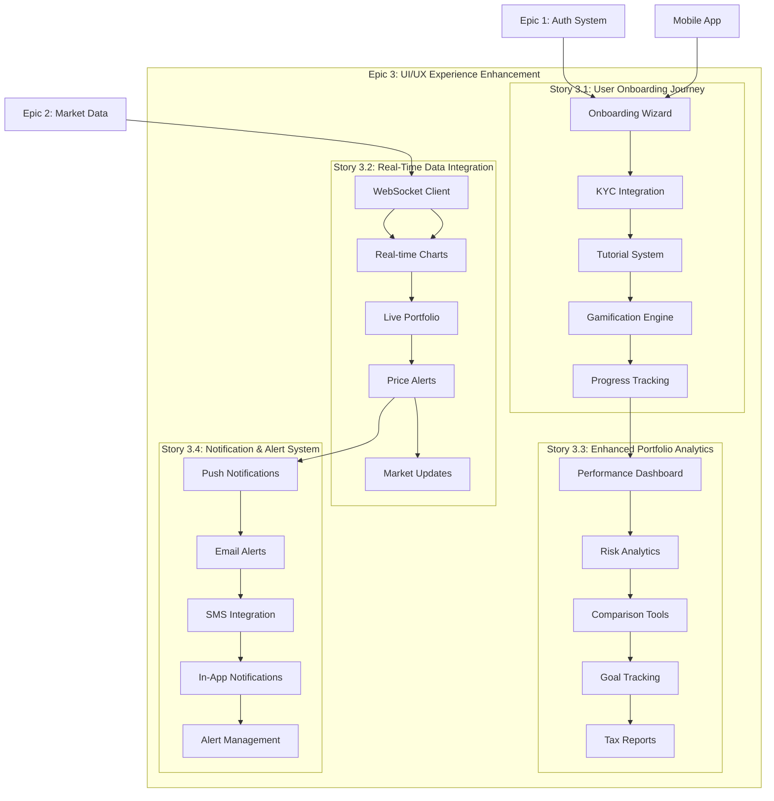

# Epic 3: UI/UX Experience Enhancement & Real-Time Integration

**Epic ID**: Epic 3  
**Status**: 📋 **PENDING** - Ready for Development  
**Priority**: User Experience Critical - Platform Completion  
**Duration**: 10 weeks (Weeks 19-28)  
**Team**: Frontend Team + Backend Team + UX Designer  

## 📋 Epic Overview

**As a** TradeMaster platform user  
**We need** enhanced user experience with real-time data integration and comprehensive portfolio analytics  
**So that** users have a professional, intuitive, and engaging trading platform that drives retention and satisfaction  

### 🎯 Business Objectives

#### Primary Goals
- **User Engagement**: Increase daily active users by 40% through enhanced UX
- **Platform Completion**: Complete the core trading platform experience
- **User Retention**: Achieve 80%+ monthly active user retention
- **Market Differentiation**: Establish TradeMaster as premium retail trading platform

#### Success Metrics
- **User Engagement**: 40% increase in daily active users, 25% increase in session duration
- **Conversion Rate**: 60% completion rate for user onboarding journey
- **Real-time Performance**: <100ms data updates, 99.5% WebSocket uptime
- **User Satisfaction**: 4.7+ app store rating, <5% churn rate

### 🔗 Dependencies & Prerequisites
- **✅ Epic 1 Complete**: Authentication, user profiles, and API gateway infrastructure
- **✅ Epic 2 Complete**: Market data services, trading APIs, portfolio backend
- **External**: Real-time data vendor WebSocket feeds, push notification services
- **Infrastructure**: WebSocket server scaling, Redis pub/sub, mobile app store approvals

## 🏗️ Epic Architecture Overview

### System Architecture

### Technology Stack
- **Frontend**: React 18, TypeScript, Tailwind CSS, Framer Motion
- **Real-time**: WebSocket, Socket.io, React Query
- **Charts**: Chart.js, D3.js, Custom canvas implementations
- **Notifications**: Firebase Cloud Messaging, OneSignal
- **Mobile**: React Native (future), Progressive Web App
- **State Management**: Zustand, React Context
- **Testing**: Jest, React Testing Library, Playwright

## 📚 Stories & Timeline

### Story 3.1: Complete User Onboarding Journey (Weeks 19-21)
**Status**: 📋 **PENDING** - Ready to Start  
**Priority**: User Experience Critical  
**Team**: Frontend + UX Designer  

**Deliverables**:
- Multi-step onboarding wizard with progress tracking
- Integrated KYC document upload and verification status
- Interactive tutorial system for platform features
- Gamified achievement system for onboarding completion
- Personalized dashboard setup and customization

**Key Features**:
- 5-step onboarding wizard with save/resume functionality
- Real-time document verification status updates
- Interactive feature tutorials with guided overlays
- Achievement badges and progress milestones
- Dark mode support with theme customization

### Story 3.2: Real-Time Data Integration (Weeks 20-24)
**Status**: 📋 **PENDING** - Dependent on Story 3.1  
**Priority**: Technical Foundation Critical  
**Team**: Frontend + Backend  

**Deliverables**:
- WebSocket client integration for real-time data streaming
- Live updating charts with smooth animations
- Real-time portfolio valuation and P&L updates
- Price alert system with customizable triggers
- Live market news and updates feed

**Key Features**:
- Sub-100ms data update latency
- Smooth chart animations and transitions
- Real-time portfolio updates across all views
- Advanced price alert configurations
- Live market sentiment indicators

### Story 3.3: Enhanced Portfolio Analytics (Weeks 22-26)
**Status**: 📋 **PENDING** - Dependent on Story 3.2  
**Priority**: User Value Critical  
**Team**: Frontend + Data Analyst  

**Deliverables**:
- Comprehensive performance dashboard with multiple time periods
- Risk analysis tools with volatility and correlation metrics
- Benchmark comparison against market indices
- Goal tracking with probability analysis
- Tax report generation and export functionality

**Key Features**:
- Interactive performance charts with drill-down capability
- Risk-adjusted return calculations (Sharpe ratio, Alpha, Beta)
- Portfolio optimization suggestions
- Goal-based investing with progress tracking
- Automated tax loss harvesting recommendations

### Story 3.4: Notification & Alert System (Weeks 25-28)
**Status**: 📋 **PENDING** - Dependent on Story 3.3  
**Priority**: User Engagement Critical  
**Team**: Frontend + Backend + Mobile Developer  

**Deliverables**:
- Multi-channel notification system (push, email, SMS)
- Intelligent alert management with smart filtering
- Real-time in-app notification center
- Notification preferences and scheduling
- Emergency alert system for market events

**Key Features**:
- Smart notification prioritization and batching
- Cross-platform notification synchronization
- Rich notification content with actionable buttons
- Do-not-disturb modes and scheduled quiet hours
- Emergency broadcast system for critical market events

## 🎯 Acceptance Criteria Summary

### Epic-Level Success Criteria

#### User Experience Metrics
- **Onboarding Completion**: >60% of users complete full onboarding journey
- **Feature Adoption**: >80% of users utilize at least 5 core features within first week
- **Session Duration**: 25% increase in average session time
- **User Satisfaction**: NPS score >50, app rating >4.7 stars

#### Technical Performance
- **Real-time Latency**: <100ms for data updates, <50ms for UI responses
- **WebSocket Uptime**: 99.5% availability during market hours
- **Mobile Performance**: <3s initial load time, >60fps animations
- **Cross-browser Compatibility**: 100% feature parity across Chrome, Safari, Firefox

#### Business Impact
- **User Engagement**: 40% increase in daily active users
- **Revenue Impact**: 25% increase in premium subscriptions
- **Support Reduction**: 30% decrease in user support tickets
- **Market Position**: Top 3 rated trading platforms in app stores

### Quality Gates

#### User Experience Standards
- **Accessibility**: WCAG 2.1 AA compliance across all new features
- **Mobile-First**: Full functionality on devices 320px+ width
- **Performance**: Lighthouse score >90 for performance, accessibility, SEO
- **Internationalization**: Support for English and Hindi with extensible framework

#### Technical Standards
- **Code Quality**: >95% test coverage, <5% technical debt ratio
- **Security**: No high/critical vulnerabilities, secure coding practices
- **Performance**: Bundle size <2MB, tree-shaking optimization
- **Documentation**: API docs, component library, user guides

## 🧪 Testing Strategy

### Epic-Level Testing Approach

#### User Experience Testing
- **Usability Testing**: A/B testing for onboarding flows, feature discoverability
- **Cross-Device Testing**: Responsive design validation across devices and screen sizes
- **Performance Testing**: Real-world network conditions, slow 3G to high-speed WiFi
- **Accessibility Testing**: Screen reader compatibility, keyboard navigation, color contrast

#### Integration Testing
- **Real-time Data Flow**: End-to-end testing of WebSocket connections and data updates
- **Cross-Platform Sync**: Notification delivery across web, mobile, and email channels
- **Third-party Integration**: Market data providers, notification services, payment systems
- **Load Testing**: Peak market hours simulation with 10K+ concurrent users

#### Quality Assurance
- **Automated Testing**: Component tests, integration tests, E2E user journey tests
- **Manual Testing**: Exploratory testing, edge case validation, user acceptance testing
- **Performance Monitoring**: Real user monitoring, synthetic testing, alerting
- **Security Testing**: Penetration testing, vulnerability scanning, compliance validation

### Testing Timeline
- **Week 20**: Story 3.1 onboarding flow testing and user feedback
- **Week 23**: Story 3.2 real-time integration testing and performance validation
- **Week 26**: Story 3.3 portfolio analytics accuracy testing and load testing
- **Week 28**: Story 3.4 notification system testing and Epic 3 final validation

## 🚀 Deployment Strategy

### Epic-Level Deployment Plan

#### Phase 1: Onboarding Enhancement (Weeks 19-21)
- **Services**: Onboarding wizard, tutorial system, progress tracking
- **Features**: Multi-step forms, document upload, gamification
- **Validation**: User completion rates, drop-off analysis, feedback collection
- **Rollout**: Gradual rollout to 10%, 50%, then 100% of new users

#### Phase 2: Real-Time Foundation (Weeks 20-24)
- **Infrastructure**: WebSocket servers, Redis pub/sub, load balancers
- **Services**: Real-time data streaming, live chart updates, price alerts
- **Validation**: Latency testing, connection stability, data accuracy
- **Rollout**: Beta testing with power users, then gradual feature rollout

#### Phase 3: Analytics Intelligence (Weeks 22-26)
- **Services**: Performance analytics, risk calculations, comparison tools
- **Features**: Interactive dashboards, goal tracking, tax reporting
- **Validation**: Calculation accuracy, performance benchmarks, user feedback
- **Rollout**: Premium users first, then standard users with feature gates

#### Phase 4: Notification Ecosystem (Weeks 25-28)
- **Infrastructure**: Multi-channel notification system, preference management
- **Services**: Push notifications, email alerts, SMS integration
- **Validation**: Delivery rates, user engagement, preference accuracy
- **Rollout**: Opt-in beta, then automatic enrollment with preference controls

### Deployment Infrastructure
- **CI/CD**: GitHub Actions with automated testing and deployment
- **Monitoring**: Real user monitoring, error tracking, performance metrics
- **Feature Flags**: LaunchDarkly for gradual rollouts and A/B testing
- **Rollback**: Automated rollback on error thresholds or performance degradation

## 📊 Success Metrics & KPIs

### User Experience KPIs
| Metric | Target | Current | Status |
|--------|--------|---------|--------|
| Onboarding Completion Rate | 60%+ | 35% | 🔄 |
| Daily Active Users | +40% | baseline | 📋 |
| Session Duration | +25% | 8.5 min | 🔄 |
| Feature Adoption Rate | 80% | 45% | 🔄 |
| User Satisfaction Score | 4.7+ | 4.2 | 🔄 |
| Support Ticket Reduction | -30% | baseline | 📋 |

### Technical KPIs
| Metric | Target | Current | Status |
|--------|--------|---------|--------|
| Real-time Update Latency | <100ms | TBD | 📋 |
| WebSocket Connection Uptime | 99.5% | TBD | 📋 |
| Mobile Load Time | <3s | 4.2s | 🔄 |
| Cross-browser Compatibility | 100% | 85% | 🔄 |
| Lighthouse Performance Score | 90+ | 78 | 🔄 |
| Test Coverage | 95%+ | 82% | 🔄 |

### Business KPIs
| Metric | Target | Current | Status |
|--------|--------|---------|--------|
| Premium Subscription Growth | +25% | baseline | 📋 |
| User Retention (30-day) | 80%+ | 65% | 🔄 |
| App Store Rating | 4.7+ | 4.2 | 🔄 |
| Revenue per User | +20% | baseline | 📋 |
| Market Share Growth | +15% | baseline | 📋 |
| Customer Lifetime Value | +30% | baseline | 📋 |

## 🔗 Integration with Other Epics

### Epic 1 Dependencies (✅ Complete)
- **Authentication System**: Seamless login integration with onboarding
- **User Profile Management**: KYC status integration and preference storage
- **Security Framework**: Secure document upload and data protection

### Epic 2 Dependencies (✅ Complete)
- **Market Data Service**: Real-time data feeds for charts and alerts
- **Trading APIs**: Portfolio data for analytics and performance tracking
- **Portfolio Service**: Real-time valuation and position updates

### Epic 4 Enablement (Mobile Interface)
- **Component Library**: Reusable UI components for mobile development
- **Design System**: Consistent design patterns across platforms
- **Real-time APIs**: WebSocket endpoints for mobile consumption

### Epic 5 Enablement (Gamification)
- **User Analytics**: Engagement data for gamification algorithms
- **Achievement System**: Foundation for expanded gamification features
- **Notification System**: Delivery mechanism for game-like interactions

## 🔒 Security & Compliance

### Security Framework
- **Data Protection**: End-to-end encryption for sensitive user data
- **Real-time Security**: WebSocket connection authentication and rate limiting
- **Document Security**: Secure upload, storage, and processing of KYC documents
- **Notification Security**: Encrypted channels for sensitive trading alerts

### Compliance Requirements
- **Data Privacy**: GDPR/CCPA compliance for user data and preferences
- **Financial Regulations**: SEBI compliance for trading notifications and advice
- **Document Retention**: Secure storage and retrieval of compliance documents
- **Audit Trails**: Complete logging of user interactions and system events

### Risk Management
- **Real-time Monitoring**: Automated detection of unusual user behavior
- **System Resilience**: Graceful degradation during high-load periods
- **Data Integrity**: Validation and backup of critical user data
- **Incident Response**: Automated alerting and response procedures

## 📝 Notes & Future Considerations

### Technical Debt Management
- **Component Refactoring**: Consolidate similar UI components for maintainability
- **Performance Optimization**: Implement virtual scrolling for large data sets
- **Code Splitting**: Lazy loading for non-critical features

### Scalability Considerations
- **WebSocket Scaling**: Horizontal scaling strategy for real-time connections
- **Caching Strategy**: Redis caching for frequently accessed data
- **CDN Integration**: Global content delivery for improved performance

### Future Enhancements
- **Advanced Analytics**: Machine learning-powered insights and recommendations
- **Social Features**: Social trading, discussion forums, expert insights
- **International Expansion**: Multi-currency support, global market data
- **Mobile Applications**: Native iOS and Android apps with feature parity

### User Research Insights
- **Behavioral Analysis**: User interaction patterns and feature usage analytics
- **Feedback Integration**: Continuous user feedback collection and analysis
- **A/B Testing**: Systematic testing of design and feature variations
- **Accessibility Improvements**: Enhanced support for users with disabilities

---

**Epic 3 Status**: 📋 **PENDING** - Ready for Development  
**Next Milestone**: Begin Story 3.1 User Onboarding Journey  
**Expected Completion**: End of Week 28  
**Risk Level**: Medium (Real-time infrastructure, user adoption)  

*Last Updated: 2024-08-23 | TradeMaster Development Team*