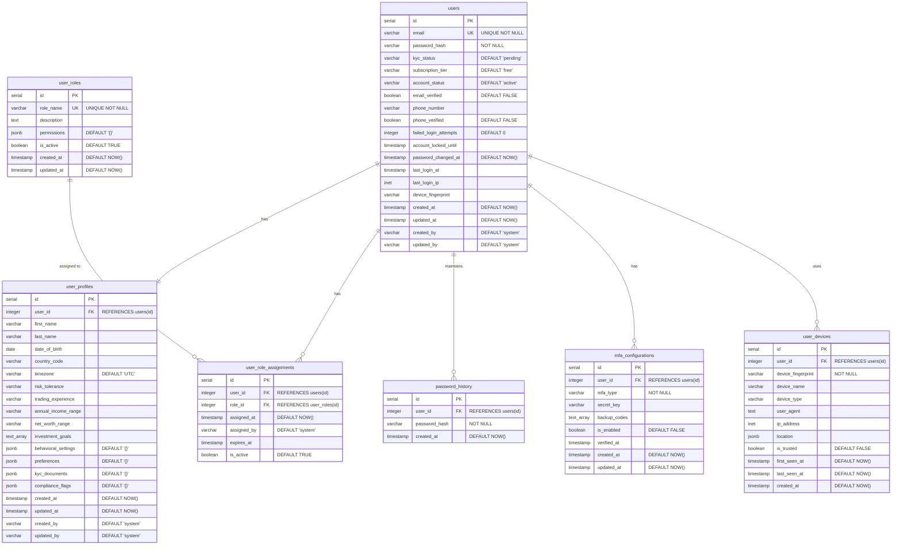

# User Authentication Schema ERD

This diagram represents the entity relationships from the V1__Create_users_table.sql migration file.

```mermaid
erDiagram
    users ||--|| user_profiles : "has"
    users ||--o{ user_role_assignments : "has"
    user_roles ||--o{ user_role_assignments : "assigned to"
    users ||--o{ password_history : "maintains"
    users ||--o{ mfa_configurations : "has"
    users ||--o{ user_devices : "uses"

    users {
        serial id PK
        varchar email UK "UNIQUE NOT NULL"
        varchar password_hash "NOT NULL"
        varchar kyc_status "DEFAULT 'pending'"
        varchar subscription_tier "DEFAULT 'free'"
        varchar account_status "DEFAULT 'active'"
        boolean email_verified "DEFAULT FALSE"
        varchar phone_number
        boolean phone_verified "DEFAULT FALSE"
        integer failed_login_attempts "DEFAULT 0"
        timestamp account_locked_until
        timestamp password_changed_at "DEFAULT NOW()"
        timestamp last_login_at
        inet last_login_ip
        varchar device_fingerprint
        timestamp created_at "DEFAULT NOW()"
        timestamp updated_at "DEFAULT NOW()"
        varchar created_by "DEFAULT 'system'"
        varchar updated_by "DEFAULT 'system'"
    }

    user_profiles {
        serial id PK
        integer user_id FK "REFERENCES users(id)"
        varchar first_name
        varchar last_name
        date date_of_birth
        varchar country_code
        varchar timezone "DEFAULT 'UTC'"
        varchar risk_tolerance
        varchar trading_experience
        varchar annual_income_range
        varchar net_worth_range
        text_array investment_goals
        jsonb behavioral_settings "DEFAULT '{}'"
        jsonb preferences "DEFAULT '{}'"
        jsonb kyc_documents "DEFAULT '{}'"
        jsonb compliance_flags "DEFAULT '{}'"
        timestamp created_at "DEFAULT NOW()"
        timestamp updated_at "DEFAULT NOW()"
        varchar created_by "DEFAULT 'system'"
        varchar updated_by "DEFAULT 'system'"
    }

    user_roles {
        serial id PK
        varchar role_name UK "UNIQUE NOT NULL"
        text description
        jsonb permissions "DEFAULT '{}'"
        boolean is_active "DEFAULT TRUE"
        timestamp created_at "DEFAULT NOW()"
        timestamp updated_at "DEFAULT NOW()"
    }

    user_role_assignments {
        serial id PK
        integer user_id FK "REFERENCES users(id)"
        integer role_id FK "REFERENCES user_roles(id)"
        timestamp assigned_at "DEFAULT NOW()"
        varchar assigned_by "DEFAULT 'system'"
        timestamp expires_at
        boolean is_active "DEFAULT TRUE"
    }

    password_history {
        serial id PK
        integer user_id FK "REFERENCES users(id)"
        varchar password_hash "NOT NULL"
        timestamp created_at "DEFAULT NOW()"
    }

    mfa_configurations {
        serial id PK
        integer user_id FK "REFERENCES users(id)"
        varchar mfa_type "NOT NULL"
        varchar secret_key
        text_array backup_codes
        boolean is_enabled "DEFAULT FALSE"
        timestamp verified_at
        timestamp created_at "DEFAULT NOW()"
        timestamp updated_at "DEFAULT NOW()"
    }

    user_devices {
        serial id PK
        integer user_id FK "REFERENCES users(id)"
        varchar device_fingerprint "NOT NULL"
        varchar device_name
        varchar device_type
        text user_agent
        inet ip_address
        jsonb location
        boolean is_trusted "DEFAULT FALSE"
        timestamp first_seen_at "DEFAULT NOW()"
        timestamp last_seen_at "DEFAULT NOW()"
        timestamp created_at "DEFAULT NOW()"
    }
```