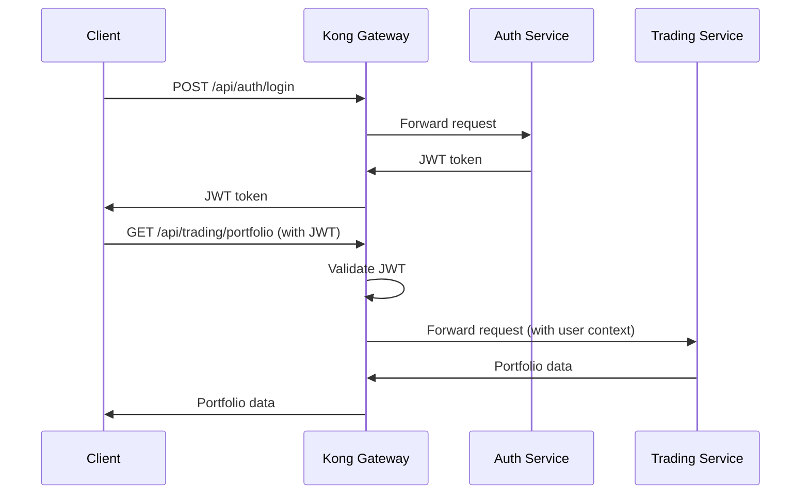
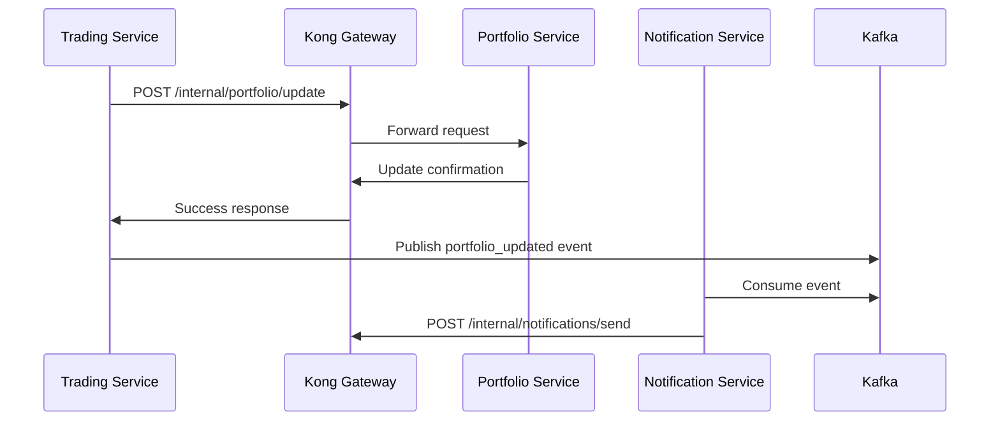

# INT-001: Microservices Communication & API Gateway Integration

## Epic
**Epic 6: System Integration & Data Orchestration** - Seamless system integration and robust data flow management

## Story Overview
**Title**: Microservices Communication & API Gateway Integration  
**Story Points**: 18  
**Priority**: Critical  
**Status**: Pending  
**Assignee**: Backend Integration Team  
**Sprint**: TBD

## Business Context
Establish a robust microservices communication framework with API Gateway as the central orchestration point. This system ensures secure, scalable, and reliable communication between all TradeMaster services while providing unified API management, authentication, rate limiting, and monitoring capabilities.

## User Story
**As a** system administrator and developer  
**I want** a centralized API gateway that manages all service communications  
**So that** we have consistent security, monitoring, and routing across all microservices

## Technical Requirements

### API Gateway Infrastructure
- **Central Routing**: Route requests to appropriate microservices based on paths and rules
- **Load Balancing**: Distribute traffic across service instances with health checks
- **Authentication & Authorization**: JWT token validation and role-based access control
- **Rate Limiting**: Prevent abuse with configurable rate limits per user/service
- **Request/Response Transformation**: Standardize data formats across services

### Service Discovery & Registration
- **Dynamic Service Registration**: Services auto-register with the gateway
- **Health Check Integration**: Monitor service health and remove unhealthy instances
- **Circuit Breaker**: Prevent cascade failures with circuit breaker patterns
- **Retry Logic**: Intelligent retry with exponential backoff
- **Service Versioning**: Support multiple API versions simultaneously

### Inter-Service Communication
- **Synchronous Communication**: RESTful APIs with standardized error handling
- **Asynchronous Messaging**: Event-driven communication for non-blocking operations
- **Service Mesh**: Secure service-to-service communication with mTLS
- **Data Consistency**: Implement saga pattern for distributed transactions
- **Monitoring & Tracing**: End-to-end request tracing and performance monitoring

## Technical Implementation

### Technology Stack
- **API Gateway**: Kong Gateway, Kong Manager
- **Service Discovery**: Consul, Kong DB
- **Load Balancing**: Kong Upstream, Nginx
- **Authentication**: Kong JWT Plugin, OAuth2
- **Monitoring**: Prometheus, Jaeger, DataDog
- **Messaging**: Apache Kafka, Redis Pub/Sub

### Architecture Components

#### 1. Kong API Gateway Configuration
```yaml
# Kong Gateway configuration
services:
  - name: user-service
    url: http://user-service:8080
    plugins:
      - name: jwt
        config:
          key_claim_name: sub
      - name: rate-limiting
        config:
          minute: 100
          policy: local
      - name: prometheus
        config:
          per_consumer: true

  - name: trading-service  
    url: http://trading-service:8081
    plugins:
      - name: jwt
      - name: request-transformer
        config:
          add:
            headers: ["X-Service-Version:v1"]

  - name: portfolio-service
    url: http://portfolio-service:8082
    plugins:
      - name: jwt
      - name: cors
        config:
          origins: ["*"]
          methods: ["GET", "POST", "PUT", "DELETE"]
```

#### 2. Service Registration Framework
```java
// Service registration with health checks
@Component
public class ServiceRegistration {
    
    @Autowired
    private KongClient kongClient;
    
    @PostConstruct
    public void registerService() {
        ServiceConfig config = ServiceConfig.builder()
            .name(applicationName)
            .url(getServiceUrl())
            .healthCheckPath("/actuator/health")
            .healthCheckInterval("30s")
            .tags(Arrays.asList("trading", "core"))
            .build();
            
        kongClient.registerService(config);
    }
    
    @PreDestroy
    public void deregisterService() {
        kongClient.deregisterService(applicationName);
    }
}

// Circuit breaker implementation
@Component
public class CircuitBreakerService {
    
    private final CircuitBreaker circuitBreaker = CircuitBreaker.ofDefaults("trading-service");
    
    public CompletableFuture<ApiResponse> callTradingService(String endpoint, Object request) {
        Supplier<CompletableFuture<ApiResponse>> decoratedSupplier = 
            CircuitBreaker.decorateSupplier(circuitBreaker, () -> {
                return restTemplate.postForObject(endpoint, request, ApiResponse.class);
            });
        
        return decoratedSupplier.get();
    }
}
```

#### 3. Inter-Service Communication Framework
```java
// Standardized service client
@Component
public class ServiceClient {
    
    private final RestTemplate restTemplate;
    private final RetryTemplate retryTemplate;
    
    public <T> T callService(String serviceName, String endpoint, 
                            Object request, Class<T> responseType) {
        String url = buildServiceUrl(serviceName, endpoint);
        
        return retryTemplate.execute(context -> {
            try {
                HttpHeaders headers = buildStandardHeaders();
                HttpEntity<Object> entity = new HttpEntity<>(request, headers);
                
                ResponseEntity<T> response = restTemplate.exchange(
                    url, HttpMethod.POST, entity, responseType);
                    
                return response.getBody();
            } catch (Exception e) {
                throw new ServiceCommunicationException(serviceName, endpoint, e);
            }
        });
    }
    
    private HttpHeaders buildStandardHeaders() {
        HttpHeaders headers = new HttpHeaders();
        headers.setContentType(MediaType.APPLICATION_JSON);
        headers.set("X-Request-ID", UUID.randomUUID().toString());
        headers.set("X-Timestamp", Instant.now().toString());
        return headers;
    }
}
```

#### 4. Event-Driven Communication
```java
// Event publisher for asynchronous communication
@Component
public class EventPublisher {
    
    @Autowired
    private KafkaTemplate<String, Object> kafkaTemplate;
    
    public void publishEvent(String topic, Object event) {
        EventMetadata metadata = EventMetadata.builder()
            .eventId(UUID.randomUUID().toString())
            .eventType(event.getClass().getSimpleName())
            .timestamp(Instant.now())
            .source(applicationName)
            .build();
            
        EventWrapper wrapper = new EventWrapper(metadata, event);
        
        kafkaTemplate.send(topic, wrapper)
            .addCallback(
                result -> log.info("Event published successfully: {}", metadata.getEventId()),
                failure -> log.error("Failed to publish event: {}", metadata.getEventId(), failure)
            );
    }
}

// Event listener for handling incoming events
@Component
@KafkaListener(topics = "trading-events")
public class TradingEventListener {
    
    @KafkaHandler
    public void handleOrderEvent(OrderEvent event) {
        try {
            processOrderEvent(event);
            publishAuditEvent("ORDER_PROCESSED", event.getOrderId());
        } catch (Exception e) {
            publishErrorEvent("ORDER_PROCESSING_FAILED", event.getOrderId(), e);
            throw e; // Trigger retry mechanism
        }
    }
}
```

### Integration Points

#### 1. Authentication Flow


#### 2. Service-to-Service Communication


## Database Schema

### Service Registry
```sql
-- Service registration and health tracking
CREATE TABLE service_registry (
    id BIGSERIAL PRIMARY KEY,
    service_name VARCHAR(100) NOT NULL UNIQUE,
    service_url VARCHAR(255) NOT NULL,
    health_check_url VARCHAR(255),
    status VARCHAR(20) DEFAULT 'healthy',
    version VARCHAR(50),
    tags TEXT[],
    registered_at TIMESTAMP DEFAULT CURRENT_TIMESTAMP,
    last_health_check TIMESTAMP,
    metadata JSONB,
    INDEX idx_service_registry_status (status),
    INDEX idx_service_registry_name (service_name)
);

-- API Gateway routing rules
CREATE TABLE gateway_routes (
    id BIGSERIAL PRIMARY KEY,
    route_name VARCHAR(100) NOT NULL,
    path_pattern VARCHAR(255) NOT NULL,
    service_name VARCHAR(100) NOT NULL,
    methods VARCHAR(20)[] DEFAULT ARRAY['GET', 'POST'],
    enabled BOOLEAN DEFAULT true,
    rate_limit_rpm INTEGER DEFAULT 1000,
    auth_required BOOLEAN DEFAULT true,
    created_at TIMESTAMP DEFAULT CURRENT_TIMESTAMP,
    updated_at TIMESTAMP DEFAULT CURRENT_TIMESTAMP,
    FOREIGN KEY (service_name) REFERENCES service_registry(service_name)
);

-- Request tracing and monitoring
CREATE TABLE request_traces (
    id BIGSERIAL PRIMARY KEY,
    trace_id VARCHAR(100) NOT NULL,
    request_id VARCHAR(100) NOT NULL,
    service_chain TEXT[] NOT NULL,
    total_duration_ms INTEGER,
    status_code INTEGER,
    error_message TEXT,
    started_at TIMESTAMP DEFAULT CURRENT_TIMESTAMP,
    completed_at TIMESTAMP,
    INDEX idx_request_traces_trace (trace_id),
    INDEX idx_request_traces_duration (total_duration_ms)
);
```

## API Specifications

### Gateway Management API
```yaml
# Service registration and management
/api/v1/gateway/services:
  post:
    summary: Register a new service
    parameters:
      - name: service_config
        schema:
          type: object
          properties:
            name: string
            url: string
            health_check_url: string
            version: string
            tags: array
    responses:
      201:
        description: Service registered successfully

  get:
    summary: List registered services
    responses:
      200:
        description: Service list
        schema:
          type: array
          items:
            type: object
            properties:
              name: string
              url: string
              status: string
              last_health_check: string

/api/v1/gateway/routes:
  post:
    summary: Create routing rule
    parameters:
      - name: route_config
        schema:
          type: object
          properties:
            path: string
            service: string
            methods: array
            rate_limit: integer
            auth_required: boolean
    responses:
      201:
        description: Route created successfully

/api/v1/gateway/health:
  get:
    summary: Get overall gateway health
    responses:
      200:
        description: Health status
        schema:
          type: object
          properties:
            status: string
            services: object
            uptime: integer
            request_count: integer
```

### Inter-Service Communication API
```yaml
# Standard inter-service endpoints
/internal/v1/health:
  get:
    summary: Service health check
    responses:
      200:
        description: Service is healthy
        schema:
          type: object
          properties:
            status: string
            timestamp: string
            dependencies: object

/internal/v1/metrics:
  get:
    summary: Service metrics
    responses:
      200:
        description: Service metrics
        schema:
          type: object
          properties:
            request_count: integer
            error_rate: number
            response_time_p95: number
            active_connections: integer

/internal/v1/config/reload:
  post:
    summary: Reload service configuration
    responses:
      200:
        description: Configuration reloaded
```

## Acceptance Criteria

### API Gateway Functionality
- [ ] **Request Routing**: Successfully route requests to appropriate services
- [ ] **Load Balancing**: Distribute traffic across healthy service instances
- [ ] **Authentication**: Validate JWT tokens and enforce access control
- [ ] **Rate Limiting**: Prevent abuse with configurable limits per user/endpoint
- [ ] **Health Checks**: Monitor service health and remove unhealthy instances

### Service Communication
- [ ] **Synchronous Communication**: RESTful API calls with standardized error handling
- [ ] **Asynchronous Messaging**: Event-driven communication via Kafka
- [ ] **Circuit Breaker**: Prevent cascade failures during service outages
- [ ] **Retry Logic**: Intelligent retry with exponential backoff
- [ ] **Request Tracing**: End-to-end tracing for debugging and monitoring

### Monitoring & Observability
- [ ] **Performance Metrics**: Track response times, error rates, throughput
- [ ] **Service Discovery**: Automatic service registration and deregistration
- [ ] **Distributed Tracing**: Trace requests across multiple services
- [ ] **Alerting**: Notify on service failures and performance degradation
- [ ] **Dashboard**: Real-time visualization of system health and metrics

## Testing Strategy

### Unit Tests
```java
@Test
public void testServiceRegistration() {
    ServiceConfig config = createTestServiceConfig();
    serviceRegistry.register(config);
    
    Optional<ServiceConfig> registered = serviceRegistry.findByName(config.getName());
    assertTrue(registered.isPresent());
    assertEquals(config.getUrl(), registered.get().getUrl());
}

@Test
public void testCircuitBreakerTrip() {
    // Simulate service failures
    for (int i = 0; i < 10; i++) {
        mockServiceFailure();
        circuitBreakerService.callService("failing-service", "/test");
    }
    
    assertEquals(CircuitBreaker.State.OPEN, 
                circuitBreaker.getState());
}

@Test
public void testRetryMechanism() {
    mockServiceTemporaryFailure(3); // Fail 3 times then succeed
    
    ApiResponse response = serviceClient.callService(
        "test-service", "/endpoint", request, ApiResponse.class);
        
    assertNotNull(response);
    verify(restTemplate, times(4)).exchange(any(), any(), any(), any());
}
```

### Integration Tests
```java
@Test
public void testEndToEndRequest() {
    // Test complete request flow through gateway
    ResponseEntity<String> response = testRestTemplate
        .withBasicAuth("testuser", "password")
        .getForEntity("/api/v1/portfolio", String.class);
        
    assertEquals(HttpStatus.OK, response.getStatusCode());
    verify(portfolioService).getPortfolio(anyString());
}

@Test
public void testEventPublishAndConsume() {
    OrderEvent event = createTestOrderEvent();
    eventPublisher.publishEvent("trading-events", event);
    
    // Wait for async processing
    await().atMost(5, SECONDS).until(() -> 
        eventListener.getProcessedEvents().contains(event.getOrderId()));
}
```

### Load Tests
```java
@Test
public void testGatewayLoadHandling() {
    int concurrentUsers = 100;
    int requestsPerUser = 50;
    
    LoadTestResult result = loadTester
        .withConcurrentUsers(concurrentUsers)
        .withRequestsPerUser(requestsPerUser)
        .target("/api/v1/trading/orders")
        .execute();
        
    assertTrue(result.getAverageResponseTime() < 500); // < 500ms
    assertTrue(result.getErrorRate() < 0.01); // < 1% error rate
}
```

## Monitoring & Alerting

### Performance Metrics
- **Request Throughput**: Requests per second through gateway
- **Response Time**: P50, P95, P99 response time percentiles
- **Error Rate**: Percentage of failed requests
- **Service Health**: Number of healthy vs unhealthy service instances
- **Circuit Breaker Status**: Open/closed status of circuit breakers

### Alert Conditions
```yaml
# Gateway performance alerts
high_response_time:
  condition: avg_response_time > 1000ms
  action: scale_up_services
  severity: warning

high_error_rate:
  condition: error_rate > 5%
  action: investigate_service_health
  severity: critical

service_down:
  condition: healthy_instances = 0
  action: restart_service
  severity: critical

circuit_breaker_open:
  condition: circuit_breaker_state = "open"
  action: investigate_downstream_service
  severity: warning
```

## Deployment Strategy

### Phase 1: Gateway Infrastructure (Week 1-2)
- Deploy Kong API Gateway with basic configuration
- Set up service discovery and registration
- Implement health checks and basic routing
- Deploy to development environment

### Phase 2: Authentication & Security (Week 3-4)
- Integrate JWT authentication
- Implement rate limiting and CORS
- Set up SSL/TLS termination
- Security testing and hardening

### Phase 3: Advanced Features (Week 5-6)
- Implement circuit breaker patterns
- Set up distributed tracing
- Create monitoring dashboards
- Performance testing and optimization

### Phase 4: Production Deployment (Week 7-8)
- Deploy to staging environment
- Load testing and performance tuning
- Production deployment with blue/green strategy
- Documentation and team training

## Risk Analysis

### High Risks
- **Single Point of Failure**: API Gateway becomes critical bottleneck
  - *Mitigation*: High availability setup with multiple gateway instances
- **Performance Bottleneck**: Gateway latency impacts all services
  - *Mitigation*: Performance optimization, caching, load balancing
- **Security Vulnerabilities**: Central authentication point attracts attacks
  - *Mitigation*: Security hardening, regular updates, penetration testing

### Medium Risks
- **Service Discovery**: Dynamic service registration may fail
  - *Mitigation*: Fallback to static configuration, health check redundancy
- **Configuration Complexity**: Complex routing rules may cause errors
  - *Mitigation*: Configuration validation, testing framework, rollback procedures

## Success Metrics

### Technical Metrics
- **Response Time**: <200ms P95 response time through gateway
- **Throughput**: Handle 10,000 requests per second
- **Availability**: 99.99% gateway uptime
- **Error Rate**: <0.1% error rate for routed requests
- **Service Health**: 99% average service health score

### Business Metrics
- **Developer Productivity**: 40% reduction in service integration time
- **System Reliability**: 50% reduction in cascade failures
- **Operational Efficiency**: 60% reduction in debugging time
- **Security Compliance**: 100% request authentication and authorization
- **Cost Optimization**: 25% reduction in infrastructure costs through better resource utilization

## Dependencies
- **Infrastructure**: Kubernetes cluster, load balancers
- **Backend Services**: All TradeMaster microservices
- **Security**: JWT authentication service
- **Monitoring**: Prometheus, Grafana infrastructure
- **External**: Kong Gateway licenses, SSL certificates

## Definition of Done
- [ ] Kong API Gateway deployed and operational
- [ ] All services registered with automatic discovery
- [ ] JWT authentication integrated and working
- [ ] Rate limiting and security policies active
- [ ] Circuit breaker patterns implemented
- [ ] Monitoring and alerting system operational
- [ ] Load testing completed successfully
- [ ] Documentation and runbooks created
- [ ] Team training completed