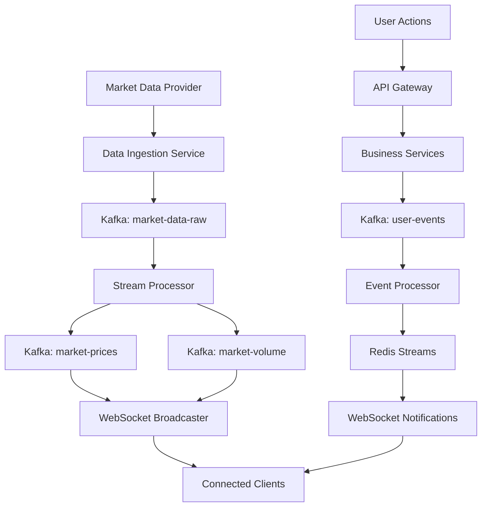
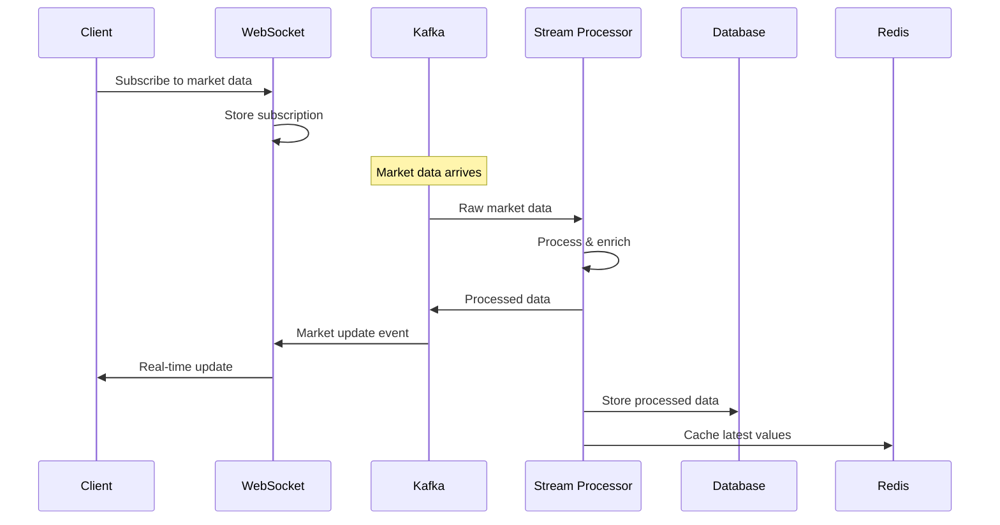

# INT-002: Real-Time Data Streaming & Event Processing

## Epic
**Epic 6: System Integration & Data Orchestration** - Seamless system integration and robust data flow management

## Story Overview
**Title**: Real-Time Data Streaming & Event Processing Infrastructure  
**Story Points**: 22  
**Priority**: Critical  
**Status**: Pending  
**Assignee**: Backend Integration Team  
**Sprint**: TBD

## Business Context
Implement a comprehensive real-time data streaming and event processing infrastructure that handles live market data, user interactions, and system events across all TradeMaster services. This system ensures sub-second data delivery, scalable event processing, and reliable message delivery with proper error handling and recovery mechanisms.

## User Story
**As a** TradeMaster user and system  
**I want** real-time data streaming with instant updates and reliable event processing  
**So that** I receive immediate market updates, trading alerts, and system notifications without delays

## Technical Requirements

### Real-Time Data Streaming
- **WebSocket Architecture**: Persistent connections for real-time client updates
- **Market Data Streaming**: Live price feeds, order book updates, trade executions
- **User-Specific Streams**: Portfolio updates, alerts, notifications
- **Connection Management**: Auto-reconnection, heartbeat monitoring, session persistence
- **Data Compression**: Optimize bandwidth usage for high-frequency updates

### Event Processing System
- **Apache Kafka Integration**: High-throughput event streaming platform
- **Event-Driven Architecture**: Microservices communication via events
- **Stream Processing**: Real-time data transformation and aggregation
- **Event Sourcing**: Maintain event history for replay and audit
- **Dead Letter Queue**: Handle failed event processing gracefully

### Message Queuing & Reliability
- **Redis Streams**: Fast in-memory event streaming
- **Message Durability**: Persistent message storage and acknowledgment
- **Exactly-Once Delivery**: Prevent duplicate event processing
- **Backpressure Handling**: Manage high-volume event scenarios
- **Circuit Breaker**: Prevent cascade failures in event processing

## Technical Implementation

### Technology Stack
- **Event Streaming**: Apache Kafka, Kafka Connect
- **WebSocket**: Socket.io, Spring WebSocket
- **Stream Processing**: Kafka Streams, Apache Flink
- **Message Queue**: Redis Streams, RabbitMQ
- **Real-Time Database**: Redis, InfluxDB
- **Monitoring**: Kafka Manager, Grafana, Prometheus

### Architecture Components

#### 1. WebSocket Connection Management
```typescript
// WebSocket connection manager with auto-reconnection
export class WebSocketManager {
    private connections: Map<string, Socket> = new Map();
    private reconnectAttempts: Map<string, number> = new Map();
    
    public connect(userId: string, authToken: string): Promise<Socket> {
        return new Promise((resolve, reject) => {
            const socket = io(WS_SERVER_URL, {
                auth: { token: authToken },
                transports: ['websocket'],
                upgrade: false,
                reconnection: true,
                reconnectionDelay: 1000,
                reconnectionAttempts: 5
            });
            
            socket.on('connect', () => {
                console.log(`WebSocket connected for user: ${userId}`);
                this.connections.set(userId, socket);
                this.setupEventHandlers(socket, userId);
                resolve(socket);
            });
            
            socket.on('disconnect', (reason) => {
                this.handleDisconnection(userId, reason);
            });
            
            socket.on('connect_error', (error) => {
                console.error('WebSocket connection error:', error);
                reject(error);
            });
        });
    }
    
    private setupEventHandlers(socket: Socket, userId: string): void {
        // Market data subscription
        socket.on('market_data', (data: MarketData) => {
            this.eventBus.emit('market_update', data);
        });
        
        // Portfolio updates
        socket.on('portfolio_update', (data: PortfolioUpdate) => {
            this.eventBus.emit('portfolio_change', data);
        });
        
        // Trading alerts
        socket.on('trading_alert', (alert: TradingAlert) => {
            this.eventBus.emit('alert_received', alert);
        });
    }
    
    public subscribeToMarketData(userId: string, symbols: string[]): void {
        const socket = this.connections.get(userId);
        if (socket) {
            socket.emit('subscribe_market_data', { symbols });
        }
    }
}
```

#### 2. Kafka Event Producer
```java
@Component
public class EventProducer {
    
    @Autowired
    private KafkaTemplate<String, Object> kafkaTemplate;
    
    @Autowired
    private ObjectMapper objectMapper;
    
    public void publishEvent(String topic, Object event, String partitionKey) {
        try {
            EventEnvelope envelope = EventEnvelope.builder()
                .eventId(UUID.randomUUID().toString())
                .eventType(event.getClass().getSimpleName())
                .timestamp(Instant.now())
                .source(applicationName)
                .data(event)
                .build();
            
            ProducerRecord<String, Object> record = new ProducerRecord<>(
                topic, 
                partitionKey, 
                envelope
            );
            
            // Add headers for tracing
            record.headers().add("trace-id", getTraceId().getBytes());
            record.headers().add("span-id", getSpanId().getBytes());
            
            ListenableFuture<SendResult<String, Object>> future = 
                kafkaTemplate.send(record);
                
            future.addCallback(
                result -> logSuccessfulSend(envelope.getEventId(), topic),
                failure -> handleSendFailure(envelope.getEventId(), topic, failure)
            );
            
        } catch (Exception e) {
            log.error("Failed to serialize event for topic: {}", topic, e);
            throw new EventPublishingException("Event serialization failed", e);
        }
    }
    
    private void handleSendFailure(String eventId, String topic, Throwable failure) {
        log.error("Failed to send event {} to topic {}", eventId, topic, failure);
        
        // Send to dead letter queue for manual processing
        deadLetterQueueService.sendFailedEvent(eventId, topic, failure);
        
        // Emit metric for monitoring
        meterRegistry.counter("kafka.producer.failures", 
            "topic", topic, "error", failure.getClass().getSimpleName())
            .increment();
    }
}
```

#### 3. Stream Processing with Kafka Streams
```java
@Component
@EnableKafkaStreams
public class MarketDataStreamProcessor {
    
    @Bean
    public KStream<String, MarketDataEvent> processMarketDataStream(
            StreamsBuilder streamsBuilder) {
        
        KStream<String, MarketDataEvent> marketDataStream = 
            streamsBuilder.stream("market-data-raw",
                Consumed.with(Serdes.String(), marketDataEventSerde()));
        
        // Transform and enrich market data
        KStream<String, EnrichedMarketData> enrichedStream = marketDataStream
            .filter((key, value) -> isValidMarketData(value))
            .mapValues(this::enrichMarketData)
            .peek((key, value) -> logMarketDataProcessed(key, value));
        
        // Fan out to different topics based on data type
        enrichedStream
            .filter((key, value) -> value.getDataType() == DataType.PRICE)
            .to("market-prices", Produced.with(Serdes.String(), enrichedMarketDataSerde()));
            
        enrichedStream
            .filter((key, value) -> value.getDataType() == DataType.VOLUME)
            .to("market-volume", Produced.with(Serdes.String(), enrichedMarketDataSerde()));
        
        // Aggregate for real-time analytics
        enrichedStream
            .groupByKey()
            .windowedBy(TimeWindows.of(Duration.ofSeconds(1)))
            .aggregate(
                MarketDataAggregate::new,
                (key, value, aggregate) -> aggregate.update(value),
                Materialized.with(Serdes.String(), marketDataAggregateSerde())
            )
            .toStream()
            .to("market-data-aggregated");
        
        return enrichedStream;
    }
    
    private EnrichedMarketData enrichMarketData(MarketDataEvent event) {
        return EnrichedMarketData.builder()
            .symbol(event.getSymbol())
            .price(event.getPrice())
            .volume(event.getVolume())
            .timestamp(event.getTimestamp())
            .exchange(event.getExchange())
            .marketCap(marketCapService.getMarketCap(event.getSymbol()))
            .sector(sectorService.getSector(event.getSymbol()))
            .build();
    }
}
```

#### 4. Redis Streams for Fast Event Processing
```java
@Component
public class RedisStreamProcessor {
    
    @Autowired
    private RedisTemplate<String, Object> redisTemplate;
    
    @EventListener
    public void handlePortfolioUpdate(PortfolioUpdateEvent event) {
        String streamKey = "portfolio-updates";
        
        Map<String, String> eventData = Map.of(
            "userId", event.getUserId().toString(),
            "portfolioId", event.getPortfolioId().toString(),
            "updateType", event.getUpdateType().name(),
            "data", objectMapper.writeValueAsString(event.getData()),
            "timestamp", event.getTimestamp().toString()
        );
        
        // Add to Redis Stream
        RecordId recordId = redisTemplate.opsForStream()
            .add(streamKey, eventData);
            
        log.debug("Added portfolio update to stream: {} with ID: {}", 
                 streamKey, recordId);
    }
    
    @StreamListener(value = "portfolio-updates", group = "portfolio-processors")
    public void processPortfolioUpdate(@Payload Map<String, String> eventData,
                                     @Header("redis-stream-id") String streamId) {
        try {
            String userId = eventData.get("userId");
            String updateType = eventData.get("updateType");
            
            // Process the update
            portfolioUpdateProcessor.process(eventData);
            
            // Acknowledge processing
            redisTemplate.opsForStream()
                .acknowledge("portfolio-updates", "portfolio-processors", streamId);
            
            // Send real-time notification to user
            webSocketService.sendToUser(userId, "portfolio_update", eventData);
            
        } catch (Exception e) {
            log.error("Failed to process portfolio update: {}", streamId, e);
            // Event will be retried automatically
        }
    }
}
```

#### 5. WebSocket Event Broadcasting
```java
@Component
public class WebSocketEventBroadcaster {
    
    @Autowired
    private SimpMessagingTemplate messagingTemplate;
    
    @Autowired
    private WebSocketSessionManager sessionManager;
    
    @KafkaListener(topics = "market-prices")
    public void broadcastMarketUpdate(MarketPriceEvent event) {
        // Broadcast to all users subscribed to this symbol
        String destination = "/topic/market/" + event.getSymbol();
        messagingTemplate.convertAndSend(destination, event);
        
        // Send to specific users with this symbol in their watchlist
        Set<String> subscribedUsers = getSubscribedUsers(event.getSymbol());
        for (String userId : subscribedUsers) {
            messagingTemplate.convertAndSendToUser(
                userId, "/queue/market-updates", event);
        }
    }
    
    @KafkaListener(topics = "trading-alerts")
    public void broadcastTradingAlert(TradingAlertEvent alert) {
        // Send alert to specific user
        messagingTemplate.convertAndSendToUser(
            alert.getUserId(), "/queue/alerts", alert);
            
        // Update user's alert count
        sessionManager.updateUserAlertCount(alert.getUserId());
    }
    
    @KafkaListener(topics = "system-notifications")
    public void broadcastSystemNotification(SystemNotificationEvent notification) {
        if (notification.isBroadcast()) {
            // Send to all connected users
            messagingTemplate.convertAndSend("/topic/notifications", notification);
        } else {
            // Send to specific users
            for (String userId : notification.getTargetUsers()) {
                messagingTemplate.convertAndSendToUser(
                    userId, "/queue/notifications", notification);
            }
        }
    }
}
```

### Integration Points

#### 1. Data Flow Architecture


#### 2. Event Processing Pipeline


## Database Schema

### Event Streaming Schema
```sql
-- WebSocket connection tracking
CREATE TABLE websocket_connections (
    id BIGSERIAL PRIMARY KEY,
    user_id BIGINT NOT NULL,
    session_id VARCHAR(100) NOT NULL UNIQUE,
    connected_at TIMESTAMP DEFAULT CURRENT_TIMESTAMP,
    last_heartbeat TIMESTAMP DEFAULT CURRENT_TIMESTAMP,
    subscriptions JSONB DEFAULT '[]',
    connection_metadata JSONB,
    is_active BOOLEAN DEFAULT true,
    INDEX idx_ws_connections_user (user_id),
    INDEX idx_ws_connections_session (session_id),
    INDEX idx_ws_connections_active (is_active)
);

-- Event processing tracking
CREATE TABLE event_processing_log (
    id BIGSERIAL PRIMARY KEY,
    event_id VARCHAR(100) NOT NULL,
    event_type VARCHAR(100) NOT NULL,
    topic_name VARCHAR(100) NOT NULL,
    partition_id INTEGER,
    offset_position BIGINT,
    processing_status VARCHAR(20) DEFAULT 'pending',
    processed_at TIMESTAMP,
    error_message TEXT,
    retry_count INTEGER DEFAULT 0,
    created_at TIMESTAMP DEFAULT CURRENT_TIMESTAMP,
    INDEX idx_event_log_status (processing_status),
    INDEX idx_event_log_type (event_type),
    INDEX idx_event_log_created (created_at)
);

-- Stream subscription management
CREATE TABLE stream_subscriptions (
    id BIGSERIAL PRIMARY KEY,
    user_id BIGINT NOT NULL,
    stream_type VARCHAR(50) NOT NULL, -- 'market_data', 'portfolio', 'alerts'
    subscription_params JSONB NOT NULL,
    subscribed_at TIMESTAMP DEFAULT CURRENT_TIMESTAMP,
    last_active TIMESTAMP DEFAULT CURRENT_TIMESTAMP,
    is_active BOOLEAN DEFAULT true,
    INDEX idx_stream_subs_user (user_id),
    INDEX idx_stream_subs_type (stream_type),
    INDEX idx_stream_subs_active (is_active)
);
```

## API Specifications

### WebSocket API
```yaml
# WebSocket event specifications
connection:
  url: "wss://api.trademaster.com/ws"
  auth:
    type: "bearer_token"
    header: "Authorization"

events:
  # Client to Server
  subscribe_market_data:
    payload:
      symbols: ["AAPL", "GOOGL", "MSFT"]
      data_types: ["price", "volume", "orderbook"]
  
  subscribe_portfolio:
    payload:
      portfolio_id: integer
      update_types: ["balance", "positions", "pnl"]
  
  subscribe_alerts:
    payload:
      alert_types: ["price", "volume", "news"]
  
  # Server to Client
  market_data:
    payload:
      symbol: string
      price: number
      volume: integer
      timestamp: string
      change: number
      change_percent: number
  
  portfolio_update:
    payload:
      portfolio_id: integer
      update_type: string
      data: object
      timestamp: string
  
  trading_alert:
    payload:
      alert_id: string
      type: string
      message: string
      severity: string
      timestamp: string
```

### Stream Management API
```yaml
# Stream management endpoints
/api/v1/streams/subscriptions:
  post:
    summary: Create stream subscription
    parameters:
      - name: subscription
        schema:
          type: object
          properties:
            stream_type: string
            parameters: object
    responses:
      201:
        description: Subscription created

  get:
    summary: List user subscriptions
    responses:
      200:
        description: Subscription list
        schema:
          type: array
          items:
            type: object
            properties:
              id: integer
              stream_type: string
              parameters: object
              created_at: string

/api/v1/streams/health:
  get:
    summary: Get streaming system health
    responses:
      200:
        description: System health
        schema:
          type: object
          properties:
            kafka_status: string
            redis_status: string
            websocket_connections: integer
            events_per_second: number

/api/v1/streams/metrics:
  get:
    summary: Get streaming metrics
    responses:
      200:
        description: Streaming metrics
        schema:
          type: object
          properties:
            total_events_processed: integer
            average_latency_ms: number
            error_rate: number
            active_connections: integer
```

## Acceptance Criteria

### Real-Time Data Streaming
- [ ] **WebSocket Connections**: Support 10,000+ concurrent connections
- [ ] **Message Latency**: <100ms end-to-end message delivery
- [ ] **Connection Reliability**: Auto-reconnection with exponential backoff
- [ ] **Data Compression**: 70% bandwidth reduction through compression
- [ ] **Subscription Management**: Dynamic subscribe/unsubscribe capabilities

### Event Processing
- [ ] **Event Throughput**: Process 100,000 events per second
- [ ] **Exactly-Once Processing**: No duplicate event processing
- [ ] **Event Ordering**: Maintain order within partitions
- [ ] **Stream Processing**: Real-time data transformation and aggregation
- [ ] **Error Handling**: Dead letter queue for failed events

### System Reliability
- [ ] **High Availability**: 99.9% system uptime
- [ ] **Backpressure Handling**: Graceful degradation under high load
- [ ] **Circuit Breaker**: Prevent cascade failures
- [ ] **Monitoring**: Real-time metrics and alerting
- [ ] **Recovery**: Automatic recovery from failures

## Testing Strategy

### Unit Tests
```typescript
describe('WebSocketManager', () => {
  test('should establish connection with valid token', async () => {
    const manager = new WebSocketManager();
    const socket = await manager.connect('user123', 'valid-token');
    
    expect(socket.connected).toBe(true);
    expect(manager.getConnection('user123')).toBeDefined();
  });
  
  test('should handle reconnection on disconnect', async () => {
    const manager = new WebSocketManager();
    const socket = await manager.connect('user123', 'valid-token');
    
    socket.disconnect();
    
    // Should attempt reconnection
    await new Promise(resolve => setTimeout(resolve, 1500));
    expect(socket.connected).toBe(true);
  });
});
```

### Integration Tests
```java
@Test
public void testEventProcessingPipeline() {
    // Publish event to Kafka
    MarketDataEvent event = createTestMarketDataEvent();
    eventProducer.publishEvent("market-data-raw", event, event.getSymbol());
    
    // Verify stream processing
    await().atMost(5, SECONDS).until(() ->
        verifyEventProcessed("market-prices", event.getSymbol()));
    
    // Verify WebSocket broadcast
    verify(webSocketBroadcaster).broadcastMarketUpdate(any());
}

@Test
public void testRedisStreamProcessing() {
    PortfolioUpdateEvent event = createPortfolioUpdateEvent();
    redisStreamProcessor.handlePortfolioUpdate(event);
    
    // Verify event added to stream
    List<MapRecord<String, Object, Object>> records = 
        redisTemplate.opsForStream().read(
            Consumer.from("test-group", "test-consumer"),
            StreamReadOptions.empty().count(1),
            StreamOffset.create("portfolio-updates", ReadOffset.lastConsumed())
        );
    
    assertFalse(records.isEmpty());
}
```

### Load Tests
```java
@Test
public void testWebSocketConcurrentConnections() {
    int concurrentConnections = 1000;
    CountDownLatch latch = new CountDownLatch(concurrentConnections);
    List<CompletableFuture<Void>> futures = new ArrayList<>();
    
    for (int i = 0; i < concurrentConnections; i++) {
        futures.add(CompletableFuture.runAsync(() -> {
            try {
                WebSocket socket = createWebSocketConnection("user" + i);
                assertTrue(socket.isOpen());
                latch.countDown();
            } catch (Exception e) {
                fail("Failed to establish connection: " + e.getMessage());
            }
        }));
    }
    
    assertTrue(latch.await(30, SECONDS));
    futures.forEach(CompletableFuture::join);
}
```

## Monitoring & Alerting

### Performance Metrics
- **Message Throughput**: Events processed per second
- **Message Latency**: End-to-end message delivery time
- **Connection Count**: Active WebSocket connections
- **Error Rate**: Percentage of failed message deliveries
- **Queue Depth**: Kafka topic lag and Redis stream length

### Alert Conditions
```yaml
# Streaming performance alerts
high_message_latency:
  condition: avg_message_latency > 500ms
  action: investigate_processing_bottleneck
  severity: warning

kafka_consumer_lag:
  condition: consumer_lag > 10000
  action: scale_up_consumers
  severity: critical

websocket_connection_drop:
  condition: connection_drop_rate > 5%
  action: investigate_network_issues
  severity: warning

event_processing_failure:
  condition: error_rate > 2%
  action: check_dead_letter_queue
  severity: critical

redis_stream_backlog:
  condition: stream_length > 100000
  action: scale_up_processors
  severity: warning
```

## Deployment Strategy

### Phase 1: Core Streaming Infrastructure (Week 1-3)
- Deploy Kafka cluster with proper partitioning
- Set up Redis streams infrastructure
- Implement basic WebSocket server
- Deploy to development environment

### Phase 2: Stream Processing (Week 4-6)
- Implement Kafka Streams processors
- Set up Redis stream consumers
- Create event transformation pipeline
- Integration testing with mock data

### Phase 3: WebSocket Integration (Week 7-8)
- Implement WebSocket event broadcasting
- Set up subscription management
- Create client-side connection handling
- End-to-end testing with real clients

### Phase 4: Production Deployment (Week 9-10)
- Deploy to staging environment
- Load testing and performance optimization
- Production deployment with monitoring
- Documentation and team training

## Risk Analysis

### High Risks
- **Message Loss**: Critical trading data may be lost during failures
  - *Mitigation*: Kafka persistence, acknowledgments, dead letter queues
- **Performance Bottlenecks**: High-volume data may overwhelm processing
  - *Mitigation*: Horizontal scaling, partitioning, caching strategies
- **WebSocket Scaling**: Maintaining many concurrent connections
  - *Mitigation*: Connection pooling, load balancing, connection limits

### Medium Risks
- **Event Ordering**: Out-of-order events may cause inconsistencies
  - *Mitigation*: Proper partitioning strategy, sequence numbers
- **Network Reliability**: Network issues may disrupt real-time data
  - *Mitigation*: Retry mechanisms, fallback data sources, client buffering

## Success Metrics

### Technical Metrics
- **Latency**: <100ms end-to-end message delivery
- **Throughput**: 100,000 events processed per second
- **Availability**: 99.9% system uptime
- **Concurrent Connections**: Support 10,000+ WebSocket connections
- **Error Rate**: <0.1% event processing failures

### Business Metrics
- **User Engagement**: 40% increase in real-time feature usage
- **Trading Activity**: 25% increase in active trading due to timely data
- **User Satisfaction**: >4.5/5 rating for real-time features
- **System Reliability**: 99% user-perceived reliability
- **Revenue Impact**: $200K additional revenue from premium real-time features

## Dependencies
- **Infrastructure**: Kafka cluster, Redis cluster, WebSocket servers
- **API Gateway**: For authentication and routing
- **Market Data Providers**: External data feeds
- **Monitoring**: Prometheus, Grafana for metrics
- **External**: Load balancers, SSL certificates

## Definition of Done
- [ ] Kafka streaming infrastructure operational
- [ ] Redis streams processing events reliably
- [ ] WebSocket connections supporting 10,000+ concurrent users
- [ ] Sub-100ms message latency achieved
- [ ] Event processing handling 100,000 events/second
- [ ] Comprehensive monitoring and alerting active
- [ ] Load testing completed successfully
- [ ] Client libraries and documentation created
- [ ] Production deployment successful