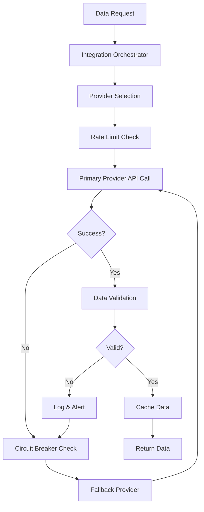
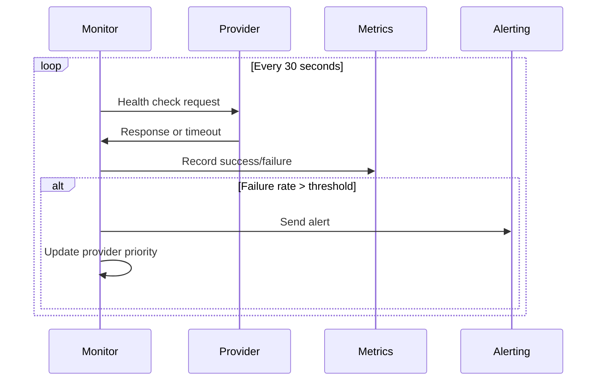

# INT-003: Third-Party Financial Data Integration

## Epic
**Epic 6: System Integration & Data Orchestration** - Seamless system integration and robust data flow management

## Story Overview
**Title**: Third-Party Financial Data Integration & Validation Framework  
**Story Points**: 16  
**Priority**: High  
**Status**: Pending  
**Assignee**: Backend Integration Team  
**Sprint**: TBD

## Business Context
Implement a comprehensive financial data integration framework that reliably ingests, validates, and normalizes data from multiple third-party providers (NSE, BSE, Yahoo Finance, Alpha Vantage, Polygon.io). This system ensures high data quality, handles provider failures gracefully, and maintains continuous data flow for trading and analytics operations.

## User Story
**As a** TradeMaster system and user  
**I want** reliable, accurate financial data from multiple sources with automatic failover  
**So that** I have continuous access to market data even when individual providers experience issues

## Technical Requirements

### Multi-Provider Data Integration
- **Provider Abstraction**: Unified interface for different data providers
- **Data Normalization**: Standardize data formats across providers
- **Rate Limit Management**: Respect provider-specific API limits
- **Cost Optimization**: Balance data quality with API usage costs
- **Provider Failover**: Automatic switching to backup providers

### Data Quality & Validation
- **Real-Time Validation**: Validate incoming data against business rules
- **Anomaly Detection**: Identify unusual data patterns or outliers
- **Cross-Provider Verification**: Compare data across multiple sources
- **Data Freshness Monitoring**: Ensure data timeliness requirements
- **Quality Scoring**: Assign quality scores to different data sources

### Resilience & Error Handling
- **Circuit Breaker Pattern**: Prevent cascade failures from provider outages
- **Retry Mechanisms**: Intelligent retry with exponential backoff
- **Fallback Strategies**: Use cached or alternative data sources
- **Error Classification**: Categorize errors for appropriate handling
- **Recovery Procedures**: Automatic data backfill after outages

## Technical Implementation

### Technology Stack
- **Integration**: Spring Integration, Apache Camel
- **HTTP Client**: OkHttp, Resilience4j
- **Data Validation**: Bean Validation, custom validators
- **Caching**: Redis, Caffeine Cache
- **Scheduling**: Spring Scheduler, Quartz
- **Monitoring**: Micrometer, Prometheus

### Architecture Components

#### 1. Provider Abstraction Layer
```java
// Unified financial data provider interface
public interface FinancialDataProvider {
    String getProviderId();
    ProviderCapabilities getCapabilities();
    CompletableFuture<MarketData> getMarketData(String symbol);
    CompletableFuture<HistoricalData> getHistoricalData(String symbol, TimeRange range);
    CompletableFuture<CompanyProfile> getCompanyProfile(String symbol);
    RateLimitInfo getRateLimitInfo();
}

// NSE provider implementation
@Component("nseProvider")
public class NSEDataProvider implements FinancialDataProvider {
    
    private final OkHttpClient httpClient;
    private final RateLimiter rateLimiter;
    private final CircuitBreaker circuitBreaker;
    
    @Override
    public CompletableFuture<MarketData> getMarketData(String symbol) {
        return CompletableFuture.supplyAsync(() -> {
            return circuitBreaker.executeSupplier(() -> {
                rateLimiter.acquirePermission();
                
                Request request = new Request.Builder()
                    .url(buildNSEUrl(symbol))
                    .addHeader("User-Agent", "TradeMaster/1.0")
                    .build();
                    
                try (Response response = httpClient.newCall(request).execute()) {
                    if (!response.isSuccessful()) {
                        throw new DataProviderException("NSE API error: " + response.code());
                    }
                    
                    String jsonData = response.body().string();
                    return parseNSEMarketData(jsonData, symbol);
                    
                } catch (IOException e) {
                    throw new DataProviderException("NSE connection failed", e);
                }
            });
        });
    }
    
    private MarketData parseNSEMarketData(String jsonData, String symbol) {
        NSEResponse nseResponse = objectMapper.readValue(jsonData, NSEResponse.class);
        
        return MarketData.builder()
            .symbol(symbol)
            .price(nseResponse.getLastPrice())
            .volume(nseResponse.getTotalTradedVolume())
            .high(nseResponse.getDayHigh())
            .low(nseResponse.getDayLow())
            .open(nseResponse.getOpen())
            .close(nseResponse.getPreviousClose())
            .timestamp(Instant.now())
            .source("NSE")
            .build();
    }
}

// Alpha Vantage provider implementation
@Component("alphaVantageProvider")
public class AlphaVantageProvider implements FinancialDataProvider {
    
    @Value("${providers.alphavantage.api-key}")
    private String apiKey;
    
    @Override
    public CompletableFuture<MarketData> getMarketData(String symbol) {
        return CompletableFuture.supplyAsync(() -> {
            return circuitBreaker.executeSupplier(() -> {
                rateLimiter.acquirePermission();
                
                String url = String.format("%s?function=GLOBAL_QUOTE&symbol=%s&apikey=%s",
                    ALPHA_VANTAGE_BASE_URL, symbol, apiKey);
                
                Request request = new Request.Builder().url(url).build();
                
                try (Response response = httpClient.newCall(request).execute()) {
                    String jsonData = response.body().string();
                    return parseAlphaVantageData(jsonData, symbol);
                } catch (IOException e) {
                    throw new DataProviderException("Alpha Vantage connection failed", e);
                }
            });
        });
    }
}
```

#### 2. Data Integration Orchestrator
```java
@Service
public class DataIntegrationOrchestrator {
    
    private final List<FinancialDataProvider> providers;
    private final DataValidator dataValidator;
    private final DataCache dataCache;
    private final ProviderHealthMonitor healthMonitor;
    
    public CompletableFuture<MarketData> getMarketData(String symbol) {
        List<FinancialDataProvider> availableProviders = 
            getAvailableProviders(DataType.MARKET_DATA);
            
        return executeWithFallback(availableProviders, 
            provider -> provider.getMarketData(symbol))
            .thenCompose(data -> validateAndCache(data, symbol));
    }
    
    private <T> CompletableFuture<T> executeWithFallback(
            List<FinancialDataProvider> providers,
            Function<FinancialDataProvider, CompletableFuture<T>> operation) {
        
        if (providers.isEmpty()) {
            return CompletableFuture.failedFuture(
                new NoAvailableProvidersException());
        }
        
        FinancialDataProvider primaryProvider = providers.get(0);
        List<FinancialDataProvider> fallbackProviders = 
            providers.subList(1, providers.size());
        
        return operation.apply(primaryProvider)
            .handle((result, throwable) -> {
                if (throwable != null) {
                    log.warn("Primary provider {} failed: {}", 
                        primaryProvider.getProviderId(), throwable.getMessage());
                    
                    healthMonitor.recordFailure(primaryProvider.getProviderId());
                    
                    if (!fallbackProviders.isEmpty()) {
                        return executeWithFallback(fallbackProviders, operation);
                    } else {
                        return CompletableFuture.<T>failedFuture(throwable);
                    }
                } else {
                    healthMonitor.recordSuccess(primaryProvider.getProviderId());
                    return CompletableFuture.completedFuture(result);
                }
            })
            .thenCompose(Function.identity());
    }
    
    private CompletableFuture<MarketData> validateAndCache(MarketData data, String symbol) {
        return CompletableFuture.supplyAsync(() -> {
            ValidationResult validation = dataValidator.validate(data);
            
            if (!validation.isValid()) {
                log.warn("Data validation failed for {}: {}", 
                    symbol, validation.getErrors());
                throw new DataValidationException(validation.getErrors());
            }
            
            // Cache validated data
            dataCache.put(CacheKey.marketData(symbol), data, Duration.ofMinutes(1));
            
            return data;
        });
    }
}
```

#### 3. Data Validation Framework
```java
@Component
public class DataValidator {
    
    private final List<ValidationRule<MarketData>> marketDataRules;
    private final AnomalyDetector anomalyDetector;
    
    public ValidationResult validate(MarketData data) {
        ValidationResult result = new ValidationResult();
        
        // Basic validation rules
        for (ValidationRule<MarketData> rule : marketDataRules) {
            RuleResult ruleResult = rule.validate(data);
            if (!ruleResult.isValid()) {
                result.addError(ruleResult.getErrorMessage());
            }
        }
        
        // Anomaly detection
        AnomalyScore anomalyScore = anomalyDetector.calculateScore(data);
        if (anomalyScore.isAnomalous()) {
            result.addWarning("Potential data anomaly detected: " + 
                anomalyScore.getDescription());
        }
        
        // Cross-provider validation if available
        Optional<MarketData> cachedData = getCachedDataFromOtherProvider(data.getSymbol());
        if (cachedData.isPresent()) {
            CrossValidationResult crossValidation = 
                crossValidate(data, cachedData.get());
            if (!crossValidation.isConsistent()) {
                result.addWarning("Data inconsistency across providers: " + 
                    crossValidation.getDiscrepancies());
            }
        }
        
        return result;
    }
}

// Validation rules
@Component
public class PriceValidationRule implements ValidationRule<MarketData> {
    
    @Override
    public RuleResult validate(MarketData data) {
        if (data.getPrice() <= 0) {
            return RuleResult.invalid("Price must be positive");
        }
        
        if (data.getHigh() < data.getLow()) {
            return RuleResult.invalid("High price cannot be less than low price");
        }
        
        if (data.getPrice() > data.getHigh() || data.getPrice() < data.getLow()) {
            return RuleResult.invalid("Current price must be between high and low");
        }
        
        return RuleResult.valid();
    }
}

@Component
public class VolumeValidationRule implements ValidationRule<MarketData> {
    
    @Override
    public RuleResult validate(MarketData data) {
        if (data.getVolume() < 0) {
            return RuleResult.invalid("Volume cannot be negative");
        }
        
        // Check for unrealistic volume spikes
        if (data.getVolume() > getAverageVolume(data.getSymbol()) * 100) {
            return RuleResult.warning("Volume appears unusually high");
        }
        
        return RuleResult.valid();
    }
}
```

#### 4. Provider Health Monitoring
```java
@Component
public class ProviderHealthMonitor {
    
    private final Map<String, ProviderHealthMetrics> healthMetrics = new ConcurrentHashMap<>();
    private final MeterRegistry meterRegistry;
    
    public void recordSuccess(String providerId) {
        ProviderHealthMetrics metrics = getOrCreateMetrics(providerId);
        metrics.recordSuccess();
        
        meterRegistry.counter("provider.requests.success", "provider", providerId)
            .increment();
    }
    
    public void recordFailure(String providerId) {
        ProviderHealthMetrics metrics = getOrCreateMetrics(providerId);
        metrics.recordFailure();
        
        meterRegistry.counter("provider.requests.failure", "provider", providerId)
            .increment();
    }
    
    public ProviderHealthStatus getHealthStatus(String providerId) {
        ProviderHealthMetrics metrics = healthMetrics.get(providerId);
        if (metrics == null) {
            return ProviderHealthStatus.UNKNOWN;
        }
        
        double errorRate = metrics.getErrorRate();
        if (errorRate > 0.5) {
            return ProviderHealthStatus.UNHEALTHY;
        } else if (errorRate > 0.1) {
            return ProviderHealthStatus.DEGRADED;
        } else {
            return ProviderHealthStatus.HEALTHY;
        }
    }
    
    @Scheduled(fixedRate = 30000) // Every 30 seconds
    public void performHealthChecks() {
        for (FinancialDataProvider provider : providers) {
            CompletableFuture.supplyAsync(() -> {
                try {
                    return provider.getMarketData("AAPL"); // Health check symbol
                } catch (Exception e) {
                    recordFailure(provider.getProviderId());
                    return null;
                }
            }).thenAccept(result -> {
                if (result != null) {
                    recordSuccess(provider.getProviderId());
                }
            });
        }
    }
}
```

#### 5. Rate Limit Management
```java
@Component
public class RateLimitManager {
    
    private final Map<String, RateLimiter> providerLimiters = new ConcurrentHashMap<>();
    
    @PostConstruct
    public void initializeRateLimiters() {
        // NSE: 1000 requests per minute
        providerLimiters.put("nse", RateLimiter.create(1000.0 / 60.0));
        
        // Alpha Vantage: 5 requests per minute for free tier
        providerLimiters.put("alphavantage", RateLimiter.create(5.0 / 60.0));
        
        // Yahoo Finance: 2000 requests per hour
        providerLimiters.put("yahoo", RateLimiter.create(2000.0 / 3600.0));
        
        // Polygon.io: 1000 requests per minute
        providerLimiters.put("polygon", RateLimiter.create(1000.0 / 60.0));
    }
    
    public boolean acquirePermission(String providerId) {
        RateLimiter limiter = providerLimiters.get(providerId);
        if (limiter == null) {
            return true; // No limit configured
        }
        
        return limiter.tryAcquire(1, TimeUnit.SECONDS);
    }
    
    public void waitForPermission(String providerId) {
        RateLimiter limiter = providerLimiters.get(providerId);
        if (limiter != null) {
            limiter.acquire();
        }
    }
    
    @EventListener
    public void handleRateLimitExceeded(RateLimitExceededEvent event) {
        String providerId = event.getProviderId();
        log.warn("Rate limit exceeded for provider: {}", providerId);
        
        // Temporarily reduce rate limit
        RateLimiter limiter = providerLimiters.get(providerId);
        if (limiter != null) {
            // Reduce rate by 50% for 5 minutes
            double currentRate = limiter.getRate();
            limiter.setRate(currentRate * 0.5);
            
            scheduler.schedule(() -> {
                limiter.setRate(currentRate); // Restore original rate
                log.info("Restored original rate limit for provider: {}", providerId);
            }, Duration.ofMinutes(5));
        }
    }
}
```

### Integration Points

#### 1. Data Provider Integration Flow


#### 2. Provider Health Monitoring


## Database Schema

### Provider Management
```sql
-- Financial data providers configuration
CREATE TABLE data_providers (
    id BIGSERIAL PRIMARY KEY,
    provider_id VARCHAR(50) NOT NULL UNIQUE,
    provider_name VARCHAR(100) NOT NULL,
    base_url VARCHAR(255) NOT NULL,
    api_key_required BOOLEAN DEFAULT false,
    rate_limit_per_minute INTEGER,
    priority INTEGER DEFAULT 100,
    is_enabled BOOLEAN DEFAULT true,
    capabilities JSONB,
    configuration JSONB,
    created_at TIMESTAMP DEFAULT CURRENT_TIMESTAMP,
    INDEX idx_providers_enabled (is_enabled),
    INDEX idx_providers_priority (priority)
);

-- Provider health metrics
CREATE TABLE provider_health_metrics (
    id BIGSERIAL PRIMARY KEY,
    provider_id VARCHAR(50) NOT NULL,
    measurement_time TIMESTAMP DEFAULT CURRENT_TIMESTAMP,
    requests_total INTEGER DEFAULT 0,
    requests_successful INTEGER DEFAULT 0,
    requests_failed INTEGER DEFAULT 0,
    average_response_time_ms INTEGER,
    error_rate DECIMAL(5,4),
    health_status VARCHAR(20), -- 'healthy', 'degraded', 'unhealthy'
    FOREIGN KEY (provider_id) REFERENCES data_providers(provider_id),
    INDEX idx_health_metrics_provider (provider_id),
    INDEX idx_health_metrics_time (measurement_time)
);

-- Data validation results
CREATE TABLE data_validation_log (
    id BIGSERIAL PRIMARY KEY,
    symbol VARCHAR(20) NOT NULL,
    provider_id VARCHAR(50) NOT NULL,
    data_type VARCHAR(30) NOT NULL,
    validation_status VARCHAR(20), -- 'valid', 'invalid', 'warning'
    validation_errors JSONB,
    data_snapshot JSONB,
    validated_at TIMESTAMP DEFAULT CURRENT_TIMESTAMP,
    INDEX idx_validation_log_symbol (symbol),
    INDEX idx_validation_log_status (validation_status),
    INDEX idx_validation_log_time (validated_at)
);
```

## API Specifications

### Data Provider Management API
```yaml
# Provider management endpoints
/api/v1/providers:
  get:
    summary: List all data providers
    responses:
      200:
        description: Provider list
        schema:
          type: array
          items:
            type: object
            properties:
              provider_id: string
              name: string
              health_status: string
              rate_limit: integer
              priority: integer

  post:
    summary: Add new data provider
    parameters:
      - name: provider_config
        schema:
          type: object
          properties:
            provider_id: string
            name: string
            base_url: string
            rate_limit: integer
            configuration: object
    responses:
      201:
        description: Provider added successfully

/api/v1/providers/{provider_id}/health:
  get:
    summary: Get provider health status
    responses:
      200:
        description: Health status
        schema:
          type: object
          properties:
            provider_id: string
            status: string
            error_rate: number
            avg_response_time: number
            last_check: string

/api/v1/providers/{provider_id}/test:
  post:
    summary: Test provider connectivity
    parameters:
      - name: test_symbol
        required: false
        schema:
          type: string
          default: "AAPL"
    responses:
      200:
        description: Test successful
        schema:
          type: object
          properties:
            success: boolean
            response_time: number
            error_message: string
```

### Data Retrieval API
```yaml
/api/v1/market-data/{symbol}:
  get:
    summary: Get market data for symbol
    parameters:
      - name: providers
        required: false
        schema:
          type: array
          items:
            type: string
      - name: validate
        required: false
        schema:
          type: boolean
          default: true
    responses:
      200:
        description: Market data
        schema:
          type: object
          properties:
            symbol: string
            price: number
            volume: integer
            timestamp: string
            source: string
            quality_score: number

/api/v1/historical-data/{symbol}:
  get:
    summary: Get historical data
    parameters:
      - name: from_date
        required: true
        schema:
          type: string
          format: date
      - name: to_date
        required: true
        schema:
          type: string
          format: date
      - name: interval
        required: false
        schema:
          type: string
          enum: ["1min", "5min", "1hour", "1day"]
          default: "1day"
    responses:
      200:
        description: Historical data
        schema:
          type: array
          items:
            type: object
            properties:
              timestamp: string
              open: number
              high: number
              low: number
              close: number
              volume: integer
```

## Acceptance Criteria

### Multi-Provider Integration
- [ ] **Provider Support**: Successfully integrate 4+ financial data providers
- [ ] **Data Normalization**: Standardize data formats across all providers
- [ ] **Failover Mechanism**: Automatic switching to backup providers within 5 seconds
- [ ] **Rate Limit Compliance**: Respect all provider-specific rate limits
- [ ] **Cost Optimization**: Minimize API usage costs while maintaining data quality

### Data Quality & Validation
- [ ] **Real-Time Validation**: Validate 100% of incoming data against business rules
- [ ] **Anomaly Detection**: Identify and flag data anomalies with 95% accuracy
- [ ] **Cross-Provider Verification**: Compare data across providers for consistency
- [ ] **Quality Scoring**: Assign quality scores to data sources
- [ ] **Data Freshness**: Ensure market data is less than 30 seconds old

### System Resilience
- [ ] **Circuit Breaker**: Prevent cascade failures during provider outages
- [ ] **Error Recovery**: Automatically recover and backfill data after outages
- [ ] **Fallback Strategies**: Use cached or alternative data sources when needed
- [ ] **Health Monitoring**: Monitor provider health with alerting
- [ ] **Uptime**: Maintain 99.9% data availability

## Testing Strategy

### Unit Tests
```java
@Test
public void testProviderFailover() {
    // Mock primary provider failure
    when(primaryProvider.getMarketData("AAPL"))
        .thenReturn(CompletableFuture.failedFuture(
            new DataProviderException("Provider unavailable")));
    
    // Mock fallback provider success
    MarketData expectedData = createTestMarketData("AAPL");
    when(fallbackProvider.getMarketData("AAPL"))
        .thenReturn(CompletableFuture.completedFuture(expectedData));
    
    MarketData actualData = orchestrator.getMarketData("AAPL").join();
    
    assertEquals(expectedData.getSymbol(), actualData.getSymbol());
    assertEquals("fallback-provider", actualData.getSource());
}

@Test
public void testDataValidation() {
    MarketData invalidData = MarketData.builder()
        .symbol("AAPL")
        .price(-10.0) // Invalid negative price
        .volume(1000)
        .build();
    
    ValidationResult result = dataValidator.validate(invalidData);
    
    assertFalse(result.isValid());
    assertTrue(result.getErrors().contains("Price must be positive"));
}

@Test
public void testRateLimit() {
    rateLimitManager.initializeRateLimiters();
    
    // First request should succeed
    assertTrue(rateLimitManager.acquirePermission("alphavantage"));
    
    // Subsequent requests within rate limit should be throttled
    for (int i = 0; i < 10; i++) {
        boolean acquired = rateLimitManager.acquirePermission("alphavantage");
        // Most should be denied due to rate limit
    }
}
```

### Integration Tests
```java
@Test
public void testEndToEndDataRetrieval() {
    // Test complete data retrieval flow
    CompletableFuture<MarketData> future = 
        orchestrator.getMarketData("AAPL");
    
    MarketData data = future.join();
    
    assertNotNull(data);
    assertEquals("AAPL", data.getSymbol());
    assertTrue(data.getPrice() > 0);
    assertTrue(data.getVolume() >= 0);
    assertNotNull(data.getSource());
}

@Test
public void testProviderHealthMonitoring() {
    // Simulate provider failures
    for (int i = 0; i < 10; i++) {
        healthMonitor.recordFailure("test-provider");
    }
    
    ProviderHealthStatus status = 
        healthMonitor.getHealthStatus("test-provider");
    
    assertEquals(ProviderHealthStatus.UNHEALTHY, status);
}
```

## Monitoring & Alerting

### Performance Metrics
- **Data Retrieval Latency**: Time to fetch data from providers
- **Provider Success Rate**: Percentage of successful requests per provider
- **Data Quality Score**: Average quality score of validated data
- **Failover Frequency**: Number of provider failovers per hour
- **API Usage**: API calls per provider per time period

### Alert Conditions
```yaml
# Data provider alerts
provider_down:
  condition: success_rate < 50% for 5 minutes
  action: switch_to_backup_provider
  severity: critical

data_quality_degraded:
  condition: avg_quality_score < 0.8
  action: investigate_data_sources
  severity: warning

high_api_usage:
  condition: api_usage > 80% of limit
  action: throttle_requests
  severity: warning

data_stale:
  condition: last_update > 5 minutes ago
  action: trigger_manual_refresh
  severity: critical

validation_failures:
  condition: validation_failure_rate > 10%
  action: review_validation_rules
  severity: warning
```

## Deployment Strategy

### Phase 1: Core Integration Framework (Week 1-2)
- Implement provider abstraction layer
- Set up basic data validation framework
- Deploy NSE and Alpha Vantage providers
- Deploy to development environment

### Phase 2: Advanced Features (Week 3-4)
- Implement circuit breaker and retry mechanisms
- Add rate limit management
- Set up provider health monitoring
- Add Yahoo Finance and Polygon.io providers

### Phase 3: Production Deployment (Week 5-6)
- Deploy to staging environment
- Comprehensive integration testing
- Performance optimization and caching
- Production deployment with monitoring

### Phase 4: Optimization (Week 7-8)
- Fine-tune failover mechanisms
- Optimize data validation rules
- Create monitoring dashboards
- Documentation and team training

## Risk Analysis

### High Risks
- **Provider Dependencies**: Dependence on external APIs for critical data
  - *Mitigation*: Multiple providers, caching strategies, fallback mechanisms
- **Data Quality**: Poor data quality may impact trading decisions
  - *Mitigation*: Comprehensive validation, cross-provider verification
- **Rate Limits**: Exceeding provider rate limits may disrupt service
  - *Mitigation*: Intelligent rate limiting, provider rotation

### Medium Risks
- **API Changes**: Provider API changes may break integration
  - *Mitigation*: API versioning, monitoring, provider communication
- **Cost Management**: API costs may escalate with usage
  - *Mitigation*: Usage monitoring, cost optimization strategies

## Success Metrics

### Technical Metrics
- **Data Availability**: 99.9% uptime for market data
- **Response Time**: <2 seconds average data retrieval time
- **Data Quality**: >95% data passes validation rules
- **Provider Failover**: <5 seconds to switch to backup provider
- **Error Rate**: <1% failed data requests

### Business Metrics
- **User Satisfaction**: >4.5/5 rating for data accuracy
- **Trading Activity**: No reduction in trading due to data issues
- **Cost Efficiency**: 20% reduction in data acquisition costs
- **System Reliability**: 99% user-perceived data reliability
- **Revenue Protection**: Zero revenue loss due to data outages

## Dependencies
- **External APIs**: NSE, BSE, Yahoo Finance, Alpha Vantage, Polygon.io
- **Infrastructure**: Redis cache, monitoring systems
- **Authentication**: API keys and tokens for providers
- **Network**: Reliable internet connectivity
- **Monitoring**: Prometheus, Grafana for metrics

## Definition of Done
- [ ] Multi-provider integration framework operational
- [ ] Data validation and quality scoring implemented
- [ ] Provider failover mechanism working reliably
- [ ] Rate limiting and health monitoring active
- [ ] 99.9% data availability achieved
- [ ] Comprehensive error handling and recovery
- [ ] Performance monitoring and alerting operational
- [ ] Integration testing completed successfully
- [ ] Documentation and runbooks created