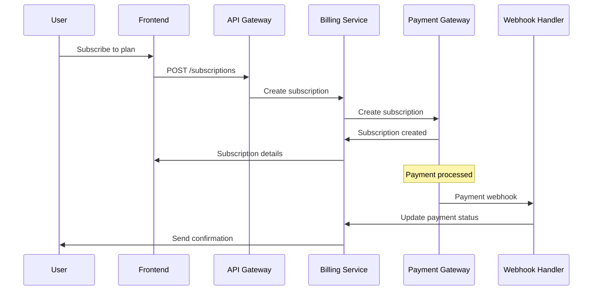
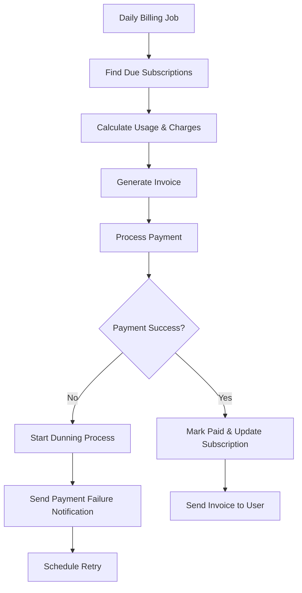

# INT-004: Payment Gateway & Billing System Integration

## Epic
**Epic 6: System Integration & Data Orchestration** - Seamless system integration and robust data flow management

## Story Overview
**Title**: Payment Gateway & Billing System Integration  
**Story Points**: 20  
**Priority**: High  
**Status**: Pending  
**Assignee**: Backend Integration Team  
**Sprint**: TBD

## Business Context
Implement comprehensive payment gateway integration and automated billing system that handles subscription payments, one-time purchases, GST compliance, invoice generation, and webhook processing. This system ensures reliable payment processing, automated billing cycles, and seamless integration with accounting systems while maintaining PCI DSS compliance.

## User Story
**As a** TradeMaster user and administrator  
**I want** seamless payment processing and automated billing management  
**So that** I can subscribe to services without payment issues and administrators can manage billing efficiently

## Technical Requirements

### Payment Gateway Integration
- **Multi-Gateway Support**: Razorpay (primary), Stripe (international), PayU (backup)
- **Payment Methods**: Credit/Debit cards, UPI, Net Banking, Wallets
- **Subscription Management**: Recurring billing, plan upgrades/downgrades
- **One-Time Payments**: Feature purchases, additional credits
- **Payment Security**: PCI DSS compliance, tokenization, fraud detection

### Billing System
- **Automated Invoicing**: Generate GST-compliant invoices automatically
- **Proration Handling**: Handle mid-cycle plan changes
- **Usage-Based Billing**: Track and bill for API usage, premium features
- **Billing Cycles**: Monthly, quarterly, annual subscription support
- **Dunning Management**: Handle failed payments and retry logic

### Webhook Processing
- **Real-Time Updates**: Process payment status updates immediately
- **Event Processing**: Handle subscription events, payment confirmations
- **Idempotency**: Prevent duplicate processing of webhooks
- **Security Validation**: Verify webhook authenticity
- **Error Handling**: Robust error handling and retry mechanisms

## Technical Implementation

### Technology Stack
- **Payment Gateways**: Razorpay Java SDK, Stripe Java SDK
- **Billing**: Custom billing engine, Chargebee (optional)
- **Invoice Generation**: iText PDF, JasperReports
- **Webhook Processing**: Spring Boot, Jackson JSON
- **Queue Management**: Redis, Apache Kafka
- **Database**: PostgreSQL, Redis cache

### Architecture Components

#### 1. Payment Gateway Abstraction
```java
// Unified payment gateway interface
public interface PaymentGateway {
    String getGatewayId();
    PaymentCapabilities getCapabilities();
    
    // One-time payments
    PaymentResponse createPayment(PaymentRequest request);
    PaymentStatus getPaymentStatus(String paymentId);
    RefundResponse refundPayment(RefundRequest request);
    
    // Subscription management
    SubscriptionResponse createSubscription(SubscriptionRequest request);
    SubscriptionResponse updateSubscription(String subscriptionId, 
                                           SubscriptionUpdateRequest request);
    SubscriptionResponse cancelSubscription(String subscriptionId);
    
    // Webhook handling
    boolean validateWebhook(String payload, String signature, String secret);
    WebhookEvent parseWebhook(String payload);
}

// Razorpay implementation
@Component("razorpayGateway")
public class RazorpayGateway implements PaymentGateway {
    
    private final RazorpayClient razorpayClient;
    private final PaymentValidator paymentValidator;
    
    @Override
    public PaymentResponse createPayment(PaymentRequest request) {
        try {
            JSONObject paymentRequest = new JSONObject();
            paymentRequest.put("amount", request.getAmount() * 100); // Convert to paise
            paymentRequest.put("currency", "INR");
            paymentRequest.put("receipt", request.getReceiptId());
            paymentRequest.put("notes", convertNotes(request.getMetadata()));
            
            Payment payment = razorpayClient.Payments.create(paymentRequest);
            
            return PaymentResponse.builder()
                .paymentId(payment.get("id"))
                .status(PaymentStatus.valueOf(payment.get("status").toString().toUpperCase()))
                .amount(request.getAmount())
                .currency("INR")
                .gatewayResponse(payment.toString())
                .build();
                
        } catch (RazorpayException e) {
            log.error("Razorpay payment creation failed", e);
            throw new PaymentGatewayException("Payment creation failed", e);
        }
    }
    
    @Override
    public SubscriptionResponse createSubscription(SubscriptionRequest request) {
        try {
            // Create plan first if it doesn't exist
            Plan plan = createOrGetPlan(request.getPlanDetails());
            
            JSONObject subscriptionRequest = new JSONObject();
            subscriptionRequest.put("plan_id", plan.get("id"));
            subscriptionRequest.put("customer_id", request.getCustomerId());
            subscriptionRequest.put("total_count", request.getTotalBillingCycles());
            subscriptionRequest.put("start_at", request.getStartDate().getEpochSecond());
            
            if (request.hasAddons()) {
                subscriptionRequest.put("addons", convertAddons(request.getAddons()));
            }
            
            Subscription subscription = razorpayClient.Subscriptions.create(subscriptionRequest);
            
            return SubscriptionResponse.builder()
                .subscriptionId(subscription.get("id"))
                .status(SubscriptionStatus.valueOf(
                    subscription.get("status").toString().toUpperCase()))
                .planId(plan.get("id").toString())
                .customerId(request.getCustomerId())
                .nextBillingDate(Instant.ofEpochSecond(
                    Long.parseLong(subscription.get("current_end").toString())))
                .build();
                
        } catch (RazorpayException e) {
            log.error("Razorpay subscription creation failed", e);
            throw new PaymentGatewayException("Subscription creation failed", e);
        }
    }
    
    @Override
    public boolean validateWebhook(String payload, String signature, String secret) {
        try {
            String expectedSignature = Utils.getHash(payload, secret);
            return expectedSignature.equals(signature);
        } catch (Exception e) {
            log.error("Webhook validation failed", e);
            return false;
        }
    }
}

// Stripe implementation for international payments
@Component("stripeGateway")
public class StripeGateway implements PaymentGateway {
    
    @Value("${payment.stripe.secret-key}")
    private String stripeSecretKey;
    
    @PostConstruct
    public void initialize() {
        Stripe.apiKey = stripeSecretKey;
    }
    
    @Override
    public PaymentResponse createPayment(PaymentRequest request) {
        try {
            PaymentIntentCreateParams params = PaymentIntentCreateParams.builder()
                .setAmount(request.getAmount().longValue() * 100L) // Convert to cents
                .setCurrency("usd")
                .putMetadata("user_id", request.getUserId().toString())
                .putMetadata("order_id", request.getOrderId())
                .build();
                
            PaymentIntent intent = PaymentIntent.create(params);
            
            return PaymentResponse.builder()
                .paymentId(intent.getId())
                .status(convertStripeStatus(intent.getStatus()))
                .amount(request.getAmount())
                .currency("USD")
                .clientSecret(intent.getClientSecret())
                .build();
                
        } catch (StripeException e) {
            log.error("Stripe payment creation failed", e);
            throw new PaymentGatewayException("Payment creation failed", e);
        }
    }
}
```

#### 2. Billing System Engine
```java
@Service
public class BillingEngine {
    
    private final SubscriptionRepository subscriptionRepository;
    private final InvoiceGenerator invoiceGenerator;
    private final PaymentGatewayManager gatewayManager;
    private final UsageTracker usageTracker;
    
    @Scheduled(cron = "0 0 2 * * ?") // Daily at 2 AM
    public void processDailyBilling() {
        log.info("Starting daily billing process");
        
        List<BillingSubscription> subscriptionsDue = 
            subscriptionRepository.findSubscriptionsDueForBilling(LocalDate.now());
            
        for (BillingSubscription subscription : subscriptionsDue) {
            try {
                processBillingCycle(subscription);
            } catch (Exception e) {
                log.error("Failed to process billing for subscription: {}", 
                    subscription.getId(), e);
                handleBillingFailure(subscription, e);
            }
        }
    }
    
    public void processBillingCycle(BillingSubscription subscription) {
        BillingPeriod currentPeriod = calculateBillingPeriod(subscription);
        
        // Calculate charges for the period
        BillingCalculation calculation = calculateBilling(subscription, currentPeriod);
        
        // Generate invoice
        Invoice invoice = invoiceGenerator.generateInvoice(subscription, calculation);
        invoiceRepository.save(invoice);
        
        // Process payment
        if (calculation.getTotalAmount().compareTo(BigDecimal.ZERO) > 0) {
            processSubscriptionPayment(subscription, invoice, calculation);
        } else {
            // Free tier or credits cover the cost
            markInvoiceAsPaid(invoice);
        }
        
        // Update subscription for next billing cycle
        updateSubscriptionForNextCycle(subscription, currentPeriod);
    }
    
    private BillingCalculation calculateBilling(BillingSubscription subscription, 
                                              BillingPeriod period) {
        BillingCalculation calculation = new BillingCalculation();
        
        // Base subscription fee
        BigDecimal baseAmount = subscription.getPlan().getPrice();
        calculation.addLineItem("Subscription", baseAmount, 1);
        
        // Usage-based charges
        if (subscription.getPlan().hasUsageCharges()) {
            UsageData usage = usageTracker.getUsage(subscription.getUserId(), period);
            
            // API calls
            if (usage.getApiCalls() > subscription.getPlan().getIncludedApiCalls()) {
                long excessCalls = usage.getApiCalls() - subscription.getPlan().getIncludedApiCalls();
                BigDecimal apiCharges = subscription.getPlan().getPerApiCallRate()
                    .multiply(BigDecimal.valueOf(excessCalls));
                calculation.addLineItem("Additional API Calls", 
                    subscription.getPlan().getPerApiCallRate(), excessCalls);
            }
            
            // Premium features usage
            usage.getPremiumFeatureUsage().forEach((feature, count) -> {
                BigDecimal rate = subscription.getPlan().getPremiumFeatureRate(feature);
                if (rate != null && count > 0) {
                    calculation.addLineItem("Premium Feature: " + feature, rate, count);
                }
            });
        }
        
        // Apply discounts
        applyDiscounts(calculation, subscription);
        
        // Calculate GST
        if (subscription.isGstApplicable()) {
            BigDecimal gstAmount = calculation.getSubtotal()
                .multiply(subscription.getGstRate())
                .divide(BigDecimal.valueOf(100), 2, RoundingMode.HALF_UP);
            calculation.setGstAmount(gstAmount);
        }
        
        return calculation;
    }
    
    private void processSubscriptionPayment(BillingSubscription subscription, 
                                          Invoice invoice, 
                                          BillingCalculation calculation) {
        PaymentGateway gateway = gatewayManager.getGateway(subscription.getPaymentGateway());
        
        try {
            // For subscriptions, charge the default payment method
            PaymentRequest paymentRequest = PaymentRequest.builder()
                .amount(calculation.getTotalAmount())
                .currency(subscription.getCurrency())
                .customerId(subscription.getCustomerId())
                .paymentMethodId(subscription.getDefaultPaymentMethodId())
                .receiptId(invoice.getInvoiceNumber())
                .description("Subscription payment for " + subscription.getPlan().getName())
                .metadata(Map.of(
                    "subscription_id", subscription.getId().toString(),
                    "invoice_id", invoice.getId().toString(),
                    "user_id", subscription.getUserId().toString()
                ))
                .build();
                
            PaymentResponse response = gateway.createPayment(paymentRequest);
            
            if (response.getStatus() == PaymentStatus.SUCCEEDED) {
                markInvoiceAsPaid(invoice);
                updateSubscriptionStatus(subscription, SubscriptionStatus.ACTIVE);
                sendPaymentSuccessNotification(subscription, invoice);
            } else {
                handlePaymentFailure(subscription, invoice, response);
            }
            
        } catch (Exception e) {
            log.error("Payment processing failed for subscription: {}", 
                subscription.getId(), e);
            handlePaymentFailure(subscription, invoice, null);
        }
    }
    
    private void handlePaymentFailure(BillingSubscription subscription, 
                                    Invoice invoice, 
                                    PaymentResponse response) {
        // Start dunning process
        DunningProcess dunning = DunningProcess.builder()
            .subscriptionId(subscription.getId())
            .invoiceId(invoice.getId())
            .failureReason(response != null ? response.getFailureReason() : "Payment failed")
            .retryCount(0)
            .nextRetryDate(LocalDateTime.now().plusDays(1))
            .build();
            
        dunningRepository.save(dunning);
        
        // Send payment failure notification
        sendPaymentFailureNotification(subscription, invoice);
        
        // Update subscription status
        updateSubscriptionStatus(subscription, SubscriptionStatus.PAST_DUE);
    }
}
```

#### 3. Invoice Generation System
```java
@Service
public class InvoiceGenerator {
    
    private final GstCalculator gstCalculator;
    private final CompanyDetailsService companyDetailsService;
    private final UserService userService;
    
    public Invoice generateInvoice(BillingSubscription subscription, 
                                 BillingCalculation calculation) {
        User user = userService.findById(subscription.getUserId());
        CompanyDetails companyDetails = companyDetailsService.getCompanyDetails();
        
        Invoice invoice = Invoice.builder()
            .invoiceNumber(generateInvoiceNumber())
            .userId(subscription.getUserId())
            .subscriptionId(subscription.getId())
            .issueDate(LocalDate.now())
            .dueDate(LocalDate.now().plusDays(subscription.getPaymentTerms()))
            .currency(subscription.getCurrency())
            .subtotal(calculation.getSubtotal())
            .taxAmount(calculation.getGstAmount())
            .totalAmount(calculation.getTotalAmount())
            .status(InvoiceStatus.PENDING)
            .build();
            
        // Add line items
        for (BillingLineItem lineItem : calculation.getLineItems()) {
            InvoiceLineItem invoiceLineItem = InvoiceLineItem.builder()
                .invoice(invoice)
                .description(lineItem.getDescription())
                .quantity(lineItem.getQuantity())
                .unitPrice(lineItem.getUnitPrice())
                .amount(lineItem.getAmount())
                .build();
            invoice.addLineItem(invoiceLineItem);
        }
        
        // Generate PDF
        byte[] pdfBytes = generateInvoicePdf(invoice, user, companyDetails);
        invoice.setPdfData(pdfBytes);
        
        return invoiceRepository.save(invoice);
    }
    
    private byte[] generateInvoicePdf(Invoice invoice, User user, 
                                    CompanyDetails companyDetails) {
        try {
            ByteArrayOutputStream outputStream = new ByteArrayOutputStream();
            PdfWriter writer = new PdfWriter(outputStream);
            PdfDocument pdfDoc = new PdfDocument(writer);
            Document document = new Document(pdfDoc);
            
            // Company header
            Paragraph companyHeader = new Paragraph(companyDetails.getName())
                .setFontSize(20)
                .setBold()
                .setTextAlignment(TextAlignment.CENTER);
            document.add(companyHeader);
            
            // Invoice details
            Table invoiceTable = new Table(2);
            invoiceTable.setWidth(UnitValue.createPercentValue(100));
            
            invoiceTable.addCell("Invoice Number:");
            invoiceTable.addCell(invoice.getInvoiceNumber());
            invoiceTable.addCell("Issue Date:");
            invoiceTable.addCell(invoice.getIssueDate().toString());
            invoiceTable.addCell("Due Date:");
            invoiceTable.addCell(invoice.getDueDate().toString());
            
            document.add(invoiceTable);
            
            // Customer details
            Paragraph customerHeader = new Paragraph("Bill To:")
                .setBold()
                .setMarginTop(20);
            document.add(customerHeader);
            
            Paragraph customerDetails = new Paragraph()
                .add(user.getFullName() + "\n")
                .add(user.getEmail() + "\n");
                
            if (user.getBillingAddress() != null) {
                customerDetails.add(user.getBillingAddress().getFormattedAddress());
            }
            
            document.add(customerDetails);
            
            // Line items
            Table lineItemsTable = new Table(4);
            lineItemsTable.setWidth(UnitValue.createPercentValue(100))
                          .setMarginTop(20);
                          
            // Header
            lineItemsTable.addHeaderCell("Description");
            lineItemsTable.addHeaderCell("Quantity");
            lineItemsTable.addHeaderCell("Unit Price");
            lineItemsTable.addHeaderCell("Amount");
            
            // Items
            for (InvoiceLineItem item : invoice.getLineItems()) {
                lineItemsTable.addCell(item.getDescription());
                lineItemsTable.addCell(item.getQuantity().toString());
                lineItemsTable.addCell(formatCurrency(item.getUnitPrice()));
                lineItemsTable.addCell(formatCurrency(item.getAmount()));
            }
            
            document.add(lineItemsTable);
            
            // Totals
            Table totalsTable = new Table(2);
            totalsTable.setWidth(UnitValue.createPercentValue(100))
                       .setMarginTop(20);
                       
            totalsTable.addCell("Subtotal:");
            totalsTable.addCell(formatCurrency(invoice.getSubtotal()));
            
            if (invoice.getTaxAmount().compareTo(BigDecimal.ZERO) > 0) {
                totalsTable.addCell("GST (18%):");
                totalsTable.addCell(formatCurrency(invoice.getTaxAmount()));
            }
            
            totalsTable.addCell(new Cell().add(new Paragraph("Total:")).setBold());
            totalsTable.addCell(new Cell().add(new Paragraph(formatCurrency(invoice.getTotalAmount()))).setBold());
            
            document.add(totalsTable);
            
            // Footer
            Paragraph footer = new Paragraph("Thank you for using TradeMaster!")
                .setTextAlignment(TextAlignment.CENTER)
                .setMarginTop(30);
            document.add(footer);
            
            document.close();
            return outputStream.toByteArray();
            
        } catch (Exception e) {
            log.error("Failed to generate invoice PDF", e);
            throw new InvoiceGenerationException("PDF generation failed", e);
        }
    }
}
```

#### 4. Webhook Processing System
```java
@RestController
@RequestMapping("/api/webhooks")
public class WebhookController {
    
    private final WebhookProcessor webhookProcessor;
    private final WebhookValidator webhookValidator;
    
    @PostMapping("/razorpay")
    public ResponseEntity<String> handleRazorpayWebhook(
            @RequestBody String payload,
            @RequestHeader("X-Razorpay-Signature") String signature) {
        
        try {
            // Validate webhook signature
            if (!webhookValidator.validateRazorpaySignature(payload, signature)) {
                log.warn("Invalid Razorpay webhook signature");
                return ResponseEntity.status(HttpStatus.UNAUTHORIZED).body("Invalid signature");
            }
            
            // Parse webhook event
            WebhookEvent event = parseRazorpayWebhook(payload);
            
            // Process asynchronously to avoid timeout
            webhookProcessor.processAsync(event);
            
            return ResponseEntity.ok("Webhook processed");
            
        } catch (Exception e) {
            log.error("Failed to process Razorpay webhook", e);
            return ResponseEntity.status(HttpStatus.INTERNAL_SERVER_ERROR)
                                 .body("Webhook processing failed");
        }
    }
    
    @PostMapping("/stripe")
    public ResponseEntity<String> handleStripeWebhook(
            @RequestBody String payload,
            @RequestHeader("Stripe-Signature") String signature) {
        
        try {
            // Validate webhook using Stripe's SDK
            Event event = Webhook.constructEvent(payload, signature, stripeWebhookSecret);
            
            WebhookEvent webhookEvent = convertStripeEvent(event);
            webhookProcessor.processAsync(webhookEvent);
            
            return ResponseEntity.ok("Webhook processed");
            
        } catch (SignatureVerificationException e) {
            log.warn("Invalid Stripe webhook signature", e);
            return ResponseEntity.status(HttpStatus.UNAUTHORIZED).body("Invalid signature");
        } catch (Exception e) {
            log.error("Failed to process Stripe webhook", e);
            return ResponseEntity.status(HttpStatus.INTERNAL_SERVER_ERROR)
                                 .body("Webhook processing failed");
        }
    }
}

@Service
public class WebhookProcessor {
    
    private final PaymentService paymentService;
    private final SubscriptionService subscriptionService;
    private final NotificationService notificationService;
    private final WebhookEventRepository eventRepository;
    
    @Async("webhookExecutor")
    public CompletableFuture<Void> processAsync(WebhookEvent event) {
        return CompletableFuture.runAsync(() -> {
            try {
                processWebhookEvent(event);
            } catch (Exception e) {
                log.error("Webhook processing failed for event: {}", event.getId(), e);
                handleWebhookProcessingFailure(event, e);
            }
        });
    }
    
    @Transactional
    public void processWebhookEvent(WebhookEvent event) {
        // Check for duplicate processing
        if (eventRepository.existsByEventId(event.getId())) {
            log.info("Webhook event {} already processed, skipping", event.getId());
            return;
        }
        
        // Save event for idempotency
        WebhookEventLog eventLog = WebhookEventLog.builder()
            .eventId(event.getId())
            .eventType(event.getType())
            .payload(event.getPayload())
            .status(ProcessingStatus.PROCESSING)
            .receivedAt(Instant.now())
            .build();
        eventRepository.save(eventLog);
        
        try {
            switch (event.getType()) {
                case PAYMENT_CAPTURED:
                    handlePaymentCaptured(event);
                    break;
                case PAYMENT_FAILED:
                    handlePaymentFailed(event);
                    break;
                case SUBSCRIPTION_ACTIVATED:
                    handleSubscriptionActivated(event);
                    break;
                case SUBSCRIPTION_CANCELLED:
                    handleSubscriptionCancelled(event);
                    break;
                case INVOICE_PAID:
                    handleInvoicePaid(event);
                    break;
                default:
                    log.info("Unhandled webhook event type: {}", event.getType());
            }
            
            // Mark as successfully processed
            eventLog.setStatus(ProcessingStatus.COMPLETED);
            eventLog.setProcessedAt(Instant.now());
            eventRepository.save(eventLog);
            
        } catch (Exception e) {
            eventLog.setStatus(ProcessingStatus.FAILED);
            eventLog.setErrorMessage(e.getMessage());
            eventRepository.save(eventLog);
            throw e;
        }
    }
    
    private void handlePaymentCaptured(WebhookEvent event) {
        String paymentId = event.getData().get("payment_id").toString();
        BigDecimal amount = new BigDecimal(event.getData().get("amount").toString());
        
        paymentService.markPaymentAsSuccessful(paymentId, amount);
        
        // Send confirmation notification
        String userId = event.getData().get("user_id").toString();
        notificationService.sendPaymentSuccessNotification(userId, paymentId, amount);
        
        log.info("Payment captured successfully: {}", paymentId);
    }
    
    private void handleSubscriptionActivated(WebhookEvent event) {
        String subscriptionId = event.getData().get("subscription_id").toString();
        
        subscriptionService.activateSubscription(subscriptionId);
        
        // Grant access to premium features
        String userId = event.getData().get("user_id").toString();
        subscriptionService.enablePremiumFeatures(userId);
        
        // Send welcome notification
        notificationService.sendSubscriptionWelcomeNotification(userId, subscriptionId);
        
        log.info("Subscription activated: {}", subscriptionId);
    }
}
```

### Integration Points

#### 1. Payment Processing Flow


#### 2. Billing Cycle Process


## Database Schema

### Payment & Billing Schema
```sql
-- Payment transactions
CREATE TABLE payment_transactions (
    id BIGSERIAL PRIMARY KEY,
    payment_id VARCHAR(100) NOT NULL UNIQUE,
    gateway_id VARCHAR(50) NOT NULL,
    user_id BIGINT NOT NULL,
    subscription_id BIGINT,
    invoice_id BIGINT,
    amount DECIMAL(12,2) NOT NULL,
    currency VARCHAR(3) DEFAULT 'INR',
    status VARCHAR(20) NOT NULL,
    gateway_response JSONB,
    created_at TIMESTAMP DEFAULT CURRENT_TIMESTAMP,
    updated_at TIMESTAMP DEFAULT CURRENT_TIMESTAMP,
    INDEX idx_payment_user (user_id),
    INDEX idx_payment_status (status),
    INDEX idx_payment_created (created_at)
);

-- Billing subscriptions
CREATE TABLE billing_subscriptions (
    id BIGSERIAL PRIMARY KEY,
    user_id BIGINT NOT NULL,
    plan_id BIGINT NOT NULL,
    subscription_id VARCHAR(100) NOT NULL UNIQUE,
    gateway_id VARCHAR(50) NOT NULL,
    customer_id VARCHAR(100),
    status VARCHAR(20) NOT NULL,
    current_period_start TIMESTAMP NOT NULL,
    current_period_end TIMESTAMP NOT NULL,
    next_billing_date TIMESTAMP,
    billing_cycle VARCHAR(20) DEFAULT 'monthly',
    amount DECIMAL(12,2) NOT NULL,
    currency VARCHAR(3) DEFAULT 'INR',
    trial_end_date TIMESTAMP,
    cancelled_at TIMESTAMP,
    created_at TIMESTAMP DEFAULT CURRENT_TIMESTAMP,
    updated_at TIMESTAMP DEFAULT CURRENT_TIMESTAMP,
    FOREIGN KEY (user_id) REFERENCES users(id),
    INDEX idx_billing_sub_user (user_id),
    INDEX idx_billing_sub_status (status),
    INDEX idx_billing_sub_next_billing (next_billing_date)
);

-- Invoices
CREATE TABLE invoices (
    id BIGSERIAL PRIMARY KEY,
    invoice_number VARCHAR(50) NOT NULL UNIQUE,
    user_id BIGINT NOT NULL,
    subscription_id BIGINT,
    issue_date DATE NOT NULL,
    due_date DATE NOT NULL,
    subtotal DECIMAL(12,2) NOT NULL,
    tax_amount DECIMAL(12,2) DEFAULT 0,
    total_amount DECIMAL(12,2) NOT NULL,
    currency VARCHAR(3) DEFAULT 'INR',
    status VARCHAR(20) DEFAULT 'pending',
    paid_at TIMESTAMP,
    pdf_data BYTEA,
    created_at TIMESTAMP DEFAULT CURRENT_TIMESTAMP,
    FOREIGN KEY (user_id) REFERENCES users(id),
    INDEX idx_invoice_user (user_id),
    INDEX idx_invoice_status (status),
    INDEX idx_invoice_due_date (due_date)
);

-- Webhook events log
CREATE TABLE webhook_events (
    id BIGSERIAL PRIMARY KEY,
    event_id VARCHAR(100) NOT NULL UNIQUE,
    gateway_id VARCHAR(50) NOT NULL,
    event_type VARCHAR(50) NOT NULL,
    payload JSONB NOT NULL,
    status VARCHAR(20) DEFAULT 'pending',
    processed_at TIMESTAMP,
    error_message TEXT,
    retry_count INTEGER DEFAULT 0,
    received_at TIMESTAMP DEFAULT CURRENT_TIMESTAMP,
    INDEX idx_webhook_event_id (event_id),
    INDEX idx_webhook_status (status),
    INDEX idx_webhook_type (event_type)
);
```

## API Specifications

### Payment API
```yaml
# Payment processing endpoints
/api/v1/payments:
  post:
    summary: Create payment
    parameters:
      - name: payment_request
        schema:
          type: object
          properties:
            amount: number
            currency: string
            payment_method: string
            description: string
    responses:
      201:
        description: Payment created
        schema:
          type: object
          properties:
            payment_id: string
            status: string
            client_secret: string

/api/v1/payments/{payment_id}/status:
  get:
    summary: Get payment status
    responses:
      200:
        description: Payment status
        schema:
          type: object
          properties:
            payment_id: string
            status: string
            amount: number
            created_at: string

/api/v1/subscriptions:
  post:
    summary: Create subscription
    parameters:
      - name: subscription_request
        schema:
          type: object
          properties:
            plan_id: integer
            payment_method: string
            trial_days: integer
    responses:
      201:
        description: Subscription created
        schema:
          type: object
          properties:
            subscription_id: string
            status: string
            next_billing_date: string

/api/v1/invoices:
  get:
    summary: List user invoices
    responses:
      200:
        description: Invoice list
        schema:
          type: array
          items:
            type: object
            properties:
              id: integer
              invoice_number: string
              amount: number
              status: string
              due_date: string

/api/v1/invoices/{invoice_id}/download:
  get:
    summary: Download invoice PDF
    responses:
      200:
        description: Invoice PDF
        content:
          application/pdf:
            schema:
              type: string
              format: binary
```

## Acceptance Criteria

### Payment Processing
- [ ] **Multi-Gateway Support**: Successfully integrate Razorpay and Stripe
- [ ] **Payment Methods**: Support cards, UPI, net banking, wallets
- [ ] **Security Compliance**: PCI DSS compliance with tokenization
- [ ] **Payment Success Rate**: >99% success rate for valid payments
- [ ] **Response Time**: <3 seconds for payment processing

### Billing System
- [ ] **Automated Billing**: Process billing cycles automatically
- [ ] **GST Compliance**: Generate GST-compliant invoices
- [ ] **Usage Tracking**: Accurate usage-based billing
- [ ] **Proration**: Handle mid-cycle plan changes correctly
- [ ] **Dunning Process**: Automatic retry for failed payments

### Webhook Processing
- [ ] **Real-Time Processing**: Process webhooks within 30 seconds
- [ ] **Idempotency**: Prevent duplicate webhook processing
- [ ] **Security Validation**: Verify all webhook signatures
- [ ] **Error Handling**: 99.9% webhook processing success rate
- [ ] **Retry Mechanism**: Automatic retry for failed webhook processing

## Testing Strategy

### Unit Tests
```java
@Test
public void testPaymentCreation() {
    PaymentRequest request = PaymentRequest.builder()
        .amount(BigDecimal.valueOf(1000))
        .currency("INR")
        .userId(123L)
        .description("Test payment")
        .build();
    
    PaymentResponse response = razorpayGateway.createPayment(request);
    
    assertNotNull(response.getPaymentId());
    assertEquals(PaymentStatus.CREATED, response.getStatus());
    assertEquals(BigDecimal.valueOf(1000), response.getAmount());
}

@Test
public void testBillingCalculation() {
    BillingSubscription subscription = createTestSubscription();
    BillingPeriod period = BillingPeriod.monthly(LocalDate.now());
    
    BillingCalculation calculation = billingEngine.calculateBilling(subscription, period);
    
    assertTrue(calculation.getSubtotal().compareTo(BigDecimal.ZERO) > 0);
    assertNotNull(calculation.getLineItems());
    assertFalse(calculation.getLineItems().isEmpty());
}

@Test
public void testWebhookValidation() {
    String payload = "{\"event\":\"payment.captured\",\"payload\":{}}";
    String signature = "valid_signature";
    
    boolean isValid = razorpayGateway.validateWebhook(payload, signature, "secret");
    
    assertTrue(isValid);
}
```

### Integration Tests
```java
@Test
public void testEndToEndPaymentFlow() {
    // Create subscription
    SubscriptionRequest request = createSubscriptionRequest();
    SubscriptionResponse response = subscriptionService.createSubscription(request);
    
    // Simulate webhook
    WebhookEvent event = WebhookEvent.builder()
        .id("test_event_id")
        .type(WebhookEventType.SUBSCRIPTION_ACTIVATED)
        .data(Map.of("subscription_id", response.getSubscriptionId()))
        .build();
    
    webhookProcessor.processWebhookEvent(event);
    
    // Verify subscription is activated
    BillingSubscription subscription = 
        subscriptionRepository.findBySubscriptionId(response.getSubscriptionId());
    assertEquals(SubscriptionStatus.ACTIVE, subscription.getStatus());
}
```

## Monitoring & Alerting

### Performance Metrics
- **Payment Success Rate**: Percentage of successful payments
- **Billing Processing Time**: Time to complete billing cycles
- **Webhook Processing Latency**: Time to process webhooks
- **Invoice Generation Time**: Time to generate and send invoices
- **Failed Payment Recovery Rate**: Percentage of recovered failed payments

### Alert Conditions
```yaml
# Payment processing alerts
high_payment_failure_rate:
  condition: payment_failure_rate > 5%
  action: investigate_payment_gateway
  severity: critical

webhook_processing_delay:
  condition: avg_webhook_processing_time > 30s
  action: scale_webhook_processors
  severity: warning

billing_job_failure:
  condition: billing_job_failed
  action: restart_billing_process
  severity: critical

dunning_process_stalled:
  condition: dunning_retries > 5 AND no_recovery
  action: manual_intervention_required
  severity: warning

invoice_generation_failure:
  condition: invoice_generation_failure_rate > 1%
  action: check_pdf_generation_service
  severity: warning
```

## Deployment Strategy

### Phase 1: Payment Gateway Integration (Week 1-3)
- Implement Razorpay and Stripe integration
- Set up payment processing APIs
- Implement security and validation
- Deploy to development environment

### Phase 2: Billing System (Week 4-6)
- Develop billing engine and calculations
- Implement invoice generation
- Set up automated billing jobs
- Integration testing with payment gateways

### Phase 3: Webhook Processing (Week 7-8)
- Implement webhook handlers for all gateways
- Set up idempotency and retry mechanisms
- Create webhook monitoring and alerting
- End-to-end testing

### Phase 4: Production Deployment (Week 9-10)
- Deploy to staging environment
- Load testing and security testing
- Production deployment with monitoring
- Documentation and team training

## Risk Analysis

### High Risks
- **Payment Security**: Handling sensitive payment data
  - *Mitigation*: PCI DSS compliance, tokenization, regular security audits
- **Payment Gateway Downtime**: Gateway outages affecting payments
  - *Mitigation*: Multiple gateway support, automatic failover
- **Billing Accuracy**: Incorrect billing calculations
  - *Mitigation*: Comprehensive testing, audit trails, reconciliation

### Medium Risks
- **Webhook Reliability**: Missing or delayed webhooks
  - *Mitigation*: Idempotency, retry mechanisms, reconciliation jobs
- **GST Compliance**: Incorrect tax calculations
  - *Mitigation*: Regular compliance updates, validation rules

## Success Metrics

### Technical Metrics
- **Payment Success Rate**: >99% for valid payments
- **Billing Accuracy**: 100% accurate billing calculations
- **Webhook Processing**: 99.9% success rate with <30s latency
- **System Uptime**: 99.9% payment system availability
- **Invoice Generation**: <5 seconds average generation time

### Business Metrics
- **Revenue Growth**: 25% increase in subscription revenue
- **Payment Recovery**: 60% recovery rate for failed payments
- **Customer Satisfaction**: >4.5/5 rating for payment experience
- **Operational Efficiency**: 80% reduction in manual billing tasks
- **Compliance**: 100% GST compliance with zero audit issues

## Dependencies
- **Payment Gateways**: Razorpay, Stripe API access and credentials
- **Infrastructure**: Secure servers for PCI DSS compliance
- **External Services**: GST validation APIs, email service
- **Database**: PostgreSQL with encryption capabilities
- **Monitoring**: Payment monitoring and alerting systems

## Definition of Done
- [ ] Multi-gateway payment processing operational
- [ ] Automated billing system processing subscriptions
- [ ] GST-compliant invoice generation working
- [ ] Webhook processing with 99.9% success rate
- [ ] PCI DSS compliance validated
- [ ] Comprehensive monitoring and alerting active
- [ ] Load testing completed successfully
- [ ] Security testing and audit completed
- [ ] Documentation and runbooks created