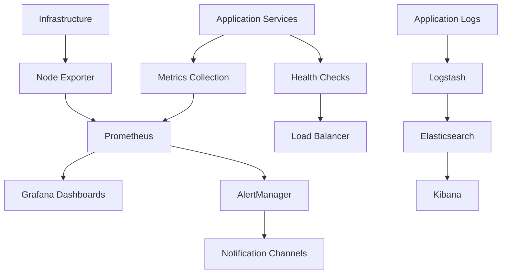
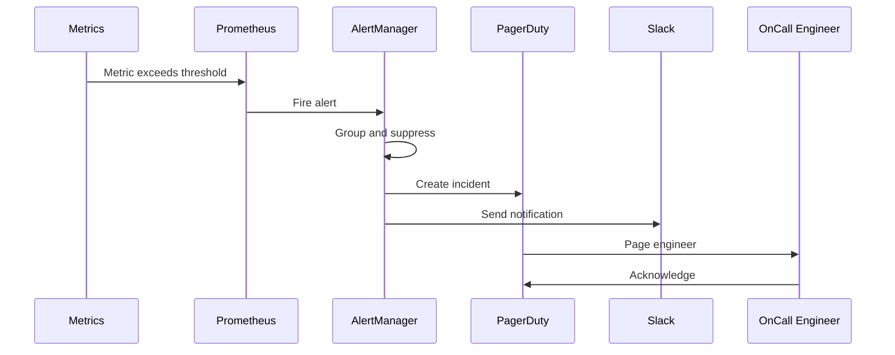

# INT-005: System Monitoring & Health Check Framework

## Epic
**Epic 6: System Integration & Data Orchestration** - Seamless system integration and robust data flow management

## Story Overview
**Title**: System Monitoring & Health Check Framework  
**Story Points**: 14  
**Priority**: High  
**Status**: Pending  
**Assignee**: DevOps Integration Team  
**Sprint**: TBD

## Business Context
Implement a comprehensive system monitoring and health check framework that provides real-time visibility into all TradeMaster services, infrastructure components, and business metrics. This system ensures proactive issue detection, automated alerting, and detailed performance analytics to maintain 99.9% system uptime and optimal user experience.

## User Story
**As a** system administrator and operations team  
**I want** comprehensive monitoring and health checks across all system components  
**So that** I can proactively identify and resolve issues before they impact users

## Technical Requirements

### System Health Monitoring
- **Service Health Checks**: Monitor all microservices with automated health endpoints
- **Infrastructure Monitoring**: Track CPU, memory, disk, network across all servers
- **Database Health**: Monitor PostgreSQL, Redis, InfluxDB performance and availability
- **External Dependencies**: Monitor third-party APIs, payment gateways, data providers
- **Application Metrics**: Track business KPIs, user activity, and feature usage

### Alerting & Notification System
- **Multi-Channel Alerts**: Email, SMS, Slack, PagerDuty notifications
- **Alert Prioritization**: Critical, warning, and info level alerts
- **Smart Alerting**: Prevent alert fatigue with intelligent grouping and suppression
- **Escalation Policies**: Automatic escalation based on response time and severity
- **On-Call Management**: Rotate on-call schedules and automatic assignment

### Performance Analytics
- **Real-Time Dashboards**: Live system status and performance metrics
- **Historical Trending**: Track performance trends over time
- **Capacity Planning**: Predict resource needs based on usage patterns
- **SLA Monitoring**: Track uptime, response times, and availability against SLAs
- **Custom Metrics**: Business-specific metrics and KPIs

## Technical Implementation

### Technology Stack
- **Metrics Collection**: Prometheus, Micrometer, StatsD
- **Visualization**: Grafana, Kibana, custom dashboards
- **Log Aggregation**: ELK Stack (Elasticsearch, Logstash, Kibana)
- **Alerting**: Prometheus AlertManager, PagerDuty, Slack
- **APM**: New Relic, Datadog (optional), or custom solution
- **Health Checks**: Spring Boot Actuator, custom endpoints

### Architecture Components

#### 1. Service Health Check Framework
```java
// Comprehensive health check implementation
@Component
public class TradeMasterHealthIndicator implements HealthIndicator {
    
    private final DatabaseHealthIndicator databaseHealth;
    private final RedisHealthIndicator redisHealth;
    private final ExternalServiceHealthIndicator externalServiceHealth;
    private final BusinessMetricsHealthIndicator businessHealth;
    
    @Override
    public Health health() {
        Health.Builder builder = Health.up();
        
        try {
            // Check database connectivity
            Health dbHealth = databaseHealth.health();
            builder.withDetail("database", dbHealth.getDetails());
            
            // Check Redis connectivity
            Health cacheHealth = redisHealth.health();
            builder.withDetail("redis", cacheHealth.getDetails());
            
            // Check external services
            Health externalHealth = externalServiceHealth.health();
            builder.withDetail("external_services", externalHealth.getDetails());
            
            // Check business metrics
            Health businessMetrics = businessHealth.health();
            builder.withDetail("business_metrics", businessMetrics.getDetails());
            
            // Overall system health assessment
            SystemHealthStatus overallStatus = assessOverallHealth(
                dbHealth, cacheHealth, externalHealth, businessMetrics);
            
            if (overallStatus == SystemHealthStatus.DOWN) {
                builder.down();
            } else if (overallStatus == SystemHealthStatus.DEGRADED) {
                builder.status("DEGRADED");
            }
            
            builder.withDetail("overall_status", overallStatus.name());
            builder.withDetail("last_check", Instant.now().toString());
            
        } catch (Exception e) {
            log.error("Health check failed", e);
            builder.down().withException(e);
        }
        
        return builder.build();
    }
}

@Component
public class DatabaseHealthIndicator {
    
    private final JdbcTemplate jdbcTemplate;
    private final RedisTemplate<String, String> redisTemplate;
    
    public Health health() {
        Health.Builder builder = Health.up();
        
        try {
            // PostgreSQL health check
            long startTime = System.currentTimeMillis();
            Integer result = jdbcTemplate.queryForObject("SELECT 1", Integer.class);
            long responseTime = System.currentTimeMillis() - startTime;
            
            builder.withDetail("postgresql", Map.of(
                "status", "UP",
                "response_time_ms", responseTime,
                "connection_pool", getConnectionPoolInfo()
            ));
            
            // Check if response time is acceptable
            if (responseTime > 1000) { // 1 second threshold
                builder.status("DEGRADED");
                builder.withDetail("warning", "Database response time is high");
            }
            
        } catch (Exception e) {
            log.error("Database health check failed", e);
            builder.down().withException(e);
            builder.withDetail("postgresql", Map.of("status", "DOWN", "error", e.getMessage()));
        }
        
        return builder.build();
    }
    
    private Map<String, Object> getConnectionPoolInfo() {
        // Get HikariCP connection pool metrics
        HikariDataSource dataSource = (HikariDataSource) jdbcTemplate.getDataSource();
        HikariPoolMXBean poolMXBean = dataSource.getHikariPoolMXBean();
        
        return Map.of(
            "active_connections", poolMXBean.getActiveConnections(),
            "idle_connections", poolMXBean.getIdleConnections(),
            "total_connections", poolMXBean.getTotalConnections(),
            "threads_awaiting", poolMXBean.getThreadsAwaitingConnection()
        );
    }
}

@Component
public class ExternalServiceHealthIndicator {
    
    private final List<ExternalServiceChecker> serviceCheckers;
    private final CircuitBreakerRegistry circuitBreakerRegistry;
    
    public Health health() {
        Health.Builder builder = Health.up();
        Map<String, Object> servicesStatus = new ConcurrentHashMap<>();
        boolean anyServiceDown = false;
        
        // Check all external services in parallel
        List<CompletableFuture<Void>> healthChecks = serviceCheckers.stream()
            .map(checker -> CompletableFuture.runAsync(() -> {
                try {
                    ExternalServiceHealth serviceHealth = checker.checkHealth();
                    servicesStatus.put(checker.getServiceName(), serviceHealth.toMap());
                    
                    if (serviceHealth.getStatus() == ServiceStatus.DOWN) {
                        anyServiceDown = true;
                    }
                } catch (Exception e) {
                    servicesStatus.put(checker.getServiceName(), Map.of(
                        "status", "DOWN",
                        "error", e.getMessage(),
                        "last_check", Instant.now().toString()
                    ));
                    anyServiceDown = true;
                }
            }))
            .collect(Collectors.toList());
        
        // Wait for all checks to complete (with timeout)
        CompletableFuture.allOf(healthChecks.toArray(new CompletableFuture[0]))
            .orTimeout(5, TimeUnit.SECONDS)
            .join();
        
        builder.withDetail("external_services", servicesStatus);
        
        if (anyServiceDown) {
            builder.status("DEGRADED");
        }
        
        return builder.build();
    }
}

// Example external service checker
@Component
public class PaymentGatewayHealthChecker implements ExternalServiceChecker {
    
    private final RazorpayClient razorpayClient;
    private final StripeClient stripeClient;
    
    @Override
    public String getServiceName() {
        return "payment_gateways";
    }
    
    @Override
    public ExternalServiceHealth checkHealth() {
        Map<String, ServiceStatus> gatewayStatus = new HashMap<>();
        
        // Check Razorpay
        try {
            razorpayClient.payments.fetch("test_payment_id"); // This will fail but shows connectivity
        } catch (RazorpayException e) {
            if (e.getMessage().contains("payment_id is invalid")) {
                gatewayStatus.put("razorpay", ServiceStatus.UP); // Expected error means API is working
            } else {
                gatewayStatus.put("razorpay", ServiceStatus.DOWN);
            }
        }
        
        // Check Stripe
        try {
            Stripe.setApiKey(stripeApiKey);
            PaymentIntent.retrieve("pi_test"); // This will fail but shows connectivity
        } catch (StripeException e) {
            if (e.getCode().equals("resource_missing")) {
                gatewayStatus.put("stripe", ServiceStatus.UP); // Expected error means API is working
            } else {
                gatewayStatus.put("stripe", ServiceStatus.DOWN);
            }
        }
        
        ServiceStatus overallStatus = gatewayStatus.values().stream()
            .allMatch(status -> status == ServiceStatus.UP) 
            ? ServiceStatus.UP : ServiceStatus.DEGRADED;
        
        return ExternalServiceHealth.builder()
            .serviceName("payment_gateways")
            .status(overallStatus)
            .details(gatewayStatus)
            .lastCheck(Instant.now())
            .build();
    }
}
```

#### 2. Metrics Collection System
```java
@Component
public class BusinessMetricsCollector {
    
    private final MeterRegistry meterRegistry;
    private final UserRepository userRepository;
    private final TransactionRepository transactionRepository;
    private final SubscriptionRepository subscriptionRepository;
    
    @Scheduled(fixedRate = 60000) // Every minute
    public void collectBusinessMetrics() {
        try {
            // Active users
            long activeUsers = userRepository.countActiveUsersInLast24Hours();
            Gauge.builder("business.active_users_24h")
                .description("Number of active users in last 24 hours")
                .register(meterRegistry)
                .set(activeUsers);
            
            // Transaction volume
            BigDecimal transactionVolume = transactionRepository.getTotalVolumeInLast24Hours();
            Gauge.builder("business.transaction_volume_24h")
                .description("Total transaction volume in last 24 hours")
                .register(meterRegistry)
                .set(transactionVolume.doubleValue());
            
            // Active subscriptions
            long activeSubscriptions = subscriptionRepository.countActiveSubscriptions();
            Gauge.builder("business.active_subscriptions")
                .description("Number of active subscriptions")
                .register(meterRegistry)
                .set(activeSubscriptions);
            
            // Error rates
            collectErrorRateMetrics();
            
        } catch (Exception e) {
            log.error("Failed to collect business metrics", e);
            meterRegistry.counter("metrics.collection.errors", 
                "type", "business_metrics").increment();
        }
    }
    
    private void collectErrorRateMetrics() {
        // Calculate error rates for different service operations
        double loginErrorRate = calculateErrorRate("user_login", Duration.ofMinutes(5));
        Gauge.builder("business.error_rate.login")
            .description("Login error rate in last 5 minutes")
            .register(meterRegistry)
            .set(loginErrorRate);
        
        double tradingErrorRate = calculateErrorRate("trading_operations", Duration.ofMinutes(5));
        Gauge.builder("business.error_rate.trading")
            .description("Trading operations error rate in last 5 minutes")
            .register(meterRegistry)
            .set(tradingErrorRate);
        
        double paymentErrorRate = calculateErrorRate("payment_processing", Duration.ofMinutes(5));
        Gauge.builder("business.error_rate.payments")
            .description("Payment processing error rate in last 5 minutes")
            .register(meterRegistry)
            .set(paymentErrorRate);
    }
}

@Component
public class InfrastructureMetricsCollector {
    
    private final MeterRegistry meterRegistry;
    private final OperatingSystemMXBean osBean;
    private final MemoryMXBean memoryBean;
    
    @PostConstruct
    public void initializeMetrics() {
        // JVM metrics
        Gauge.builder("jvm.memory.used")
            .description("JVM memory usage")
            .register(meterRegistry, this, InfrastructureMetricsCollector::getUsedMemory);
        
        Gauge.builder("jvm.memory.max")
            .description("JVM max memory")
            .register(meterRegistry, this, InfrastructureMetricsCollector::getMaxMemory);
        
        // System metrics
        Gauge.builder("system.cpu.usage")
            .description("System CPU usage")
            .register(meterRegistry, this, InfrastructureMetricsCollector::getCpuUsage);
        
        Gauge.builder("system.load.average")
            .description("System load average")
            .register(meterRegistry, this, InfrastructureMetricsCollector::getLoadAverage);
    }
    
    private double getUsedMemory(InfrastructureMetricsCollector collector) {
        return memoryBean.getHeapMemoryUsage().getUsed();
    }
    
    private double getMaxMemory(InfrastructureMetricsCollector collector) {
        return memoryBean.getHeapMemoryUsage().getMax();
    }
    
    private double getCpuUsage(InfrastructureMetricsCollector collector) {
        return osBean.getProcessCpuLoad() * 100;
    }
    
    private double getLoadAverage(InfrastructureMetricsCollector collector) {
        return osBean.getSystemLoadAverage();
    }
}
```

#### 3. Alerting System
```java
@Component
public class AlertingService {
    
    private final NotificationService notificationService;
    private final AlertRuleRepository alertRuleRepository;
    private final AlertHistoryRepository alertHistoryRepository;
    private final OnCallScheduleService onCallService;
    
    @EventListener
    public void handleMetricThresholdBreach(MetricThresholdEvent event) {
        List<AlertRule> matchingRules = alertRuleRepository
            .findByMetricNameAndEnabled(event.getMetricName(), true);
        
        for (AlertRule rule : matchingRules) {
            if (shouldTriggerAlert(event, rule)) {
                triggerAlert(event, rule);
            }
        }
    }
    
    private boolean shouldTriggerAlert(MetricThresholdEvent event, AlertRule rule) {
        // Check if threshold is breached
        boolean thresholdBreached = false;
        switch (rule.getOperator()) {
            case GREATER_THAN:
                thresholdBreached = event.getValue() > rule.getThreshold();
                break;
            case LESS_THAN:
                thresholdBreached = event.getValue() < rule.getThreshold();
                break;
            case EQUALS:
                thresholdBreached = event.getValue() == rule.getThreshold();
                break;
        }
        
        if (!thresholdBreached) {
            return false;
        }
        
        // Check alert suppression (prevent alert fatigue)
        Instant suppressUntil = getLastAlertTime(rule)
            .plus(rule.getSuppressionDuration());
        
        if (Instant.now().isBefore(suppressUntil)) {
            log.debug("Alert suppressed for rule: {}", rule.getName());
            return false;
        }
        
        return true;
    }
    
    private void triggerAlert(MetricThresholdEvent event, AlertRule rule) {
        Alert alert = Alert.builder()
            .id(UUID.randomUUID().toString())
            .ruleName(rule.getName())
            .severity(rule.getSeverity())
            .metricName(event.getMetricName())
            .currentValue(event.getValue())
            .threshold(rule.getThreshold())
            .description(rule.getDescription())
            .triggeredAt(Instant.now())
            .status(AlertStatus.TRIGGERED)
            .build();
        
        alertHistoryRepository.save(alert);
        
        // Send notifications based on severity
        sendAlertNotifications(alert, rule);
        
        // Handle escalation if needed
        if (rule.getEscalationPolicy() != null) {
            scheduleEscalation(alert, rule.getEscalationPolicy());
        }
        
        log.warn("Alert triggered: {} - Current value: {}, Threshold: {}", 
            rule.getName(), event.getValue(), rule.getThreshold());
    }
    
    private void sendAlertNotifications(Alert alert, AlertRule rule) {
        List<NotificationChannel> channels = rule.getNotificationChannels();
        
        for (NotificationChannel channel : channels) {
            try {
                switch (channel.getType()) {
                    case EMAIL:
                        sendEmailAlert(alert, channel);
                        break;
                    case SLACK:
                        sendSlackAlert(alert, channel);
                        break;
                    case SMS:
                        sendSmsAlert(alert, channel);
                        break;
                    case PAGERDUTY:
                        sendPagerDutyAlert(alert, channel);
                        break;
                    case WEBHOOK:
                        sendWebhookAlert(alert, channel);
                        break;
                }
            } catch (Exception e) {
                log.error("Failed to send alert via {}: {}", channel.getType(), e.getMessage());
            }
        }
    }
    
    private void sendSlackAlert(Alert alert, NotificationChannel channel) {
        String message = formatSlackMessage(alert);
        SlackMessage slackMessage = SlackMessage.builder()
            .channel(channel.getSlackChannel())
            .text(message)
            .color(getAlertColor(alert.getSeverity()))
            .build();
        
        notificationService.sendSlackMessage(slackMessage);
    }
    
    private void sendPagerDutyAlert(Alert alert, NotificationChannel channel) {
        PagerDutyIncident incident = PagerDutyIncident.builder()
            .incidentKey(alert.getId())
            .description(alert.getDescription())
            .severity(convertToPagerDutySeverity(alert.getSeverity()))
            .serviceKey(channel.getPagerDutyServiceKey())
            .details(Map.of(
                "metric", alert.getMetricName(),
                "current_value", alert.getCurrentValue(),
                "threshold", alert.getThreshold()
            ))
            .build();
        
        notificationService.createPagerDutyIncident(incident);
    }
}
```

#### 4. Dashboard Configuration
```java
@Configuration
public class MonitoringDashboardConfig {
    
    @Bean
    public DashboardProvider systemOverviewDashboard() {
        return DashboardProvider.builder()
            .name("System Overview")
            .description("High-level system health and performance metrics")
            .panels(Arrays.asList(
                createSystemHealthPanel(),
                createResponseTimePanel(),
                createErrorRatePanel(),
                createThroughputPanel(),
                createResourceUtilizationPanel()
            ))
            .build();
    }
    
    @Bean
    public DashboardProvider businessMetricsDashboard() {
        return DashboardProvider.builder()
            .name("Business Metrics")
            .description("Key business KPIs and user activity metrics")
            .panels(Arrays.asList(
                createActiveUsersPanel(),
                createTransactionVolumePanel(),
                createRevenuePanel(),
                createSubscriptionMetricsPanel(),
                createUserEngagementPanel()
            ))
            .build();
    }
    
    private DashboardPanel createSystemHealthPanel() {
        return DashboardPanel.builder()
            .title("System Health Status")
            .type(PanelType.STATUS_INDICATOR)
            .query("up{job=\"trademaster-services\"}")
            .thresholds(Map.of(
                "healthy", 1.0,
                "degraded", 0.8,
                "down", 0.0
            ))
            .build();
    }
    
    private DashboardPanel createResponseTimePanel() {
        return DashboardPanel.builder()
            .title("API Response Times")
            .type(PanelType.LINE_CHART)
            .query("histogram_quantile(0.95, rate(http_request_duration_seconds_bucket[5m]))")
            .unit("seconds")
            .thresholds(Map.of(
                "good", 0.5,
                "warning", 1.0,
                "critical", 2.0
            ))
            .build();
    }
    
    private DashboardPanel createErrorRatePanel() {
        return DashboardPanel.builder()
            .title("Error Rate")
            .type(PanelType.STAT)
            .query("rate(http_requests_total{status=~\"5..\"}[5m]) / rate(http_requests_total[5m]) * 100")
            .unit("percent")
            .thresholds(Map.of(
                "good", 1.0,
                "warning", 5.0,
                "critical", 10.0
            ))
            .build();
    }
}
```

### Integration Points

#### 1. Monitoring Architecture


#### 2. Alert Flow


## Database Schema

### Monitoring Schema
```sql
-- Alert rules configuration
CREATE TABLE alert_rules (
    id BIGSERIAL PRIMARY KEY,
    name VARCHAR(100) NOT NULL UNIQUE,
    description TEXT,
    metric_name VARCHAR(100) NOT NULL,
    operator VARCHAR(20) NOT NULL, -- 'gt', 'lt', 'eq'
    threshold DECIMAL(15,6) NOT NULL,
    severity VARCHAR(20) NOT NULL, -- 'critical', 'warning', 'info'
    enabled BOOLEAN DEFAULT true,
    suppression_duration_minutes INTEGER DEFAULT 15,
    escalation_policy_id BIGINT,
    notification_channels JSONB,
    created_at TIMESTAMP DEFAULT CURRENT_TIMESTAMP,
    updated_at TIMESTAMP DEFAULT CURRENT_TIMESTAMP,
    INDEX idx_alert_rules_metric (metric_name),
    INDEX idx_alert_rules_enabled (enabled)
);

-- Alert history
CREATE TABLE alert_history (
    id BIGSERIAL PRIMARY KEY,
    alert_id VARCHAR(100) NOT NULL,
    rule_name VARCHAR(100) NOT NULL,
    severity VARCHAR(20) NOT NULL,
    metric_name VARCHAR(100) NOT NULL,
    current_value DECIMAL(15,6) NOT NULL,
    threshold DECIMAL(15,6) NOT NULL,
    description TEXT,
    status VARCHAR(20) DEFAULT 'triggered', -- 'triggered', 'acknowledged', 'resolved'
    triggered_at TIMESTAMP NOT NULL,
    acknowledged_at TIMESTAMP,
    resolved_at TIMESTAMP,
    acknowledged_by VARCHAR(100),
    INDEX idx_alert_history_status (status),
    INDEX idx_alert_history_triggered (triggered_at),
    INDEX idx_alert_history_metric (metric_name)
);

-- System health checks log
CREATE TABLE health_check_log (
    id BIGSERIAL PRIMARY KEY,
    service_name VARCHAR(100) NOT NULL,
    check_type VARCHAR(50) NOT NULL,
    status VARCHAR(20) NOT NULL, -- 'up', 'down', 'degraded'
    response_time_ms INTEGER,
    error_message TEXT,
    details JSONB,
    checked_at TIMESTAMP DEFAULT CURRENT_TIMESTAMP,
    INDEX idx_health_log_service (service_name),
    INDEX idx_health_log_status (status),
    INDEX idx_health_log_time (checked_at)
);

-- On-call schedule
CREATE TABLE on_call_schedule (
    id BIGSERIAL PRIMARY KEY,
    user_id BIGINT NOT NULL,
    start_time TIMESTAMP NOT NULL,
    end_time TIMESTAMP NOT NULL,
    escalation_level INTEGER DEFAULT 1,
    contact_method VARCHAR(20) DEFAULT 'pagerduty',
    is_active BOOLEAN DEFAULT true,
    FOREIGN KEY (user_id) REFERENCES users(id),
    INDEX idx_on_call_schedule_time (start_time, end_time),
    INDEX idx_on_call_schedule_user (user_id)
);
```

## API Specifications

### Monitoring API
```yaml
# System monitoring endpoints
/api/v1/monitoring/health:
  get:
    summary: Get overall system health
    responses:
      200:
        description: System health status
        schema:
          type: object
          properties:
            status: string
            services: object
            last_check: string
            details: object

/api/v1/monitoring/metrics:
  get:
    summary: Get system metrics
    parameters:
      - name: metric_name
        required: false
        schema:
          type: string
      - name: time_range
        required: false
        schema:
          type: string
          default: "1h"
    responses:
      200:
        description: System metrics
        schema:
          type: object
          properties:
            metrics: array
            time_range: string
            timestamp: string

/api/v1/monitoring/alerts:
  get:
    summary: List active alerts
    parameters:
      - name: severity
        required: false
        schema:
          type: string
          enum: ["critical", "warning", "info"]
      - name: status
        required: false
        schema:
          type: string
          enum: ["triggered", "acknowledged", "resolved"]
    responses:
      200:
        description: Alert list
        schema:
          type: array
          items:
            type: object
            properties:
              id: string
              rule_name: string
              severity: string
              status: string
              triggered_at: string

  post:
    summary: Create alert rule
    parameters:
      - name: alert_rule
        schema:
          type: object
          properties:
            name: string
            metric_name: string
            operator: string
            threshold: number
            severity: string
            notification_channels: array
    responses:
      201:
        description: Alert rule created

/api/v1/monitoring/dashboards:
  get:
    summary: List available dashboards
    responses:
      200:
        description: Dashboard list
        schema:
          type: array
          items:
            type: object
            properties:
              id: string
              name: string
              description: string
              url: string

/api/v1/monitoring/sla:
  get:
    summary: Get SLA metrics
    parameters:
      - name: period
        required: false
        schema:
          type: string
          enum: ["24h", "7d", "30d"]
          default: "24h"
    responses:
      200:
        description: SLA metrics
        schema:
          type: object
          properties:
            uptime_percentage: number
            average_response_time: number
            error_rate: number
            availability: number
```

## Acceptance Criteria

### Health Monitoring
- [ ] **Service Health Checks**: Monitor all microservices with <30s check intervals
- [ ] **Infrastructure Monitoring**: Track CPU, memory, disk, network metrics
- [ ] **Database Health**: Monitor PostgreSQL, Redis with connection pool metrics
- [ ] **External Service Health**: Monitor third-party APIs and payment gateways
- [ ] **Custom Health Checks**: Business-specific health indicators

### Alerting System
- [ ] **Multi-Channel Alerts**: Email, Slack, SMS, PagerDuty notifications
- [ ] **Alert Prioritization**: Critical, warning, info level classification
- [ ] **Alert Suppression**: Prevent alert fatigue with intelligent grouping
- [ ] **Escalation Policies**: Automatic escalation based on severity and response time
- [ ] **Alert Response Time**: <2 minutes for critical alerts

### Performance Monitoring
- [ ] **Real-Time Dashboards**: Live system metrics with <10s refresh
- [ ] **Historical Trending**: 30+ days of metric history
- [ ] **SLA Monitoring**: Track 99.9% uptime requirement
- [ ] **Capacity Planning**: Resource usage trends and predictions
- [ ] **Business Metrics**: User activity, transaction volume, revenue tracking

## Testing Strategy

### Unit Tests
```java
@Test
public void testHealthCheckIndicator() {
    when(databaseHealth.health()).thenReturn(Health.up().build());
    when(redisHealth.health()).thenReturn(Health.up().build());
    when(externalServiceHealth.health()).thenReturn(Health.up().build());
    
    Health health = tradeMasterHealthIndicator.health();
    
    assertEquals(Status.UP, health.getStatus());
    assertNotNull(health.getDetails().get("database"));
    assertNotNull(health.getDetails().get("redis"));
}

@Test
public void testAlertTriggering() {
    AlertRule rule = createTestAlertRule("cpu_usage", "gt", 80.0, AlertSeverity.WARNING);
    MetricThresholdEvent event = new MetricThresholdEvent("cpu_usage", 85.0);
    
    alertingService.handleMetricThresholdBreach(event);
    
    verify(notificationService).sendSlackMessage(any(SlackMessage.class));
    verify(alertHistoryRepository).save(any(Alert.class));
}

@Test
public void testMetricsCollection() {
    when(userRepository.countActiveUsersInLast24Hours()).thenReturn(1000L);
    when(transactionRepository.getTotalVolumeInLast24Hours())
        .thenReturn(BigDecimal.valueOf(50000));
    
    businessMetricsCollector.collectBusinessMetrics();
    
    verify(meterRegistry, times(2)).gauge(anyString(), anyDouble());
}
```

### Integration Tests
```java
@Test
public void testEndToEndHealthCheck() {
    ResponseEntity<Map> response = testRestTemplate
        .getForEntity("/actuator/health", Map.class);
    
    assertEquals(HttpStatus.OK, response.getStatusCode());
    assertEquals("UP", response.getBody().get("status"));
    assertNotNull(response.getBody().get("details"));
}

@Test
public void testAlertingWorkflow() {
    // Simulate metric threshold breach
    MetricThresholdEvent event = new MetricThresholdEvent("error_rate", 15.0);
    applicationEventPublisher.publishEvent(event);
    
    // Wait for async processing
    await().atMost(5, SECONDS).until(() ->
        alertHistoryRepository.findByMetricName("error_rate").size() > 0);
    
    List<Alert> alerts = alertHistoryRepository.findByMetricName("error_rate");
    assertFalse(alerts.isEmpty());
    assertEquals(AlertStatus.TRIGGERED, alerts.get(0).getStatus());
}
```

## Monitoring & Alerting

### System Metrics
- **Application Performance**: Response time, throughput, error rate
- **Infrastructure Health**: CPU, memory, disk, network utilization
- **Database Performance**: Connection pool usage, query performance
- **Business Metrics**: Active users, transaction volume, revenue
- **External Dependencies**: Third-party API response times and availability

### Alert Conditions
```yaml
# Critical system alerts
service_down:
  condition: up{job="trademaster-services"} == 0
  duration: 2m
  action: immediate_page_oncall
  severity: critical

high_error_rate:
  condition: rate(http_requests_total{status=~"5.."}[5m]) > 0.05
  duration: 2m
  action: notify_team
  severity: critical

database_connection_issues:
  condition: database_connections_active / database_connections_max > 0.8
  duration: 5m
  action: investigate_connection_leaks
  severity: warning

memory_usage_high:
  condition: jvm_memory_used_bytes / jvm_memory_max_bytes > 0.8
  duration: 10m
  action: consider_scaling_up
  severity: warning

external_service_down:
  condition: probe_success{instance="payment-gateway"} == 0
  duration: 1m
  action: activate_fallback_provider
  severity: warning
```

## Deployment Strategy

### Phase 1: Core Monitoring (Week 1-2)
- Deploy Prometheus and Grafana infrastructure
- Implement basic service health checks
- Set up application metrics collection
- Create initial dashboards

### Phase 2: Alerting System (Week 3-4)
- Implement AlertManager configuration
- Set up notification channels (Slack, PagerDuty)
- Create alert rules for critical metrics
- Implement on-call schedule management

### Phase 3: Advanced Features (Week 5-6)
- Add business metrics collection
- Implement log aggregation with ELK stack
- Create comprehensive dashboards
- Set up SLA monitoring

### Phase 4: Production Optimization (Week 7-8)
- Fine-tune alert thresholds
- Optimize dashboard performance
- Load test monitoring infrastructure
- Documentation and team training

## Risk Analysis

### High Risks
- **Alert Fatigue**: Too many false positive alerts
  - *Mitigation*: Careful threshold tuning, alert suppression, prioritization
- **Monitoring System Failure**: Loss of visibility when monitoring fails
  - *Mitigation*: Redundant monitoring infrastructure, external health checks
- **Performance Impact**: Monitoring overhead affecting application performance
  - *Mitigation*: Efficient metrics collection, sampling, separate monitoring resources

### Medium Risks
- **Storage Costs**: High volume of metrics and logs
  - *Mitigation*: Data retention policies, metric aggregation, cost monitoring
- **Configuration Complexity**: Complex alert rules and dashboard configuration
  - *Mitigation*: Infrastructure as code, version control, documentation

## Success Metrics

### Technical Metrics
- **System Uptime**: Achieve 99.9% monitored uptime
- **Alert Response Time**: <2 minutes for critical alerts
- **Monitoring Coverage**: 100% of services monitored
- **False Positive Rate**: <5% false alerts
- **Dashboard Load Time**: <3 seconds for all dashboards

### Business Metrics
- **MTTR Improvement**: 50% reduction in mean time to recovery
- **Proactive Issue Detection**: 80% of issues detected before user impact
- **Operational Efficiency**: 60% reduction in manual monitoring tasks
- **Team Productivity**: 25% improvement in engineering productivity
- **Cost Optimization**: 20% reduction in infrastructure costs through better resource utilization

## Dependencies
- **Infrastructure**: Prometheus, Grafana, ELK stack deployment
- **External Services**: PagerDuty, Slack integration APIs
- **Application Code**: Health check endpoints in all services
- **Network**: Monitoring network connectivity and permissions
- **Security**: SSL certificates, authentication for monitoring tools

## Definition of Done
- [ ] Comprehensive health checks for all services operational
- [ ] Prometheus metrics collection from all components
- [ ] Grafana dashboards providing real-time system visibility
- [ ] AlertManager with multi-channel notification working
- [ ] On-call schedule and escalation policies configured
- [ ] SLA monitoring achieving 99.9% uptime visibility
- [ ] Business metrics collection and reporting active
- [ ] Log aggregation and search functionality operational
- [ ] Load testing of monitoring infrastructure completed
- [ ] Documentation and team training completed