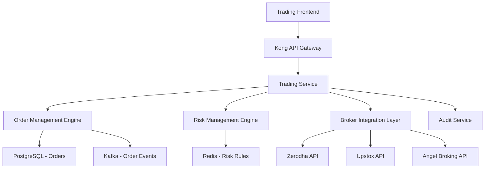

# Story 2.2: Trading API & Order Management

**Epic**: Epic 2 - Market Data & Trading Foundation  
**Story ID**: 2.2  
**Priority**: Revenue Critical  
**Status**: ⏳ **PENDING** - Awaiting Story 2.1 Completion  
**Estimated Effort**: 4 weeks (Weeks 12-15)  
**Assigned Team**: Backend Team + Security Engineer  

## 📋 Story Overview

**As a** TradeMaster platform user  
**I want** comprehensive trading API with order management capabilities  
**So that** I can execute trades, manage positions, and monitor order status in real-time  

### 🎯 Business Value
- **Revenue Generation**: Core trading functionality enables platform monetization
- **Risk Management**: Advanced order types and risk controls prevent losses
- **Regulatory Compliance**: SEBI-compliant order audit trails and reporting
- **User Experience**: Professional-grade trading interface with institutional features

### 🔗 Dependencies
- **Story 2.1**: Market data service for price validation and order routing
- **Epic 1**: Authentication and user profile services for trading permissions
- **External**: Broker API integrations (Zerodha, Upstox, Angel Broking)
- **Infrastructure**: Transaction database, message queues, audit systems

## 🏗️ Technical Architecture

### System Components

### Technology Stack
- **Backend**: Java 21, Spring Boot 3.2, Spring Security
- **Database**: PostgreSQL 15+ (transactional), Redis 7+ (caching)
- **Messaging**: Apache Kafka for order events and notifications
- **Integration**: REST APIs for broker connectivity
- **Monitoring**: Prometheus, Grafana, distributed tracing

## 📋 Acceptance Criteria

### AC-1: Multi-Broker Trading Integration
**Given** configured broker accounts (Zerodha, Upstox, Angel Broking)  
**When** users place orders through the platform  
**Then** the system should:
- ✅ Route orders to user's preferred broker
- ✅ Handle broker-specific authentication (OAuth2, API keys)
- ✅ Normalize order responses across different brokers
- ✅ Implement failover to secondary brokers
- ✅ Track order status across multiple broker platforms

**Validation Criteria**:
- Support minimum 3 major brokers
- Order routing success rate ≥99.5%
- Failover response time <5 seconds
- Order status synchronization within 1 second

### AC-2: Comprehensive Order Types
**Given** authenticated users with trading permissions  
**When** placing different types of orders  
**Then** the system should support:
- ✅ **Basic Orders**: Market, Limit, Stop-Loss, Stop-Limit
- ✅ **Advanced Orders**: Good Till Cancelled (GTC), Fill or Kill (FOK), Immediate or Cancel (IOC)
- ✅ **Bracket Orders**: Entry, target, and stop-loss in single order
- ✅ **Cover Orders**: Market order with compulsory stop-loss
- ✅ **Algorithmic Orders**: TWAP, VWAP, Iceberg orders

**Validation Criteria**:
- Support 15+ order types with proper validation
- Order parameter validation accuracy 100%
- Complex order logic execution correctness ≥99.9%
- Order modification and cancellation within 500ms

### AC-3: Real-time Order Management
**Given** active orders in the system  
**When** monitoring order status and execution  
**Then** the system should provide:
- ✅ Real-time order status updates via WebSocket
- ✅ Order book management with position tracking
- ✅ Partial fill handling and aggregation
- ✅ Order history and trade confirmations
- ✅ Position reconciliation across brokers

**Validation Criteria**:
- Order status update latency <100ms
- WebSocket message delivery guarantee 99.99%
- Position accuracy verification 100%
- Trade confirmation within 5 seconds

### AC-4: Advanced Risk Management
**Given** trading operations and market conditions  
**When** evaluating risk exposure  
**Then** the system should implement:
- ✅ **Pre-trade Risk Checks**: Margin validation, position limits, exposure limits
- ✅ **Real-time Risk Monitoring**: P&L tracking, VAR calculation, drawdown limits
- ✅ **Automated Risk Actions**: Position squaring, margin calls, trading restrictions
- ✅ **Circuit Breakers**: Individual and portfolio-level loss limits
- ✅ **Compliance Monitoring**: SEBI risk guidelines and regulatory limits

**Validation Criteria**:
- Pre-trade risk check latency <50ms
- Risk limit enforcement accuracy 100%
- Automated risk action execution <10 seconds
- Compliance violation detection rate 100%

## 🧪 Testing Strategy

### Unit Testing
- **Coverage Target**: 95%+ line coverage
- **Focus Areas**: Order validation, risk calculations, execution logic
- **Frameworks**: JUnit 5, Mockito, TestContainers

### Integration Testing
- **Broker API Integration**: Mock broker responses and error scenarios
- **Database Integration**: Order persistence and transaction handling
- **Kafka Integration**: Event publishing and consumption
- **Cache Integration**: Risk rule caching and performance

### Performance Testing
- **Load Testing**: 1000+ concurrent order placements
- **Stress Testing**: High-frequency trading scenarios
- **Latency Testing**: Order execution under load
- **Volume Testing**: Large portfolio position management

## 🚀 Deployment Strategy

### Phase 1: Core Trading Engine (Week 12)
- Deploy basic order management system
- Implement single broker integration (Zerodha)
- Setup basic risk management rules
- Configure database and caching layers

### Phase 2: Multi-Broker Integration (Week 13)
- Add Upstox and Angel Broking integrations
- Implement order routing logic
- Add advanced order types
- Setup monitoring and alerting

### Phase 3: Advanced Features (Week 14)
- Implement algorithmic order types
- Add comprehensive risk management
- Setup audit and compliance features
- Performance optimization and tuning

### Phase 4: Production Rollout (Week 15)
- Gradual user rollout with trading limits
- Monitor system performance and stability
- User acceptance testing with beta traders
- Final security and compliance validation

## 📊 Success Metrics

### Technical KPIs
- **Order Latency**: <200ms end-to-end execution
- **System Uptime**: 99.9% during trading hours
- **Order Success Rate**: ≥99.5% successful executions
- **Risk Check Performance**: <50ms pre-trade validation
- **Data Consistency**: 100% position accuracy

### Business KPIs
- **Trading Volume**: ₹10 crore+ monthly trading volume
- **User Adoption**: 70%+ of users place trades monthly
- **Broker Integration**: Support 95%+ of user broker accounts
- **Cost Efficiency**: <₹2 per order execution cost
- **Revenue Generation**: Trading fees contribute 40%+ of revenue

---

**Story 2.2 Status**: ⏳ **PENDING** - Awaiting Market Data Service Completion  
**Prerequisites**: Story 2.1 must be completed and deployed  
**Start Date**: Week 12 (after Story 2.1 completion)  
**Delivery Date**: End of Week 15  

*Last Updated: 2024-08-20 | TradeMaster Development Team*