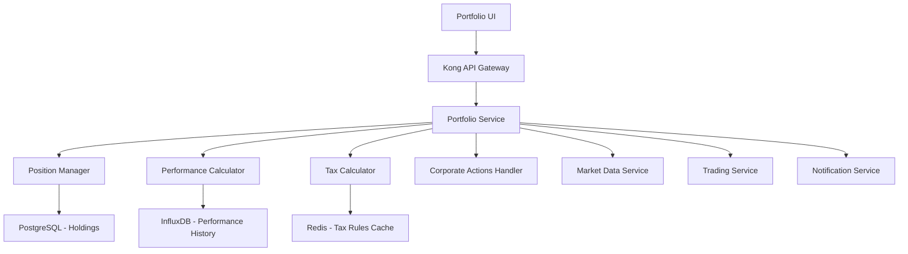

# Story 2.3: Portfolio & Performance Tracking

**Epic**: Epic 2 - Market Data & Trading Foundation  
**Story ID**: 2.3  
**Priority**: User Experience Critical  
**Status**: ⏳ **PENDING** - Awaiting Story 2.2 Completion  
**Estimated Effort**: 3 weeks (Weeks 15-18)  
**Assigned Team**: Backend Team + Frontend Developer  

## 📋 Story Overview

**As a** TradeMaster platform user  
**I want** comprehensive portfolio tracking and performance analytics  
**So that** I can monitor my investments, track P&L, and make data-driven trading decisions  

### 🎯 Business Value
- **User Retention**: Rich portfolio insights keep users engaged daily
- **Premium Features**: Advanced analytics drive subscription upgrades
- **Tax Compliance**: Automated tax calculations reduce user friction
- **Investment Intelligence**: Performance data enables AI-driven recommendations

### 🔗 Dependencies
- **Story 2.2**: Trading service for executed trade data and positions
- **Story 2.1**: Market data service for real-time portfolio valuations
- **Epic 1**: User profile service for account and preference information
- **External**: Corporate action data feeds, tax calculation APIs

## 🏗️ Technical Architecture

### System Components

### Technology Stack
- **Backend**: Java 21, Spring Boot 3.2, Spring Batch
- **Database**: PostgreSQL 15+ (portfolio data), InfluxDB (performance metrics)
- **Caching**: Redis 7+ for real-time calculations
- **Messaging**: Kafka for portfolio updates and notifications
- **Analytics**: Apache Spark for complex performance calculations

## 📋 Acceptance Criteria

### AC-1: Real-time Portfolio Valuation
**Given** user has positions and holdings in their portfolio  
**When** market prices change during trading hours  
**Then** the system should:
- ✅ Update portfolio values in real-time (<1 second)
- ✅ Calculate total portfolio P&L with mark-to-market pricing
- ✅ Show individual position P&L and percentage changes
- ✅ Display day's gain/loss and overall portfolio performance
- ✅ Support multi-currency portfolios with FX conversion

**Validation Criteria**:
- Portfolio update latency <1 second during market hours
- P&L calculation accuracy 99.99%
- Support 1000+ holdings per portfolio
- Real-time updates for top 500 most traded symbols

### AC-2: Position Consolidation & Management
**Given** trades executed across multiple brokers  
**When** consolidating portfolio positions  
**Then** the system should:
- ✅ Aggregate positions across all connected brokers
- ✅ Handle partial fills and position averaging
- ✅ Track cost basis using FIFO, LIFO, or specific identification
- ✅ Maintain position history and trade attribution
- ✅ Handle corporate actions (splits, bonuses, dividends)

**Validation Criteria**:
- Position reconciliation accuracy 100%
- Support 5+ different brokers per user
- Handle 10,000+ daily position updates
- Corporate action processing within 1 business day

### AC-3: Performance Analytics & Metrics
**Given** historical portfolio and trade data  
**When** calculating performance metrics  
**Then** the system should provide:
- ✅ **Time-weighted Returns**: Daily, weekly, monthly, yearly
- ✅ **Money-weighted Returns**: IRR calculations for cash flows
- ✅ **Risk Metrics**: Sharpe ratio, maximum drawdown, volatility
- ✅ **Benchmark Comparison**: Against NIFTY, SENSEX, custom benchmarks
- ✅ **Sector/Asset Allocation**: Portfolio diversification analysis

**Validation Criteria**:
- Performance calculation accuracy 99.9%
- Support 5+ years of historical data
- Benchmark comparison with <0.1% tracking error
- Analytics generation time <10 seconds

### AC-4: Tax Calculation & Reporting
**Given** completed trades and dividend receipts  
**When** calculating tax obligations  
**Then** the system should:
- ✅ Calculate short-term and long-term capital gains
- ✅ Apply current Indian tax rules and rates
- ✅ Generate tax-loss harvesting recommendations
- ✅ Provide detailed trade-wise tax reports
- ✅ Support advance tax calculation and planning

**Validation Criteria**:
- Tax calculation accuracy 99.5% (verified against CA calculations)
- Support latest Income Tax Act provisions
- Generate ITR-ready reports in Excel/PDF format
- Tax-loss harvesting recommendations with 90%+ accuracy

### AC-5: Dividend & Corporate Actions Tracking
**Given** portfolio holdings subject to corporate actions  
**When** processing corporate events  
**Then** the system should:
- ✅ Automatically detect and process dividend payments
- ✅ Handle stock splits and bonus share adjustments
- ✅ Process rights issues and buyback offers
- ✅ Update cost basis for all corporate actions
- ✅ Notify users of upcoming corporate events

**Validation Criteria**:
- Corporate action detection rate ≥95%
- Position adjustment accuracy 100%
- Cost basis calculation correctness 99.9%
- User notifications sent within 1 hour of announcement

### AC-6: Portfolio Analytics Dashboard
**Given** users accessing portfolio information  
**When** viewing portfolio dashboard  
**Then** the system should display:
- ✅ **Overview Widgets**: Total value, day change, allocation charts
- ✅ **Performance Charts**: Historical performance with benchmark overlay
- ✅ **Holdings Table**: Sortable/filterable position details
- ✅ **Asset Allocation**: Sector, market cap, geography breakdown
- ✅ **Risk Analysis**: Concentration risk, correlation matrix

**Validation Criteria**:
- Dashboard load time <3 seconds
- Real-time data updates every 1 second
- Support 100+ customizable widgets
- Mobile-responsive design for all screen sizes

### AC-7: Historical Data & Backtesting
**Given** portfolio and market historical data  
**When** analyzing past performance  
**Then** the system should provide:
- ✅ Historical portfolio snapshots at any point in time
- ✅ What-if analysis for different allocation strategies
- ✅ Backtesting tools for investment strategies
- ✅ Historical correlation and risk analysis
- ✅ Performance attribution analysis

**Validation Criteria**:
- Historical data accuracy 99.9%
- Support 10+ years of historical portfolio data
- Backtesting engine performance <30 seconds for 5-year analysis
- Attribution analysis covering 95% of portfolio returns

### AC-8: Goals & Target Tracking
**Given** users with investment goals and targets  
**When** tracking goal progress  
**Then** the system should:
- ✅ Set and track multiple financial goals
- ✅ Calculate goal achievement probability
- ✅ Provide goal-based portfolio recommendations
- ✅ Send progress notifications and milestones
- ✅ Adjust strategies based on market conditions

**Validation Criteria**:
- Support 10+ concurrent goals per user
- Goal probability calculations with 85%+ accuracy
- Recommendation engine suggestions with 70%+ user acceptance
- Progress tracking updates in real-time

### AC-9: Export & Reporting Capabilities
**Given** portfolio and performance data  
**When** generating reports  
**Then** the system should provide:
- ✅ **Excel Exports**: Complete portfolio data with formatting
- ✅ **PDF Reports**: Professional portfolio statements
- ✅ **Tax Reports**: ITR-ready capital gains statements
- ✅ **Custom Reports**: User-defined date ranges and metrics
- ✅ **API Access**: Programmatic data access for power users

**Validation Criteria**:
- Report generation time <60 seconds for 5 years of data
- Excel exports maintain formatting and formulas
- PDF reports are print-ready and professional
- API response times <500ms for standard queries

### AC-10: Portfolio Alerts & Notifications
**Given** portfolio monitoring and thresholds  
**When** significant events occur  
**Then** the system should:
- ✅ Price-based alerts for individual holdings
- ✅ Portfolio-level alerts (value, P&L thresholds)
- ✅ Risk-based notifications (concentration, drawdown)
- ✅ Corporate action and dividend announcements
- ✅ Goal milestone and rebalancing reminders

**Validation Criteria**:
- Alert delivery within 30 seconds of trigger
- Support 50+ custom alerts per user
- Multi-channel delivery (email, SMS, push, in-app)
- Alert accuracy rate ≥98%

## 🧪 Testing Strategy

### Unit Testing
- **Coverage Target**: 90%+ line coverage
- **Focus Areas**: P&L calculations, tax computations, corporate action processing
- **Frameworks**: JUnit 5, Mockito, TestContainers

### Integration Testing
- **Market Data Integration**: Real-time price updates and portfolio valuation
- **Trading Service Integration**: Position updates from executed trades
- **Database Integration**: Complex portfolio queries and aggregations
- **Corporate Action Processing**: End-to-end workflow testing

### Performance Testing
- **Load Testing**: 10,000+ concurrent users viewing portfolios
- **Calculation Performance**: Complex portfolio metrics under load
- **Real-time Updates**: Market data processing during peak trading
- **Report Generation**: Large portfolio exports and PDF generation

### End-to-End Testing
- **Portfolio Workflows**: Complete user journey from trades to reports
- **Corporate Actions**: Stock splits, dividends, and bonus processing
- **Tax Calculations**: Comprehensive tax scenario testing
- **Multi-broker**: Position consolidation across different brokers

## 🚀 Deployment Strategy

### Phase 1: Core Portfolio Engine (Week 15)
- Deploy basic portfolio tracking system
- Implement position consolidation logic
- Setup real-time P&L calculations
- Configure performance metrics database

### Phase 2: Analytics & Reporting (Week 16)
- Add performance analytics engine
- Implement tax calculation module
- Create dashboard and reporting features
- Setup corporate action processing

### Phase 3: Advanced Features (Week 17)
- Add goal tracking and recommendations
- Implement backtesting capabilities
- Create advanced risk analytics
- Setup alert and notification system

### Phase 4: Production Rollout (Week 18)
- Gradual user rollout with portfolio validation
- Monitor calculation accuracy and performance
- User acceptance testing with existing traders
- Historical data migration and validation

## 📊 Success Metrics

### Technical KPIs
- **Portfolio Update Latency**: <1 second for real-time valuations
- **Calculation Accuracy**: 99.99% for P&L calculations
- **System Availability**: 99.9% uptime during market hours
- **Dashboard Performance**: <3 second load times
- **Data Integrity**: 100% position reconciliation accuracy

### Business KPIs
- **User Engagement**: 80%+ daily portfolio views
- **Feature Adoption**: 60%+ users use advanced analytics
- **Upgrade Conversion**: 25%+ free users upgrade for premium features
- **User Satisfaction**: 4.5+ rating for portfolio features
- **Support Reduction**: <5 portfolio-related tickets per day

### Operational KPIs
- **Report Generation**: 95%+ success rate within SLA
- **Tax Accuracy**: 99%+ accuracy validated against professional calculations
- **Corporate Actions**: 100% accurate processing within 1 business day
- **Alert Delivery**: 98%+ alerts delivered within 30 seconds

## 🔧 Implementation Tasks

### Week 15: Core Portfolio Foundation
- [ ] Design portfolio database schema with holdings and positions
- [ ] Implement real-time portfolio valuation engine
- [ ] Create position consolidation logic across brokers
- [ ] Setup market data integration for portfolio updates
- [ ] Implement basic P&L calculation algorithms

### Week 16: Performance Analytics & Tax Engine
- [ ] Develop performance metrics calculation engine
- [ ] Implement tax calculation module with Indian tax rules
- [ ] Create corporate action processing workflow
- [ ] Build performance analytics and benchmarking
- [ ] Setup historical data storage and retrieval

### Week 17: Dashboard & Advanced Features
- [ ] Create responsive portfolio dashboard UI
- [ ] Implement goal tracking and progress monitoring
- [ ] Add backtesting and what-if analysis tools
- [ ] Build risk analysis and correlation metrics
- [ ] Create export and reporting functionality

### Week 18: Testing & Production Deployment
- [ ] Complete comprehensive testing suite
- [ ] Perform accuracy validation with sample portfolios
- [ ] Implement monitoring and alerting
- [ ] Execute production deployment with data migration
- [ ] User acceptance testing and feedback incorporation

## 🔗 Integration Points

### Upstream Dependencies
- **Trading Service**: Executed trades and position updates
- **Market Data Service**: Real-time prices for portfolio valuation
- **User Profile Service**: Account information and preferences
- **Corporate Action Service**: Dividend, split, and bonus data

### Downstream Consumers
- **Notification Service**: Portfolio alerts and milestone notifications
- **Analytics Service**: Portfolio behavior for AI/ML recommendations
- **Tax Service**: Capital gains data for tax planning
- **Mobile/Web Apps**: Portfolio dashboard and performance data

## 📝 Notes and Considerations

### Technical Debt
- Initial implementation may use simplified tax calculations
- Advanced risk metrics (VaR, Beta) deferred to later iterations
- Some corporate action types handled manually initially

### Future Enhancements
- **Advanced Analytics**: Factor analysis, style drift detection
- **Social Features**: Portfolio sharing and comparison
- **International Holdings**: Foreign stock and ETF support
- **Derivatives Tracking**: Options and futures position management
- **ESG Analytics**: Environmental and sustainability metrics

### Risk Mitigation
- **Calculation Accuracy**: Multiple validation layers and reconciliation
- **Data Dependencies**: Fallback mechanisms for missing market data
- **Performance Risk**: Caching strategies for complex calculations
- **Tax Compliance**: Regular updates for changing tax regulations

## 🔒 Security & Compliance

### Data Security
- **Encryption**: AES-256 encryption for portfolio and financial data
- **Access Controls**: Role-based access to sensitive portfolio information
- **Audit Trails**: Complete logging of portfolio modifications
- **Data Masking**: PII protection in analytics and reporting

### Regulatory Compliance
- **Data Privacy**: GDPR/PDP compliance for portfolio data
- **Financial Reporting**: Accurate calculations for regulatory submissions
- **Tax Compliance**: Updated Indian Income Tax Act provisions
- **Record Keeping**: 7-year retention for all portfolio transactions

---

**Story 2.3 Status**: ⏳ **PENDING** - Awaiting Trading Service Completion  
**Prerequisites**: Story 2.2 must be completed with basic trading functionality  
**Start Date**: Week 15 (parallel to Story 2.2 final week)  
**Delivery Date**: End of Week 18  

*Last Updated: 2024-08-20 | TradeMaster Development Team*